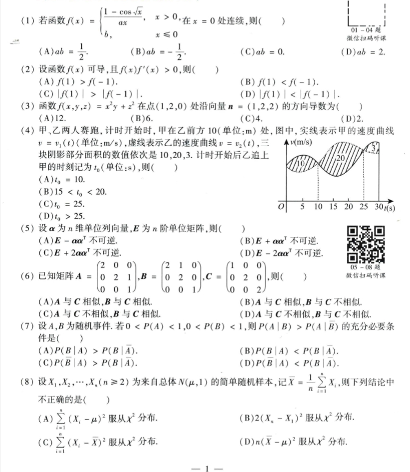
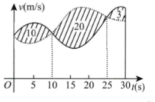
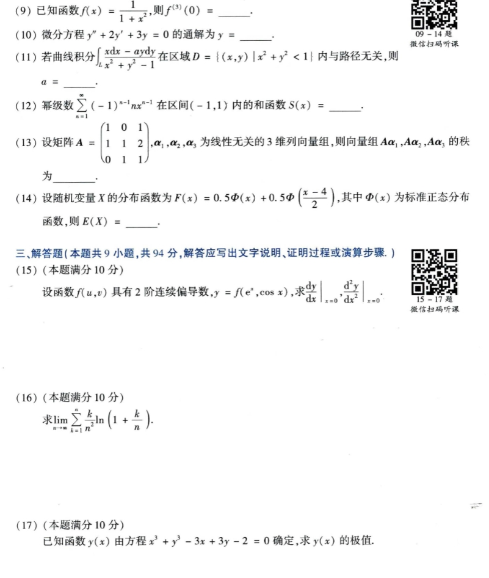
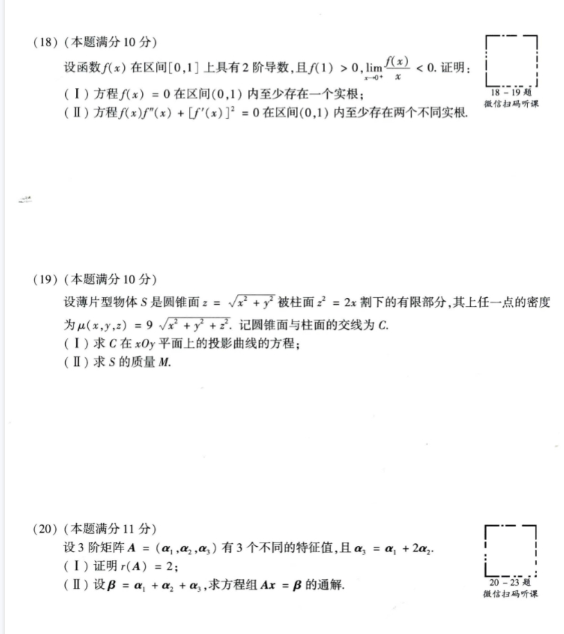
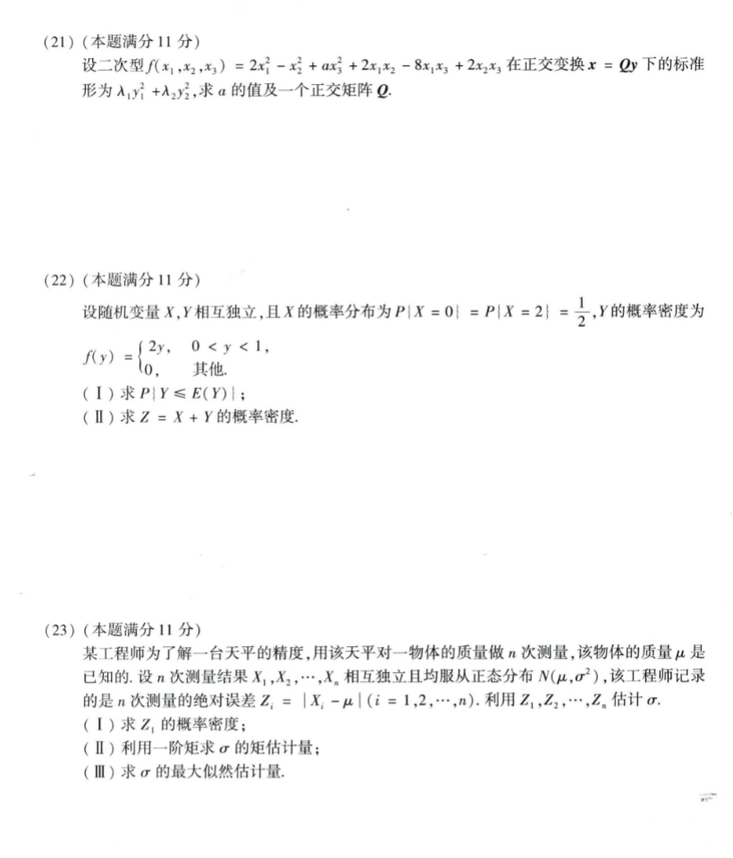

# Math 1 2017 Exam Questions

资料类型：考研数学一历年真题  
年份：2017  
科目：数学一  
整理状态：待复核  

说明：本文件根据用户提供的 2017 年真题截图整理。截图已保存到 `images/` 目录；第 4 题另有单独配图。

## 2017 数一 选择题 1-8

选择题 1-8 截图：



### 第 1 题

- 题型：选择题
- 题号：1
- 分值：4
- 模块：高数
- 考点：极限、导数、积分、级数、微分方程
- 校对状态：根据截图整理

若函数

```text
f(x) = {
  (1 - cos sqrt(x))/(a x),  x > 0,
  b,                       x <= 0
}
```

在 `x=0` 处连续，则（ ）

选项：A. `ab=1/2`  B. `ab=-1/2`  C. `ab=0`  D. `ab=2`

### 第 2 题

- 题型：选择题
- 题号：2
- 分值：4
- 模块：高数
- 考点：极限、导数、积分、级数、微分方程
- 校对状态：根据截图整理

设函数 `f(x)` 可导，且 `f(x)f'(x)>0`，则（ ）

选项：

A. `f(1)>f(-1)`  
B. `f(1)<f(-1)`  
C. `|f(1)|>|f(-1)|`  
D. `|f(1)|<|f(-1)|`

### 第 3 题

- 题型：选择题
- 题号：3
- 分值：4
- 模块：高数
- 考点：极限、导数、积分、级数、微分方程
- 校对状态：根据截图整理

函数 `f(x,y,z)=x^2 y+z^2` 在点 `(1,2,0)` 处沿向量 `n=(1,2,2)` 的方向导数为（ ）

选项：A. `12`  B. `6`  C. `4`  D. `2`

### 第 4 题

- 题型：选择题
- 题号：4
- 分值：4
- 模块：高数
- 考点：极限、导数、积分、级数、微分方程
- 校对状态：根据截图整理

甲、乙两人赛跑，计时开始时，甲在乙前方 `10m` 处。图中实线表示甲的速度曲线 `v=v_1(t)`，虚线表示乙的速度曲线 `v=v_2(t)`，三块阴影部分面积的数值依次是 `10,20,3`。计时开始后乙追上甲的时刻记为 `t_0`，则（ ）

第 4 题配图：



选项：

A. `t_0 = 10`  
B. `15 < t_0 < 20`  
C. `t_0 = 25`  
D. `t_0 > 25`

### 第 5 题

- 题型：选择题
- 题号：5
- 分值：4
- 模块：线代
- 考点：矩阵、向量组、二次型
- 校对状态：根据截图整理

设 `alpha` 为 `n` 维单位列向量，`E` 为 `n` 阶单位矩阵，则（ ）

选项：

A. `E - alpha alpha^T` 不可逆。  
B. `E + alpha alpha^T` 不可逆。  
C. `E + 2alpha alpha^T` 不可逆。  
D. `E - 2alpha alpha^T` 不可逆。

### 第 6 题

- 题型：选择题
- 题号：6
- 分值：4
- 模块：线代
- 考点：矩阵、向量组、二次型
- 校对状态：根据截图整理

已知矩阵

```text
A = [2 0 0
     0 2 1
     0 0 1],
B = [2 1 0
     0 2 0
     0 0 1],
C = [1 0 0
     0 2 0
     0 0 2]
```

则（ ）

选项：

A. `A` 与 `C` 相似，`B` 与 `C` 相似。  
B. `A` 与 `C` 相似，`B` 与 `C` 不相似。  
C. `A` 与 `C` 不相似，`B` 与 `C` 相似。  
D. `A` 与 `C` 不相似，`B` 与 `C` 不相似。

### 第 7 题

- 题型：选择题
- 题号：7
- 分值：4
- 模块：概率统计
- 考点：随机变量、概率分布、参数估计
- 校对状态：根据截图整理

设 `A,B` 为随机事件。若 `0<P(A)<1, 0<P(B)<1`，则 `P(A|B)>P(A|B_bar)` 的充分必要条件是（ ）

选项：

A. `P(B|A)>P(B|A_bar)`  
B. `P(B|A)<P(B|A_bar)`  
C. `P(B_bar|A)>P(B|A_bar)`  
D. `P(B_bar|A)<P(B|A_bar)`

待确认：C、D 项截图疑似含条件中的补事件符号，建议核对。

### 第 8 题

- 题型：选择题
- 题号：8
- 分值：4
- 模块：概率统计
- 考点：随机变量、概率分布、参数估计
- 校对状态：根据截图整理

设 `X_1,X_2,...,X_n (n>=2)` 为来自总体 `N(mu,1)` 的简单随机样本，记 `X_bar=(1/n)sum X_i`，则下列结论中不正确的是（ ）

选项：

A. `sum_{i=1}^n (X_i-mu)^2` 服从 `chi^2`（卡方）分布。  
B. `2(X_n-X_1)^2` 服从 `chi^2`（卡方）分布。  
C. `sum_{i=1}^n (X_i-X_bar)^2` 服从 `chi^2`（卡方）分布。  
D. `n(X_bar-mu)^2` 服从 `chi^2`（卡方）分布。

## 2017 数一 填空题 9-14 与解答题 15-17

截图：



### 第 9 题

- 题型：填空题
- 题号：9
- 分值：4
- 模块：高数
- 考点：极限、导数、积分、级数、微分方程
- 校对状态：根据截图整理

已知函数 `f(x)=1/(1+x^2)`，则 `f^(3)(0)=____`。

### 第 10 题

- 题型：填空题
- 题号：10
- 分值：4
- 模块：高数
- 考点：极限、导数、积分、级数、微分方程
- 校对状态：根据截图整理

微分方程 `y''+2y'+3y=0` 的通解为 `y=____`。

### 第 11 题

- 题型：填空题
- 题号：11
- 分值：4
- 模块：高数
- 考点：极限、导数、积分、级数、微分方程
- 校对状态：根据截图整理

若曲线积分

```text
∫_L (x dx - a y dy)/(x^2 + y^2 - 1)
```

在区域 `D={(x,y)|x^2+y^2<1}` 内与路径无关，则 `a=____`。

### 第 12 题

- 题型：填空题
- 题号：12
- 分值：4
- 模块：高数
- 考点：极限、导数、积分、级数、微分方程
- 校对状态：根据截图整理

幂级数

```text
sum_{n=1}^∞ (-1)^(n-1) n x^(n-1)
```

在区间 `(-1,1)` 内的和函数 `S(x)=____`。

### 第 13 题

- 题型：填空题
- 题号：13
- 分值：4
- 模块：线代
- 考点：矩阵、向量组、二次型
- 校对状态：根据截图整理

设矩阵

```text
A = [1 0 1
     1 1 2
     0 1 1]
```

`alpha_1,alpha_2,alpha_3` 为线性无关的 3 维列向量组，则向量组 `A alpha_1, A alpha_2, A alpha_3` 的秩为 `____`。

### 第 14 题

- 题型：填空题
- 题号：14
- 分值：4
- 模块：概率统计
- 考点：随机变量、概率分布、参数估计
- 校对状态：根据截图整理

设随机变量 `X` 的分布函数为

```text
F(x)=0.5 Phi(x)+0.5 Phi((x-4)/2)
```

其中 `Phi(x)` 为标准正态分布函数，则 `E(X)=____`。

### 第 15 题

- 题型：解答题
- 题号：15
- 分值：10
- 模块：高数
- 考点：极限、导数、积分、级数、微分方程
- 校对状态：根据截图整理

设函数 `f(u,v)` 具有 2 阶连续偏导数，`y=f(e^x, cos x)`，求

```text
(dy/dx)|_(x=0),  (d^2y/dx^2)|_(x=0)
```

### 第 16 题

- 题型：解答题
- 题号：16
- 分值：10
- 模块：高数
- 考点：极限、导数、积分、级数、微分方程
- 校对状态：根据截图整理

求极限

```text
lim_{n->∞} sum_{k=1}^n (k/n^2) ln(1+k/n)
```

### 第 17 题

- 题型：解答题
- 题号：17
- 分值：10
- 模块：高数
- 考点：极限、导数、积分、级数、微分方程
- 校对状态：根据截图整理

已知函数 `y(x)` 由方程

```text
x^3 + y^3 - 3x + 3y - 2 = 0
```

确定，求 `y(x)` 的极值。

## 2017 数一 解答题 18-20

截图：



### 第 18 题

- 题型：解答题
- 题号：18
- 分值：10
- 模块：高数
- 考点：极限、导数、积分、级数、微分方程
- 校对状态：根据截图整理

设函数 `f(x)` 在区间 `[0,1]` 上具有 2 阶导数，且 `f(1)>0, lim_{x->0+} f(x)/x < 0`。证明：

1. 方程 `f(x)=0` 在区间 `(0,1)` 内至少存在一个实根；
2. 方程 `f(x)f''(x)+[f'(x)]^2=0` 在区间 `(0,1)` 内至少存在两个不同实根。

### 第 19 题

- 题型：解答题
- 题号：19
- 分值：10
- 模块：高数
- 考点：极限、导数、积分、级数、微分方程
- 校对状态：根据截图整理

设薄片型物体 `S` 是圆锥面

```text
z = sqrt(x^2+y^2)
```

被柱面 `z^2=2x` 割下的有限部分，其上任一点的密度为

```text
mu(x,y,z)=9 sqrt(x^2+y^2+z^2)
```

记圆锥面与柱面的交线为 `C`。

1. 求 `C` 在 `xOy` 平面上的投影曲线的方程；
2. 求 `S` 的质量 `M`。

### 第 20 题

- 题型：解答题
- 题号：20
- 分值：11
- 模块：线代
- 考点：矩阵、向量组、二次型
- 校对状态：根据截图整理

设 3 阶矩阵 `A=(alpha_1,alpha_2,alpha_3)` 有 3 个不同的特征值，且 `alpha_3=alpha_1+2alpha_2`。

1. 证明 `r(A)=2`；
2. 设 `beta=alpha_1+alpha_2+alpha_3`，求方程组 `Ax=beta` 的通解。

## 2017 数一 解答题 21-23

截图：



### 第 21 题

- 题型：解答题
- 题号：21
- 分值：11
- 模块：线代
- 考点：矩阵、向量组、二次型
- 校对状态：根据截图整理

设二次型

```text
f(x_1,x_2,x_3)=2x_1^2-x_2^2+a x_3^2+2x_1x_2-8x_1x_3+2x_2x_3
```

在正交变换 `x=Qy` 下的标准形为 `lambda_1 y_1^2 + lambda_2 y_2^2`，求 `a` 的值及一个正交矩阵 `Q`。

### 第 22 题

- 题型：解答题
- 题号：22
- 分值：11
- 模块：概率统计
- 考点：随机变量、概率分布、参数估计
- 校对状态：根据截图整理

设随机变量 `X,Y` 相互独立，且 `X` 的概率分布为 `P{X=0}=P{X=2}=1/2`，`Y` 的概率密度为

```text
f(y) = {
  2y, 0<y<1,
  0,  其他
}
```

1. 求 `P{Y<=E(Y)}`；
2. 求 `Z=X+Y` 的概率密度。

### 第 23 题

- 题型：解答题
- 题号：23
- 分值：11
- 模块：概率统计
- 考点：随机变量、概率分布、参数估计
- 校对状态：根据截图整理

某工程师为了解一台天平的精度，用该天平对一物体的质量做 `n` 次测量，该物体的质量 `mu` 是已知的。设 `n` 次测量结果 `X_1,X_2,...,X_n` 相互独立且均服从正态分布 `N(mu,sigma^2)`，该工程师记录的是 `n` 次测量的绝对误差 `Z_i=|X_i-mu| (i=1,2,...,n)`。利用 `Z_1,Z_2,...,Z_n` 估计 `sigma`。

1. 求 `Z_i` 的概率密度；
2. 利用一阶矩求 `sigma` 的矩估计量；
3. 求 `sigma` 的最大似然估计量。
