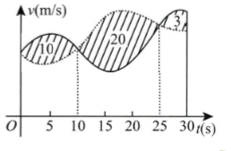

# 2017 数学一第 4 题

## 题目

甲、乙两人赛跑，计时开始时，甲在乙前方 `10m` 处。图中实线表示甲的速度曲线 `v=v_1(t)`，虚线表示乙的速度曲线 `v=v_2(t)`，三块阴影部分面积的数值依次是 `10,20,3`。计时开始后乙追上甲的时刻记为 `t_0`，则（ ）

第 4 题配图：

选项：

A. `t_0 = 10`
B. `15 < t_0 < 20`
C. `t_0 = 25`
D. `t_0 > 25`

## 标准答案

C

## 解析

设 $s_1(t),s_2(t)$ 分别表示甲、乙两人的路程。计时开始时甲在乙前方 $10$ m，要在 $t_0$ 时刻追上甲，应满足

$$
s_1(t_0)-s_2(t_0)=-10.
$$

由图中阴影面积可知：

$$
\int_0^{10}[v_1(t)-v_2(t)]\,dt=10,
$$

所以 $t=10$ 时有 $s_1(10)-s_2(10)=10$。

当 $15<t<20$ 时，

$$
s_1(t)-s_2(t)=10+\int_{10}^{t}[v_1(t)-v_2(t)]\,dt
>10+\int_{10}^{25}[v_1(t)-v_2(t)]\,dt=10-20=-10.
$$

当 $t=25$ 时，

$$
s_1(25)-s_2(25)=\int_0^{25}[v_1(t)-v_2(t)]\,dt=10-20=-10.
$$

而当 $t>25$ 时，

$$
s_1(t)-s_2(t)=\int_0^{25}[v_1(t)-v_2(t)]\,dt+\int_{25}^{t}[v_1(t)-v_2(t)]\,dt
=-10+\int_{25}^{t}[v_1(t)-v_2(t)]\,dt>-10.
$$

因此恰在 $t_0=25$ 时乙追上甲，故选 C。

## 来源

- 题目来源：`math1_2017_questions.md`
- 答案来源：`math1_2017_answers.md`
