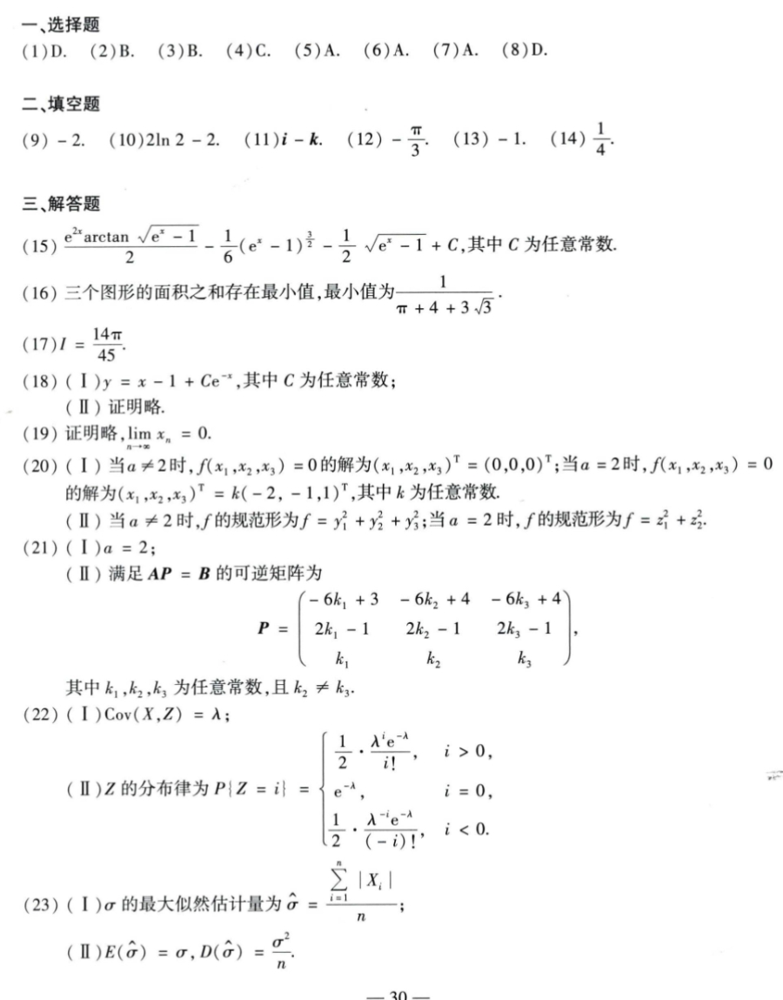

# Math 1 2018 Answers

资料类型：考研数学一答案速查  
年份：2018  
科目：数学一  
来源：本地答案速查图片 OCR/人工转写  
校对状态：待复核  

原图：

## 选择题

| 题号 | 答案 |
|---|---|
| 1 | D |
| 2 | B |
| 3 | B |
| 4 | C |
| 5 | A |
| 6 | A |
| 7 | A |
| 8 | D |

## 填空题

| 题号 | 答案 |
|---|---|
| 9 | `-2` |
| 10 | `2ln2-2` |
| 11 | `i-k` |
| 12 | `-π/3` |
| 13 | `-1` |
| 14 | `1/4` |

## 解答题

| 题号 | 答案速查 |
|---|---|
| 15 | 原函数为 `e^(2x) arctan sqrt(e^x-1)/2 - (1/6)(e^x-1)^(3/2) - (1/2)sqrt(e^x-1) + C` |
| 16 | 最小值 `1/(π+4+3sqrt(3))` |
| 17 | `I=14π/45` |
| 18 | （1）`y=x-1+Ce^(-x)`；（2）证明略 |
| 19 | （1）证明略；（2）`lim x_n=0` |
| 20 | （1）`a!=2` 时仅零解，`a=2` 时解为 `k(-2,-1,1)^T`；（2）规范形：`a!=2` 时 `f=y_1^2+y_2^2+y_3^2`，`a=2` 时 `f=z_1^2+z_2^2` |
| 21 | （1）`a=2`；（2）可取 `P=[3,-2,4; -1,1,-1; 0,1,0]`，满足 `AP=B`，且 `|P|=-1` |
| 22 | （1）`Cov(X,Z)=λ`；（2）`P{Z=i}=1/2·λ^i e^(-λ)/i! (i>0), e^(-λ) (i=0), 1/2·λ^(-i)e^(-λ)/(-i)! (i<0)` |
| 23 | （1）`sigma_hat=(sum |X_i|)/n`；（2）`E(sigma_hat)=sigma, D(sigma_hat)=sigma^2/n` |
