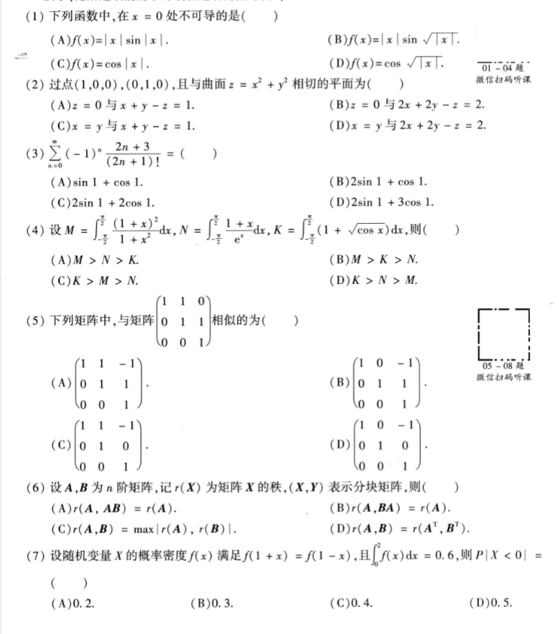
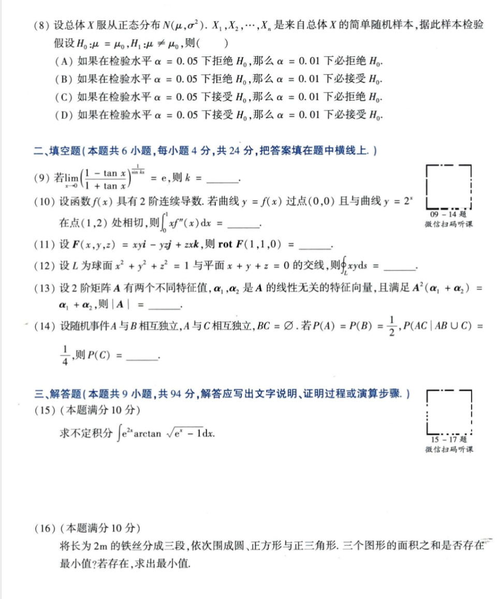
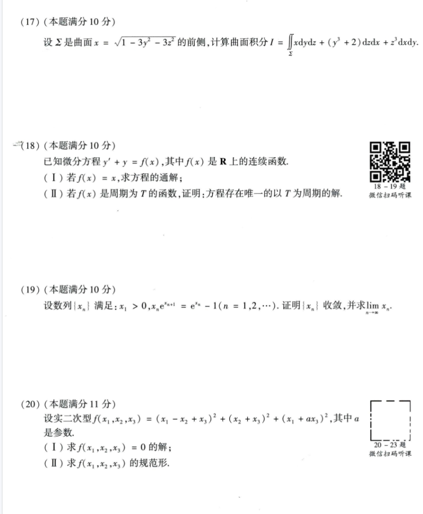
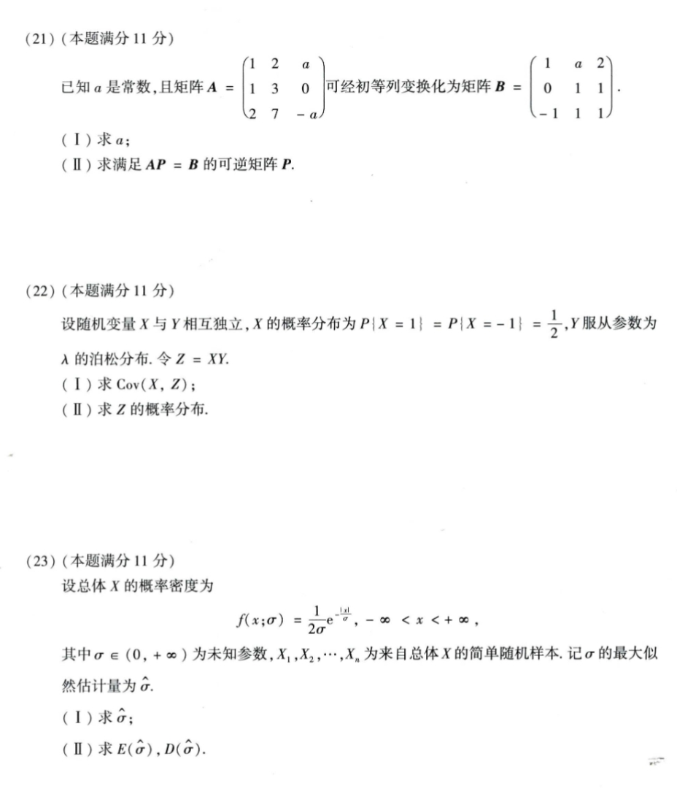

# Math 1 2018 Exam Questions

资料类型：考研数学一历年真题  
年份：2018  
科目：数学一  
整理状态：待复核  

说明：本文件根据用户提供的 2018 年真题截图整理。截图已保存到 `images/` 目录。

## 2018 数一 选择题 1-7

截图：



### 第 1 题

- 题型：选择题
- 题号：1
- 分值：4
- 模块：高数
- 考点：极限、导数、积分、级数、微分方程
- 校对状态：根据截图整理

下列函数中，在 `x=0` 处不可导的是（ ）

选项：

A. `f(x)=|x| sin|x|`  
B. `f(x)=|x| sin sqrt(|x|)`  
C. `f(x)=cos|x|`  
D. `f(x)=cos sqrt(|x|)`

### 第 2 题

- 题型：选择题
- 题号：2
- 分值：4
- 模块：高数
- 考点：极限、导数、积分、级数、微分方程
- 校对状态：根据截图整理

过点 `(1,0,0),(0,1,0)`，且与曲面 `z=x^2+y^2` 相切的平面为（ ）

选项：

A. `z=0` 与 `x+y-z=1`  
B. `z=0` 与 `2x+2y-z=2`  
C. `x=y` 与 `x+y-z=1`  
D. `x=y` 与 `2x+2y-z=2`

### 第 3 题

- 题型：选择题
- 题号：3
- 分值：4
- 模块：高数
- 考点：极限、导数、积分、级数、微分方程
- 校对状态：根据截图整理

```text
sum_{n=0}^∞ (-1)^n (2n+3)/(2n+1)! = ( )
```

选项：

A. `sin1+cos1`  
B. `2sin1+cos1`  
C. `2sin1+2cos1`  
D. `2sin1+3cos1`

### 第 4 题

- 题型：选择题
- 题号：4
- 分值：4
- 模块：高数
- 考点：极限、导数、积分、级数、微分方程
- 校对状态：根据截图整理

设

```text
M = ∫_{-π/2}^{π/2} ((1+x)^2 / (1+x^2)) dx,
N = ∫_{-π/2}^{π/2} ((1+x)/e^x) dx,
K = ∫_{-π/2}^{π/2} (1 + sqrt(cos x)) dx
```

则（ ）

选项：A. `M>N>K`  B. `M>K>N`  C. `K>M>N`  D. `K>N>M`

### 第 5 题

- 题型：选择题
- 题号：5
- 分值：4
- 模块：线代
- 考点：矩阵、向量组、二次型
- 校对状态：根据截图整理

下列矩阵中，与矩阵

```text
[1 1 0
 0 1 1
 0 0 1]
```

相似的为（ ）

选项：

A.
```text
[1 1 -1
 0 1  1
 0 0  1]
```

B.
```text
[1 0 -1
 0 1  1
 0 0  1]
```

C.
```text
[1 1 -1
 0 1  0
 0 0  1]
```

D.
```text
[1 0 -1
 0 1  0
 0 0  1]
```

### 第 6 题

- 题型：选择题
- 题号：6
- 分值：4
- 模块：线代
- 考点：矩阵、向量组、二次型
- 校对状态：根据截图整理

设 `A,B` 为 `n` 阶矩阵，记 `r(X)` 为矩阵 `X` 的秩，`(X,Y)` 表示分块矩阵，则（ ）

选项：

A. `r(A,AB)=r(A)`  
B. `r(A,BA)=r(A)`  
C. `r(A,B)=max{r(A),r(B)}`  
D. `r(A,B)=r(A^T,B^T)`

### 第 7 题

- 题型：选择题
- 题号：7
- 分值：4
- 模块：概率统计
- 考点：随机变量、概率分布、参数估计
- 校对状态：根据截图整理

设随机变量 `X` 的概率密度 `f(x)` 满足 `f(1+x)=f(1-x)`，且 `∫_0^2 f(x)dx=0.6`，则 `P{X<0}=（ ）`

选项：A. `0.2`  B. `0.3`  C. `0.4`  D. `0.5`

## 2018 数一 选择题 8 与填空题 9-14 与解答题 15-16

截图：



### 第 8 题

- 题型：选择题
- 题号：8
- 分值：4
- 模块：概率统计
- 考点：随机变量、概率分布、参数估计
- 校对状态：根据截图整理

设总体 `X` 服从正态分布 `N(mu,sigma^2)`，`X_1,...,X_n` 是来自总体 `X` 的简单随机样本，据此样本检验假设 `H_0:mu=mu_0, H_1:mu!=mu_0`，则（ ）

选项：

A. 如果在检验水平 `alpha=0.05` 下拒绝 `H_0`，那么 `alpha=0.01` 下必拒绝 `H_0`。  
B. 如果在检验水平 `alpha=0.05` 下拒绝 `H_0`，那么 `alpha=0.01` 下必接受 `H_0`。  
C. 如果在检验水平 `alpha=0.05` 下接受 `H_0`，那么 `alpha=0.01` 下必拒绝 `H_0`。  
D. 如果在检验水平 `alpha=0.05` 下接受 `H_0`，那么 `alpha=0.01` 下必接受 `H_0`。

### 第 9 题

- 题型：填空题
- 题号：9
- 分值：4
- 模块：高数
- 考点：极限、导数、积分、级数、微分方程
- 校对状态：根据截图整理

若

```text
lim_{x->0} ((1 - tan x)/(1 + tan x))^(1/sin(kx)) = e
```

则 `k=____`。

### 第 10 题

- 题型：填空题
- 题号：10
- 分值：4
- 模块：高数
- 考点：极限、导数、积分、级数、微分方程
- 校对状态：根据截图整理

设函数 `f(x)` 具有 2 阶连续导数。若曲线 `y=f(x)` 过点 `(0,0)` 且与曲线 `y=2^x` 在点 `(1,2)` 处相切，则

```text
∫_0^1 x f''(x) dx = ____
```

### 第 11 题

- 题型：填空题
- 题号：11
- 分值：4
- 模块：高数
- 考点：极限、导数、积分、级数、微分方程
- 校对状态：根据截图整理

设 `F(x,y,z)=xy i - yz j + zx k`，则 `rot F(1,1,0)=____`。

### 第 12 题

- 题型：填空题
- 题号：12
- 分值：4
- 模块：高数
- 考点：极限、导数、积分、级数、微分方程
- 校对状态：根据截图整理

设 `L` 为球面 `x^2+y^2+z^2=1` 与平面 `x+y+z=0` 的交线，则

```text
∮_L xy ds = ____
```

### 第 13 题

- 题型：填空题
- 题号：13
- 分值：4
- 模块：线代
- 考点：矩阵、向量组、二次型
- 校对状态：根据截图整理

设 2 阶矩阵 `A` 有两个不同特征值，`alpha_1,alpha_2` 是 `A` 的线性无关的特征向量，且满足

```text
A^2(alpha_1+alpha_2)=alpha_1+alpha_2
```

则 `|A|=____`。

### 第 14 题

- 题型：填空题
- 题号：14
- 分值：4
- 模块：概率统计
- 考点：随机变量、概率分布、参数估计
- 校对状态：根据截图整理

设随机事件 `A` 与 `B` 相互独立，`A` 与 `C` 相互独立，`BC=emptyset`。若 `P(A)=P(B)=1/2, P(AC|A union C)=1/4`，则 `P(C)=____`。

### 第 15 题

- 题型：解答题
- 题号：15
- 分值：10
- 模块：高数
- 考点：极限、导数、积分、级数、微分方程
- 校对状态：根据截图整理

求不定积分

```text
∫ e^(2x) arctan sqrt(e^x - 1) dx
```

### 第 16 题

- 题型：解答题
- 题号：16
- 分值：10
- 模块：高数
- 考点：极限、导数、积分、级数、微分方程
- 校对状态：根据截图整理

将长为 `2m` 的铁丝分成三段，依次围成圆、正方形与正三角形。三个图形的面积之和是否存在最小值？若存在，求出最小值。

## 2018 数一 解答题 17-20

截图：



### 第 17 题

- 题型：解答题
- 题号：17
- 分值：10
- 模块：高数
- 考点：极限、导数、积分、级数、微分方程
- 校对状态：根据截图整理

设 `Sigma` 是曲面

```text
x = sqrt(1 - 3y^2 - 3z^2)
```

的前侧，计算曲面积分

```text
I = ∬_Sigma x dy dz + (y^3+2) dz dx + z^3 dx dy
```

### 第 18 题

- 题型：解答题
- 题号：18
- 分值：10
- 模块：高数
- 考点：极限、导数、积分、级数、微分方程
- 校对状态：根据截图整理

已知微分方程 `y' + y = f(x)`，其中 `f(x)` 是 `R` 上的连续函数。

1. 若 `f(x)=x`，求方程的通解；
2. 若 `f(x)` 是周期为 `T` 的函数，证明：方程存在唯一的以 `T` 为周期的解。

### 第 19 题

- 题型：解答题
- 题号：19
- 分值：10
- 模块：高数
- 考点：极限、导数、积分、级数、微分方程
- 校对状态：根据截图整理

设数列 `{x_n}` 满足 `x_1>0, x_n e^(x_{n+1}) = e^(x_n)-1 (n=1,2,...)`。证明 `{x_n}` 收敛，并求 `lim_{n->∞} x_n`。

### 第 20 题

- 题型：解答题
- 题号：20
- 分值：11
- 模块：线代
- 考点：矩阵、向量组、二次型
- 校对状态：根据截图整理

设实二次型

```text
f(x_1,x_2,x_3)=(x_1-x_2+x_3)^2+(x_2+x_3)^2+(x_1+a x_3)^2
```

其中 `a` 是参数。

1. 求 `f(x_1,x_2,x_3)=0` 的解；
2. 求 `f(x_1,x_2,x_3)` 的规范形。

## 2018 数一 解答题 21-23

截图：



### 第 21 题

- 题型：解答题
- 题号：21
- 分值：11
- 模块：线代
- 考点：矩阵、向量组、二次型
- 校对状态：根据截图整理

已知 `a` 是常数，且矩阵

```text
A = [1 2  a
     1 3  0
     2 7 -a]
```

可经初等列变换化为矩阵

```text
B = [ 1 a 2
      0 1 1
     -1 1 1]
```

1. 求 `a`；
2. 求满足 `AP=B` 的可逆矩阵 `P`。

### 第 22 题

- 题型：解答题
- 题号：22
- 分值：11
- 模块：概率统计
- 考点：随机变量、概率分布、参数估计
- 校对状态：根据截图整理

设随机变量 `X` 与 `Y` 相互独立，`X` 的概率分布为 `P{X=1}=P{X=-1}=1/2`，`Y` 服从参数为 `lambda` 的泊松分布。令 `Z=XY`。

1. 求 `Cov(X,Z)`；
2. 求 `Z` 的概率分布。

### 第 23 题

- 题型：解答题
- 题号：23
- 分值：11
- 模块：概率统计
- 考点：随机变量、概率分布、参数估计
- 校对状态：根据截图整理

设总体 `X` 的概率密度为

```text
f(x;sigma)=1/(2sigma) e^(-|x|/sigma), -∞<x<+∞
```

其中 `sigma in (0,+∞)` 为未知参数，`X_1,X_2,...,X_n` 为来自总体 `X` 的简单随机样本。记 `sigma` 的最大似然估计量为 `hat_sigma`。

1. 求 `hat_sigma`；
2. 求 `E(hat_sigma), D(hat_sigma)`。
