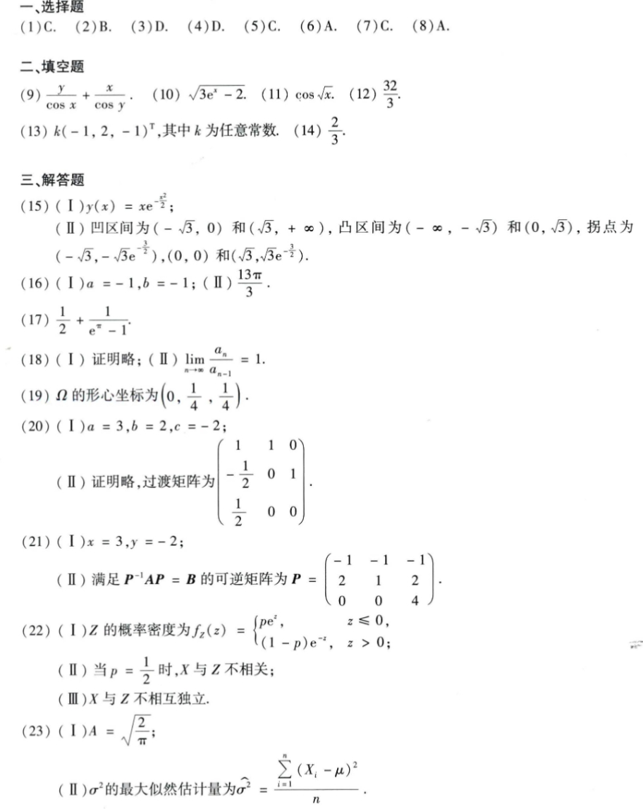

# Math 1 2019 Answers

资料类型：考研数学一答案速查  
年份：2019  
科目：数学一  
来源：本地答案速查图片 OCR/人工转写  
校对状态：待复核  

原图：

## 选择题

| 题号 | 答案 |
|---|---|
| 1 | C |
| 2 | B |
| 3 | D |
| 4 | D |
| 5 | C |
| 6 | A |
| 7 | C |
| 8 | A |

## 填空题

| 题号 | 答案 |
|---|---|
| 9 | `y/cos x + x/cos y` |
| 10 | `sqrt(3e^x-2)` |
| 11 | `cos sqrt(x)` |
| 12 | `32/3` |
| 13 | `k(-1,2,-1)^T`，其中 `k` 为任意常数 |
| 14 | `2/3` |

## 解答题

| 题号 | 答案速查 |
|---|---|
| 15 | （1）`y(x)=x e^(-x^2/2)`；（2）凸区间 `(-∞,-sqrt(3))` 和 `(0,sqrt(3))`，凹区间 `(-sqrt(3),0)` 和 `(sqrt(3),+∞)`；拐点 `(-sqrt(3),-sqrt(3)e^(-3/2))`、`(0,0)`、`(sqrt(3),sqrt(3)e^(-3/2))` |
| 16 | （1）`a=-1,b=-1`；（2）面积 `13π/3` |
| 17 | `1/2 + 1/(e^π-1)` |
| 18 | 证明略；`lim a_n/a_{n-1}=1` |
| 19 | 形心坐标 `(0,1/4,1/4)` |
| 20 | （1）`a=3,b=2,c=-2`；（2）过渡矩阵 `[[1,1,0],[-1/2,0,1],[1/2,0,0]]` |
| 21 | （1）`x=3,y=-2`；（2）`P=[-1 -1 -1; 2 1 2; 0 0 4]` |
| 22 | （1）`f_Z(z)=p e^z (z<=0), (1-p)e^(-z) (z>0)`；（2）`p=1/2` 时不相关；（3）不相互独立 |
| 23 | （1）`A=sqrt(2/π)`；（2）`sigma^2_hat=(1/n)sum(X_i-mu)^2` |
