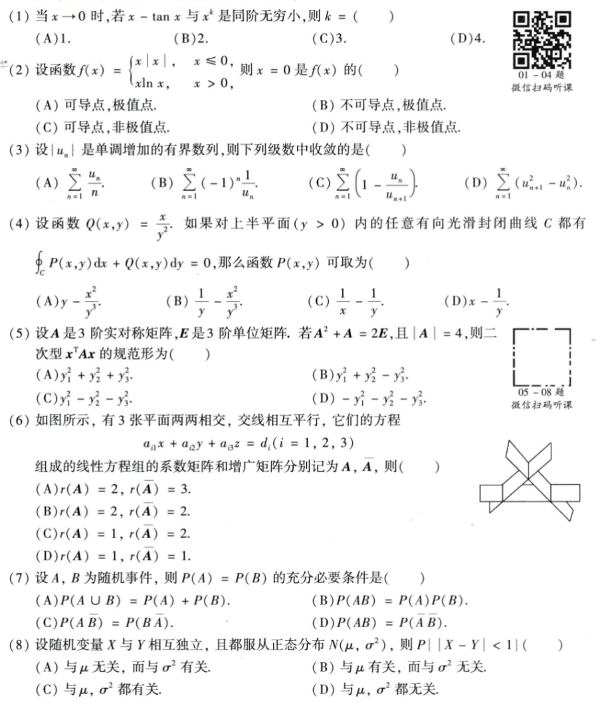
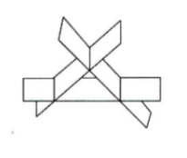
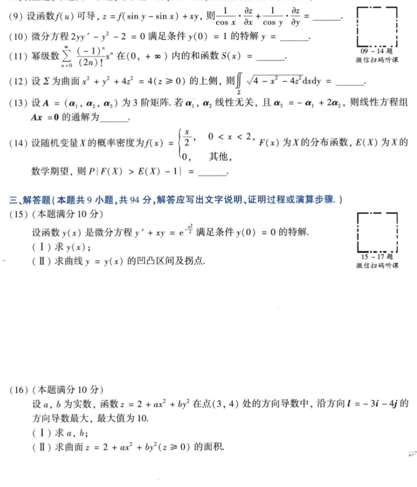
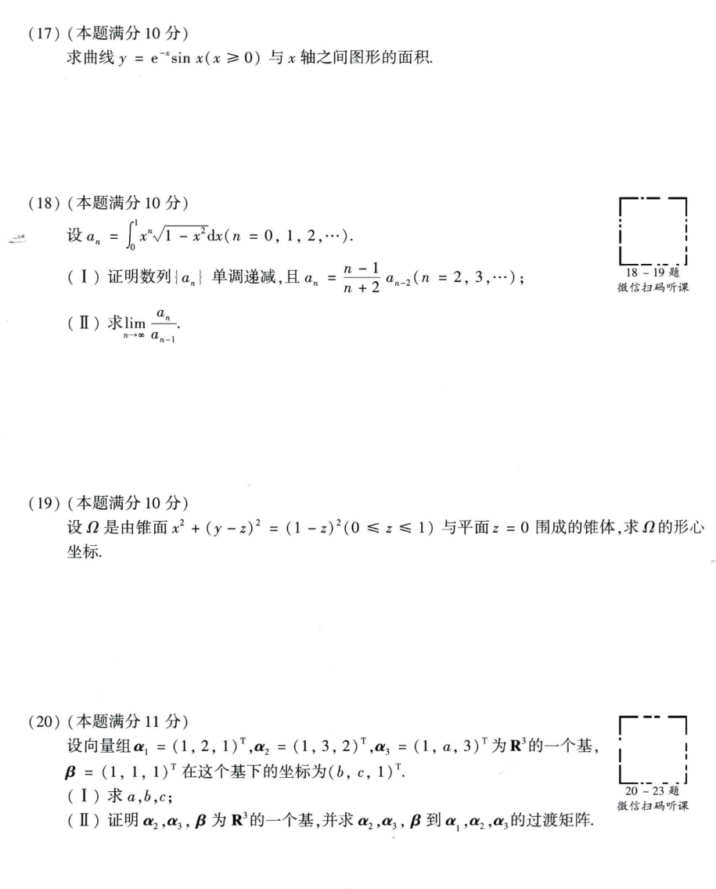
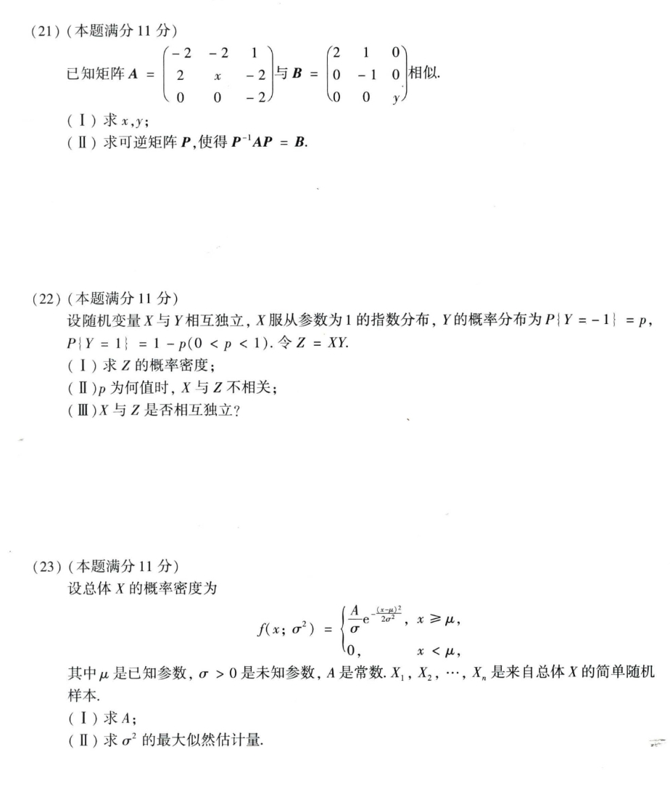

# Math 1 2019 Exam Questions

资料类型：考研数学一历年真题  
年份：2019  
科目：数学一  
整理状态：待复核  

说明：本文件根据用户提供的 2019 年真题截图整理。截图已保存到 `images/` 目录；第 6 题另有单独配图。

## 2019 数一 选择题 1-8

截图：



### 第 1 题

- 题型：选择题
- 题号：1
- 分值：4
- 模块：高数
- 考点：极限、导数、积分、级数、微分方程
- 校对状态：根据截图整理

当 `x->0` 时，若 `x-tan x` 与 `x^k` 是同阶无穷小，则 `k=（ ）`

选项：A. `1`  B. `2`  C. `3`  D. `4`

### 第 2 题

- 题型：选择题
- 题号：2
- 分值：4
- 模块：高数
- 考点：极限、导数、积分、级数、微分方程
- 校对状态：根据截图整理

设函数

```text
f(x) = {
  x|x|,  x <= 0,
  x ln x, x > 0
}
```

则 `x=0` 是 `f(x)` 的（ ）

选项：

A. 可导点，极值点。  
B. 不可导点，极值点。  
C. 可导点，非极值点。  
D. 不可导点，非极值点。

### 第 3 题

- 题型：选择题
- 题号：3
- 分值：4
- 模块：高数
- 考点：极限、导数、积分、级数、微分方程
- 校对状态：根据截图整理

设 `{u_n}` 是单调增加的有界数列，则下列级数中收敛的是（ ）

选项：

A. `sum_{n=1}^∞ u_n/n`  
B. `sum_{n=1}^∞ (-1)^n 1/u_n`  
C. `sum_{n=1}^∞ (1 - u_n/u_{n+1})`  
D. `sum_{n=1}^∞ (u_{n+1}^2 - u_n^2)`

### 第 4 题

- 题型：选择题
- 题号：4
- 分值：4
- 模块：高数
- 考点：极限、导数、积分、级数、微分方程
- 校对状态：根据截图整理

设函数 `Q(x,y)=x/y^2`。如果对上半平面 `(y>0)` 内的任意有向光滑封闭曲线 `C` 都有

```text
∮_C P(x,y) dx + Q(x,y) dy = 0
```

那么函数 `P(x,y)` 可取为（ ）

选项：

A. `y - x^2/y^3`  
B. `1/y - x^2/y^3`  
C. `1/x - 1/y`  
D. `x - 1/y`

### 第 5 题

- 题型：选择题
- 题号：5
- 分值：4
- 模块：线代
- 考点：矩阵、向量组、二次型
- 校对状态：根据截图整理

设 `A` 是 3 阶实对称矩阵，`E` 是 3 阶单位矩阵。若 `A^2+A=2E`，且 `|A|=4`，则二次型 `x^T A x` 的规范形为（ ）

选项：

A. `y_1^2+y_2^2+y_3^2`  
B. `y_1^2+y_2^2-y_3^2`  
C. `y_1^2-y_2^2-y_3^2`  
D. `-y_1^2-y_2^2-y_3^2`

### 第 6 题

- 题型：选择题
- 题号：6
- 分值：4
- 模块：线代
- 考点：矩阵、向量组、二次型
- 校对状态：根据截图整理

如图所示，有 3 张平面两两相交，交线相互平行，它们的方程

```text
a_i1 x + a_i2 y + a_i3 z = d_i,  i=1,2,3
```

组成的线性方程组的系数矩阵和增广矩阵分别记为 `A, A_bar`，则（ ）

第 6 题配图：



选项：

A. `r(A)=2, r(A_bar)=3`  
B. `r(A)=2, r(A_bar)=2`  
C. `r(A)=1, r(A_bar)=2`  
D. `r(A)=1, r(A_bar)=1`

### 第 7 题

- 题型：选择题
- 题号：7
- 分值：4
- 模块：概率统计
- 考点：随机变量、概率分布、参数估计
- 校对状态：根据截图整理

设 `A,B` 为随机事件，则 `P(A)=P(B)` 的充分必要条件是（ ）

选项：

A. `P(A union B)=P(A)+P(B)`  
B. `P(AB)=P(A)P(B)`  
C. `P(A B_bar)=P(B A_bar)`  
D. `P(AB)=P(A_bar B_bar)`

### 第 8 题

- 题型：选择题
- 题号：8
- 分值：4
- 模块：概率统计
- 考点：随机变量、概率分布、参数估计
- 校对状态：根据截图整理

设随机变量 `X` 与 `Y` 相互独立，且都服从正态分布 `N(mu,sigma^2)`，则 `P{|X-Y|<1}`（ ）

选项：

A. 与 `mu` 无关，而与 `sigma^2` 有关。  
B. 与 `mu` 有关，而与 `sigma^2` 无关。  
C. 与 `mu,sigma^2` 都有关。  
D. 与 `mu,sigma^2` 都无关。

## 2019 数一 填空题 9-14 与解答题 15-16

截图：



### 第 9 题

- 题型：填空题
- 题号：9
- 分值：4
- 模块：高数
- 考点：极限、导数、积分、级数、微分方程
- 校对状态：根据截图整理

设函数 `f(u)` 可导，`z=f(sin y - sin x)+xy`，则

```text
(1/cos x)(∂z/∂x) + (1/cos y)(∂z/∂y) = ____
```

### 第 10 题

- 题型：填空题
- 题号：10
- 分值：4
- 模块：高数
- 考点：极限、导数、积分、级数、微分方程
- 校对状态：根据截图整理

微分方程 `2yy' - y^2 - 2 = 0` 满足条件 `y(0)=1` 的特解 `y=____`。

### 第 11 题

- 题型：填空题
- 题号：11
- 分值：4
- 模块：高数
- 考点：极限、导数、积分、级数、微分方程
- 校对状态：根据截图整理

幂级数

```text
sum_{n=0}^∞ [(-1)^n/(2n)!] x^n
```

在 `(0,+∞)` 内的和函数 `S(x)=____`。

### 第 12 题

- 题型：填空题
- 题号：12
- 分值：4
- 模块：高数
- 考点：极限、导数、积分、级数、微分方程
- 校对状态：根据截图整理

设 `Sigma` 为曲面 `x^2+y^2+4z^2=4 (z>=0)` 的上侧，则

```text
∬_Sigma sqrt(4 - x^2 - 4z^2) dxdy = ____
```

### 第 13 题

- 题型：填空题
- 题号：13
- 分值：4
- 模块：线代
- 考点：矩阵、向量组、二次型
- 校对状态：根据截图整理

设 `A=(alpha_1,alpha_2,alpha_3)` 为 3 阶矩阵。若 `alpha_1,alpha_2` 线性无关，且 `alpha_3=-alpha_1+2alpha_2`，则线性方程组 `Ax=0` 的通解为 `____`。

### 第 14 题

- 题型：填空题
- 题号：14
- 分值：4
- 模块：概率统计
- 考点：随机变量、概率分布、参数估计
- 校对状态：根据截图整理

设随机变量 `X` 的概率密度为

```text
f(x) = {
  x/2, 0<x<2,
  0,   其他
}
```

`F(x)` 为 `X` 的分布函数，`E(X)` 为 `X` 的数学期望，则 `P{|F(X)>E(X)-1|}=____`。

### 第 15 题

- 题型：解答题
- 题号：15
- 分值：10
- 模块：高数
- 考点：极限、导数、积分、级数、微分方程
- 校对状态：根据截图整理

设函数 `y(x)` 是微分方程

```text
y' + xy = e^(-x^2/2)
```

满足条件 `y(0)=0` 的特解。

1. 求 `y(x)`；
2. 求曲线 `y=y(x)` 的凹凸区间及拐点。

### 第 16 题

- 题型：解答题
- 题号：16
- 分值：10
- 模块：高数
- 考点：极限、导数、积分、级数、微分方程
- 校对状态：根据截图整理

设 `a,b` 为实数，函数 `z=2+a x^2+b y^2` 在点 `(3,4)` 处的方向导数中，沿方向 `l=-3i-4j` 的方向导数最大，最大值为 `10`。

1. 求 `a,b`；
2. 求曲面 `z=2+a x^2+b y^2 (z>=0)` 的面积。

## 2019 数一 解答题 17-20

截图：



### 第 17 题

- 题型：解答题
- 题号：17
- 分值：10
- 模块：高数
- 考点：极限、导数、积分、级数、微分方程
- 校对状态：根据截图整理

求曲线 `y=e^(-x) sin x (x>=0)` 与 `x` 轴之间图形的面积。

### 第 18 题

- 题型：解答题
- 题号：18
- 分值：10
- 模块：高数
- 考点：极限、导数、积分、级数、微分方程
- 校对状态：根据截图整理

设

```text
a_n = ∫_0^1 x^n sqrt(1-x^2) dx  (n=0,1,2,...)
```

1. 证明数列 `{a_n}` 单调递减，且 `a_n = ((n-1)/(n+2)) a_{n-2} (n=2,3,...)`；
2. 求 `lim_{n->∞} a_n/a_{n-1}`。

### 第 19 题

- 题型：解答题
- 题号：19
- 分值：10
- 模块：高数
- 考点：极限、导数、积分、级数、微分方程
- 校对状态：根据截图整理

设 `Omega` 是由锥面

```text
x^2 + (y-z)^2 = (1-z)^2, 0<=z<=1
```

与平面 `z=0` 围成的锥体，求 `Omega` 的形心坐标。

### 第 20 题

- 题型：解答题
- 题号：20
- 分值：11
- 模块：线代
- 考点：矩阵、向量组、二次型
- 校对状态：根据截图整理

设向量组

```text
alpha_1=(1,2,1)^T,
alpha_2=(1,3,2)^T,
alpha_3=(1,a,3)^T
```

为 `R^3` 的一个基，`beta=(1,1,1)^T` 在这个基下的坐标为 `(b,c,1)^T`。

1. 求 `a,b,c`；
2. 证明 `alpha_2,alpha_3,beta` 为 `R^3` 的一个基，并求 `alpha_2,alpha_3,beta` 到 `alpha_1,alpha_2,alpha_3` 的过渡矩阵。

## 2019 数一 解答题 21-23

截图：



### 第 21 题

- 题型：解答题
- 题号：21
- 分值：11
- 模块：线代
- 考点：矩阵、向量组、二次型
- 校对状态：根据截图整理

已知矩阵

```text
A = [-2 -2  1
      2  x -2
      0  0 -2]
B = [2  1 0
     0 -1 0
     0  0 y]
```

相似。

1. 求 `x,y`；
2. 求可逆矩阵 `P`，使得 `P^(-1)AP=B`。

### 第 22 题

- 题型：解答题
- 题号：22
- 分值：11
- 模块：概率统计
- 考点：随机变量、概率分布、参数估计
- 校对状态：根据截图整理

设随机变量 `X` 与 `Y` 相互独立，`X` 服从参数为 1 的指数分布，`Y` 的概率分布为 `P{Y=-1}=p, P{Y=1}=1-p (0<p<1)`。令 `Z=XY`。

1. 求 `Z` 的概率密度；
2. `p` 为何值时，`X` 与 `Z` 不相关；
3. `X` 与 `Z` 是否相互独立？

### 第 23 题

- 题型：解答题
- 题号：23
- 分值：11
- 模块：概率统计
- 考点：随机变量、概率分布、参数估计
- 校对状态：根据截图整理

设总体 `X` 的概率密度为

```text
f(x;sigma^2) = {
  A/sigma * exp(-(x-mu)^2/(2sigma^2)), x >= mu,
  0,                                   x < mu,
}
```

其中 `mu` 是已知参数，`sigma>0` 是未知参数，`A` 是常数，`X_1,X_2,...,X_n` 是来自总体 `X` 的简单随机样本。

1. 求 `A`；
2. 求 `sigma^2` 的最大似然估计量。
