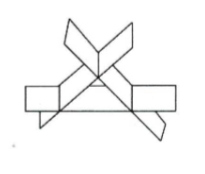

# 2019 数学一第 6 题

## 题目

如图所示，有 3 张平面两两相交，交线相互平行，它们的方程

$$
a_i1 x + a_i2 y + a_i3 z = d_i,  i=1,2,3
$$

组成的线性方程组的系数矩阵和增广矩阵分别记为 `A, A_bar`，则（ ）

第 6 题配图：

选项：

A. `r(A)=2, r(A_bar)=3`
B. `r(A)=2, r(A_bar)=2`
C. `r(A)=1, r(A_bar)=2`
D. `r(A)=1, r(A_bar)=1`

## 标准答案

A

## 解析

三张平面没有公共交线，说明非齐次方程组 $Ax=b$ 无解，因此

$$
r(A)<r(\overline{A}),
$$

可排除 B、D。又因为三平面两两相交且交线互相平行，所以齐次方程组 $Ax=0$ 只有一个线性无关解，从而

$$
r(A)=2.
$$

故选 A。

## 来源

- 题目来源：`math1_2019_questions.md`
- 答案来源：`math1_2019_answers.md`
