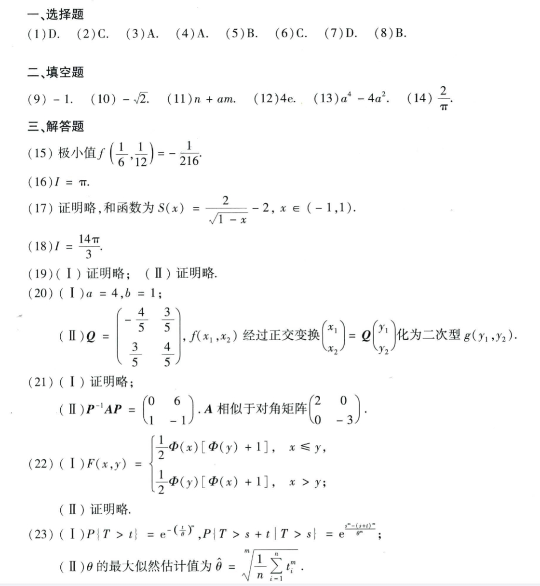

# Math 1 2020 Answers

资料类型：考研数学一答案速查  
年份：2020  
科目：数学一  
来源：本地答案速查图片 OCR/人工转写  
校对状态：待复核  

原图：

## 选择题

| 题号 | 答案 |
|---|---|
| 1 | D |
| 2 | C |
| 3 | A |
| 4 | A |
| 5 | B |
| 6 | C |
| 7 | D |
| 8 | B |

## 填空题

| 题号 | 答案 |
|---|---|
| 9 | `-1` |
| 10 | `-sqrt(2)` |
| 11 | `n+am` |
| 12 | `4e` |
| 13 | `a^4-4a^2` |
| 14 | `2/π` |

## 解答题

| 题号 | 答案速查 |
|---|---|
| 15 | 极小值 `f(1/6,1/12)=-1/216` |
| 16 | `I=π` |
| 17 | （1）证明略；（2）和函数 `S(x)=2/sqrt(1-x)-2, x in (-1,1)` |
| 18 | `I=14π/3` |
| 19 | 证明略 |
| 20 | （1）`a=4,b=1`；（2）`Q=[-4/5,3/5;3/5,4/5]` |
| 21 | （1）`P^(-1)AP=[0,6;1,-1]`；（2）`A` 相似于对角矩阵 `diag(2,-3)` |
| 22 | （1）`F(x,y)=1/2 Phi(x)[Phi(y)+1] (x<=y)`，`F(x,y)=1/2 Phi(y)[Phi(x)+1] (x>y)`；（2）证明略 |
| 23 | （1）`P{T>t}=e^{-(t/theta)^m}`；（2）`P{T>s+t|T>s}=exp((s^m-(s+t)^m)/theta^m)`；（3）`theta_hat=(1/n sum t_i^m)^(1/m)` |
