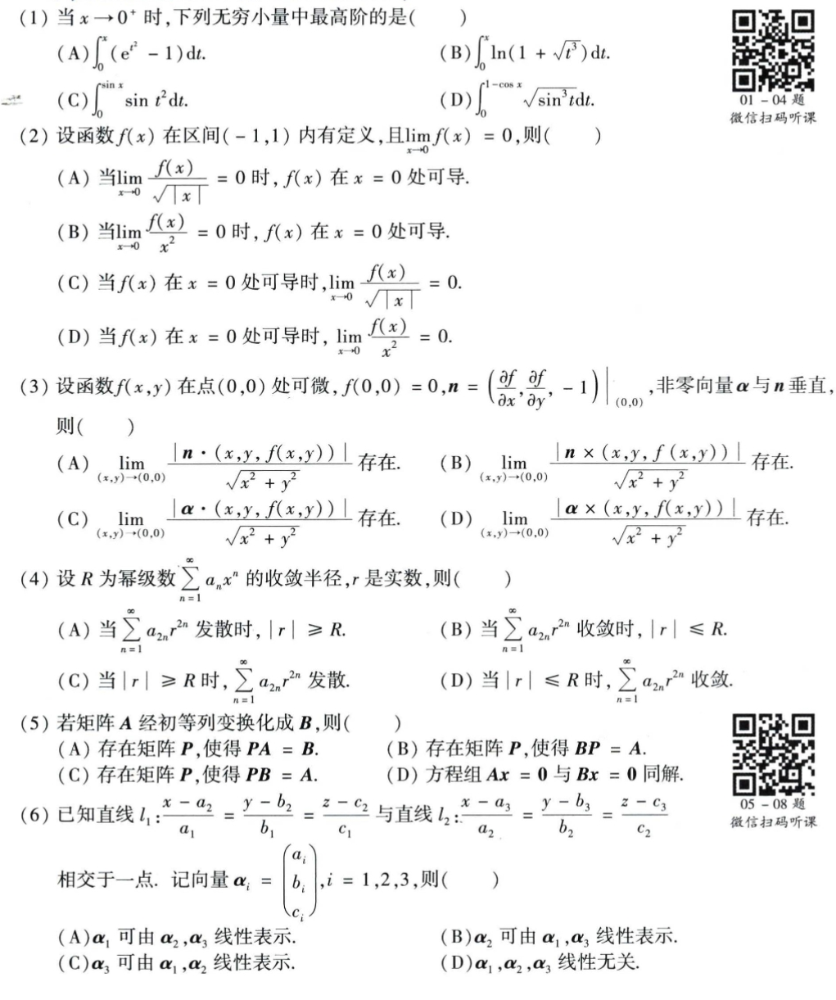
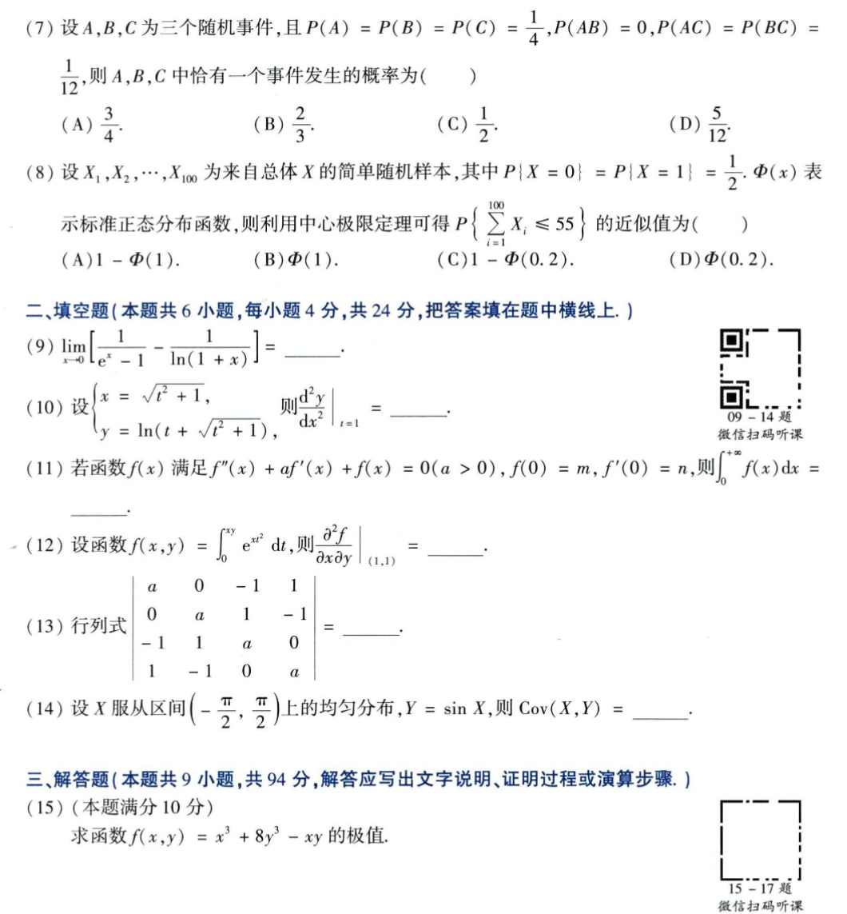
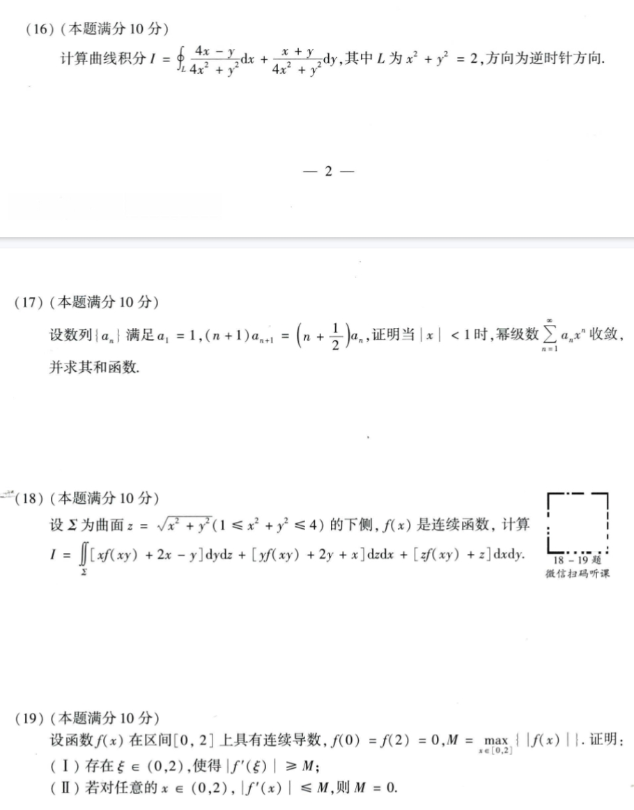
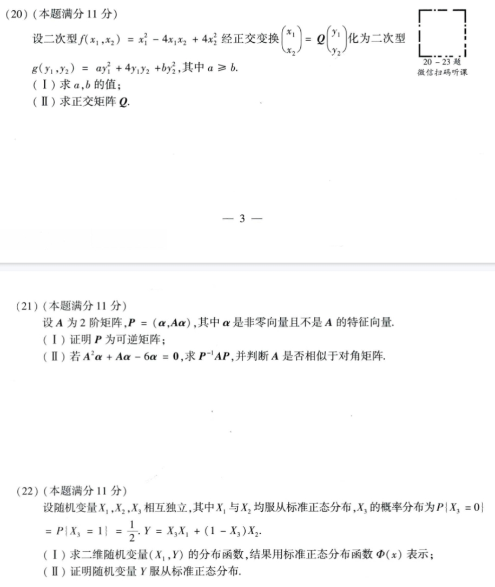
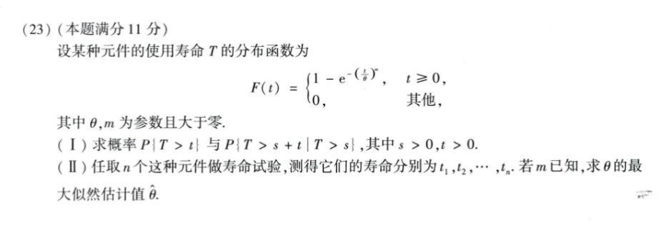

# Math 1 2020 Exam Questions

资料类型：考研数学一历年真题  
年份：2020  
科目：数学一  
整理状态：待复核  

说明：本文件根据用户提供的 2020 年真题截图整理。截图已保存到 `images/` 目录。

## 2020 数一 选择题 1-6

截图：



### 第 1 题

- 题型：选择题
- 题号：1
- 分值：4
- 模块：高数
- 考点：极限、导数、积分、级数、微分方程
- 校对状态：根据截图整理

当 `x->0+` 时，下列无穷小量中最高阶的是（ ）

选项：

A. `∫_0^x (e^(t^2)-1) dt`  
B. `∫_0^x ln(1+sqrt(t^3)) dt`  
C. `∫_0^(sin x) sin(t^2) dt`  
D. `∫_0^(1-cos x) sqrt(sin^3 t) dt`

### 第 2 题

- 题型：选择题
- 题号：2
- 分值：4
- 模块：高数
- 考点：极限、导数、积分、级数、微分方程
- 校对状态：根据截图整理

设函数 `f(x)` 在区间 `(-1,1)` 内有定义，且 `lim_{x->0} f(x)=0`，则（ ）

选项：

A. 当 `lim_{x->0} f(x)/sqrt(|x|)=0` 时，`f(x)` 在 `x=0` 处可导。  
B. 当 `lim_{x->0} f(x)/x^2=0` 时，`f(x)` 在 `x=0` 处可导。  
C. 当 `f(x)` 在 `x=0` 处可导时，`lim_{x->0} f(x)/sqrt(|x|)=0`。  
D. 当 `f(x)` 在 `x=0` 处可导时，`lim_{x->0} f(x)/x^2=0`。

### 第 3 题

- 题型：选择题
- 题号：3
- 分值：4
- 模块：高数
- 考点：极限、导数、积分、级数、微分方程
- 校对状态：根据截图整理

设函数 `f(x,y)` 在点 `(0,0)` 处可微，`f(0,0)=0`，

```text
n = (∂f/∂x, ∂f/∂y, -1)|_(0,0)
```

非零向量 `alpha` 与 `n` 垂直，则（ ）

选项：

A. `lim_{(x,y)->(0,0)} |n·(x,y,f(x,y))|/sqrt(x^2+y^2)` 存在。  
B. `lim_{(x,y)->(0,0)} |n×(x,y,f(x,y))|/sqrt(x^2+y^2)` 存在。  
C. `lim_{(x,y)->(0,0)} |alpha·(x,y,f(x,y))|/sqrt(x^2+y^2)` 存在。  
D. `lim_{(x,y)->(0,0)} |alpha×(x,y,f(x,y))|/sqrt(x^2+y^2)` 存在。

### 第 4 题

- 题型：选择题
- 题号：4
- 分值：4
- 模块：高数
- 考点：极限、导数、积分、级数、微分方程
- 校对状态：根据截图整理

设 `R` 为幂级数 `sum_{n=1}^∞ a_n x^n` 的收敛半径，`r` 是实数，则（ ）

选项：

A. 当 `sum_{n=1}^∞ a_{2n} r^(2n)` 发散时，`|r|>=R`。  
B. 当 `sum_{n=1}^∞ a_{2n} r^(2n)` 收敛时，`|r|<=R`。  
C. 当 `|r|>=R` 时，`sum_{n=1}^∞ a_{2n} r^(2n)` 发散。  
D. 当 `|r|<=R` 时，`sum_{n=1}^∞ a_{2n} r^(2n)` 收敛。

### 第 5 题

- 题型：选择题
- 题号：5
- 分值：4
- 模块：线代
- 考点：矩阵、向量组、二次型
- 校对状态：根据截图整理

若矩阵 `A` 经初等列变换化成 `B`，则（ ）

选项：

A. 存在矩阵 `P`，使得 `PA=B`。  
B. 存在矩阵 `P`，使得 `BP=A`。  
C. 存在矩阵 `P`，使得 `PB=A`。  
D. 方程组 `Ax=0` 与 `Bx=0` 同解。

### 第 6 题

- 题型：选择题
- 题号：6
- 分值：4
- 模块：线代
- 考点：矩阵、向量组、二次型
- 校对状态：根据截图整理

已知直线

```text
l_1: (x-a_2)/a_1 = (y-b_2)/b_1 = (z-c_2)/c_1
l_2: (x-a_3)/a_2 = (y-b_3)/b_2 = (z-c_3)/c_2
```

相交于一点。记向量

```text
alpha_i = (a_i,b_i,c_i)^T, i=1,2,3
```

则（ ）

选项：

A. `alpha_1` 可由 `alpha_2,alpha_3` 线性表示。  
B. `alpha_2` 可由 `alpha_1,alpha_3` 线性表示。  
C. `alpha_3` 可由 `alpha_1,alpha_2` 线性表示。  
D. `alpha_1,alpha_2,alpha_3` 线性无关。

## 2020 数一 选择题 7-8 与填空题 9-14 与解答题 15

截图：



### 第 7 题

- 题型：选择题
- 题号：7
- 分值：4
- 模块：概率统计
- 考点：随机变量、概率分布、参数估计
- 校对状态：根据截图整理

设 `A,B,C` 为三个随机事件，且

```text
P(A)=P(B)=P(C)=1/4,
P(AB)=0,
P(AC)=P(BC)=1/12
```

则 `A,B,C` 中恰有一个事件发生的概率为（ ）

选项：A. `3/4`  B. `2/3`  C. `1/2`  D. `5/12`

### 第 8 题

- 题型：选择题
- 题号：8
- 分值：4
- 模块：概率统计
- 考点：随机变量、概率分布、参数估计
- 校对状态：根据截图整理

设 `X_1,X_2,...,X_100` 为来自总体 `X` 的简单随机样本，其中 `P{X=0}=P{X=1}=1/2`，`Phi(x)` 表示标准正态分布函数，则利用中心极限定理可得

```text
P{sum_{i=1}^{100} X_i <= 55}
```

的近似值为（ ）

选项：

A. `1-Phi(1)`  
B. `Phi(1)`  
C. `1-Phi(0.2)`  
D. `Phi(0.2)`

### 第 9 题

- 题型：填空题
- 题号：9
- 分值：4
- 模块：高数
- 考点：极限、导数、积分、级数、微分方程
- 校对状态：根据截图整理

```text
lim_{x->0} [1/(e^x-1) - 1/ln(1+x)] = ____
```

### 第 10 题

- 题型：填空题
- 题号：10
- 分值：4
- 模块：高数
- 考点：极限、导数、积分、级数、微分方程
- 校对状态：根据截图整理

设

```text
x = sqrt(t^2+1),
y = ln(t + sqrt(t^2+1))
```

则

```text
(d^2y/dx^2)|_(t=1) = ____
```

### 第 11 题

- 题型：填空题
- 题号：11
- 分值：4
- 模块：高数
- 考点：极限、导数、积分、级数、微分方程
- 校对状态：根据截图整理

若函数 `f(x)` 满足

```text
f''(x)+a f'(x)+f(x)=0 (a>0), f(0)=m, f'(0)=n
```

则

```text
∫_0^(+∞) f(x) dx = ____
```

### 第 12 题

- 题型：填空题
- 题号：12
- 分值：4
- 模块：高数
- 考点：极限、导数、积分、级数、微分方程
- 校对状态：根据截图整理

设函数

```text
f(x,y)=∫_0^(xy) e^(x t^2) dt
```

则

```text
(∂²f/∂x∂y)|_(1,1) = ____
```

### 第 13 题

- 题型：填空题
- 题号：13
- 分值：4
- 模块：线代
- 考点：矩阵、向量组、二次型
- 校对状态：根据截图整理

行列式

```text
| a  0 -1  1 |
| 0  a  1 -1 |
|-1  1  a  0 |
| 1 -1  0  a |
```

的值为 `____`。

### 第 14 题

- 题型：填空题
- 题号：14
- 分值：4
- 模块：概率统计
- 考点：随机变量、概率分布、参数估计
- 校对状态：根据截图整理

设 `X` 服从区间 `(-π/2,π/2)` 上的均匀分布，`Y=sin X`，则 `Cov(X,Y)=____`。

### 第 15 题

- 题型：解答题
- 题号：15
- 分值：10
- 模块：高数
- 考点：极限、导数、积分、级数、微分方程
- 校对状态：根据截图整理

求函数

```text
f(x,y)=x^3+8y^3-xy
```

的极值。

## 2020 数一 解答题 16-19

截图：



### 第 16 题

- 题型：解答题
- 题号：16
- 分值：10
- 模块：高数
- 考点：极限、导数、积分、级数、微分方程
- 校对状态：根据截图整理

计算曲线积分

```text
I = ∮_L (4x-y)/(4x^2+y^2) dx + (x+y)/(4x^2+y^2) dy
```

其中 `L` 为 `x^2+y^2=2`，方向为逆时针方向。

### 第 17 题

- 题型：解答题
- 题号：17
- 分值：10
- 模块：高数
- 考点：极限、导数、积分、级数、微分方程
- 校对状态：根据截图整理

设数列 `{a_n}` 满足

```text
a_1=1, (n+1)a_{n+1}=(n+1/2)a_n
```

证明当 `|x|<1` 时，幂级数

```text
sum_{n=1}^∞ a_n x^n
```

收敛，并求其和函数。

### 第 18 题

- 题型：解答题
- 题号：18
- 分值：10
- 模块：高数
- 考点：极限、导数、积分、级数、微分方程
- 校对状态：根据截图整理

设 `Sigma` 为曲面 `z=sqrt(x^2+y^2) (1<=x^2+y^2<=4)` 的下侧，`f(x)` 是连续函数，计算

```text
I = ∬_Sigma [x f(xy)+2x-y] dy dz
  + [y f(xy)+2y+x] dz dx
  + [z f(xy)+z] dx dy
```

### 第 19 题

- 题型：解答题
- 题号：19
- 分值：10
- 模块：高数
- 考点：极限、导数、积分、级数、微分方程
- 校对状态：根据截图整理

设函数 `f(x)` 在区间 `[0,2]` 上具有连续导数，`f(0)=f(2)=0`，`M=max_{x in [0,2]} |f(x)|`。证明：

1. 存在 `xi in (0,2)`，使得 `|f'(xi)|>=M`；
2. 若对任意的 `x in (0,2)`，`|f'(x)|<=M`，则 `M=0`。

## 2020 数一 解答题 20-22

截图：



### 第 20 题

- 题型：解答题
- 题号：20
- 分值：11
- 模块：线代
- 考点：矩阵、向量组、二次型
- 校对状态：根据截图整理

设二次型

```text
f(x_1,x_2)=x_1^2-4x_1x_2+4x_2^2
```

经正交变换

```text
(x_1,x_2)^T = Q (y_1,y_2)^T
```

化为二次型

```text
g(y_1,y_2)=a y_1^2+4y_1y_2+b y_2^2
```

其中 `a>=b`。

1. 求 `a,b` 的值；
2. 求正交矩阵 `Q`。

### 第 21 题

- 题型：解答题
- 题号：21
- 分值：11
- 模块：线代
- 考点：矩阵、向量组、二次型
- 校对状态：根据截图整理

设 `A` 为 2 阶矩阵，`P=(alpha,A alpha)`，其中 `alpha` 是非零向量且不是 `A` 的特征向量。

1. 证明 `P` 为可逆矩阵；
2. 若 `A^2 alpha + A alpha - 6alpha = 0`，求 `P^(-1)AP`，并判断 `A` 是否相似于对角矩阵。

### 第 22 题

- 题型：解答题
- 题号：22
- 分值：11
- 模块：概率统计
- 考点：随机变量、概率分布、参数估计
- 校对状态：根据截图整理

设随机变量 `X_1,X_2,X_3` 相互独立，其中 `X_1` 与 `X_2` 均服从标准正态分布，`X_3` 的概率分布为

```text
P{X_3=0}=P{X_3=1}=1/2
```

令 `Y=X_3 X_1 + (1-X_3)X_2`。

1. 求二维随机变量 `(X_1,Y)` 的分布函数，结果用标准正态分布函数 `Phi(x)` 表示；
2. 证明随机变量 `Y` 服从标准正态分布。

## 2020 数一 解答题 23

截图：



### 第 23 题

- 题型：解答题
- 题号：23
- 分值：11
- 模块：概率统计
- 考点：随机变量、概率分布、参数估计
- 校对状态：根据截图整理

设某种元件的使用寿命 `T` 的分布函数为

```text
F(t) = {
  1 - exp(-(t/theta)^m), t >= 0,
  0,                    其他,
}
```

其中 `theta,m` 为参数且大于零。

1. 求概率 `P{T>t}` 与 `P{T>s+t | T>s}`，其中 `s>0,t>0`；
2. 任取 `n` 个这种元件做寿命试验，测得它们的寿命分别为 `t_1,t_2,...,t_n`。若 `m` 已知，求 `theta` 的最大似然估计值 `hat_theta`。
