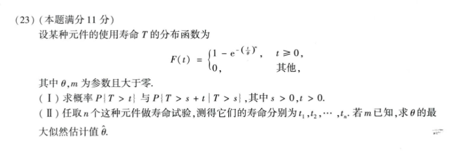

# 2020 数学一第 23 题

## 相关图片

## 题目

设某种元件的使用寿命 `T` 的分布函数为

$$
F(t) = {
  1 - exp(-(t/theta)^m), t >= 0,
  0,                    其他,
}
$$

其中 `theta,m` 为参数且大于零。

1. 求概率 `P{T>t}` 与 `P{T>s+t | T>s}`，其中 `s>0,t>0`；
2. 任取 `n` 个这种元件做寿命试验，测得它们的寿命分别为 `t_1,t_2,...,t_n`。若 `m` 已知，求 `theta` 的最大似然估计值 `hat_theta`。

## 标准答案

(I) $P\{T>t\}=e^{-(t/\theta)^m}$，$P\{T>s+t\mid T>s\}=e^{\frac{s^m-(s+t)^m}{\theta^m}}$；(II) $\hat\theta=\sqrt[m]{\dfrac{1}{n}\sum_{i=1}^n t_i^m}$

## 解析

由分布函数

$$
F(t)=
\begin{cases}
1-e^{-(t/\theta)^m}, & t\ge 0,\\
0, & t<0
\end{cases}
$$

知

$$
P(T>t)=1-F(t)=e^{-(t/\theta)^m}\quad (t>0).
$$

于是

$$
P(T>s+t\mid T>s)
=\frac{P(T>s+t)}{P(T>s)}
=e^{-\frac{(s+t)^m}{\theta^m}+\frac{s^m}{\theta^m}}
=e^{\frac{s^m-(s+t)^m}{\theta^m}}.
$$

再求极大似然估计。密度函数为

$$
f(t)=F'(t)=
\begin{cases}
\dfrac{m}{\theta}\left(\dfrac{t}{\theta}\right)^{m-1}e^{-(t/\theta)^m}, & t\ge 0,\\
0, & t<0.
\end{cases}
$$

对样本 $t_1,\dots,t_n$，

$$
L(\theta)=\prod_{i=1}^n f(t_i)
=m^n\prod_{i=1}^n t_i^{m-1}\cdot \theta^{-mn}
\exp\left(-\sum_{i=1}^n \frac{t_i^m}{\theta^m}\right).
$$

取对数得

$$
\ln L(\theta)
=n\ln m+(m-1)\sum_{i=1}^n \ln t_i-mn\ln\theta-\sum_{i=1}^n \frac{t_i^m}{\theta^m}.
$$

求导并令其为 0：

$$
\frac{d\ln L}{d\theta}
=-\frac{mn}{\theta}+m\sum_{i=1}^n \frac{t_i^m}{\theta^{m+1}}=0.
$$

化简得

$$
\theta^m=\frac{1}{n}\sum_{i=1}^n t_i^m.
$$

故

$$
\hat\theta=\sqrt[m]{\frac{1}{n}\sum_{i=1}^n t_i^m}.
$$

## 来源

- 题目来源：`math1_2020_questions.md`
- 答案来源：`math1_2020_answers.md`
