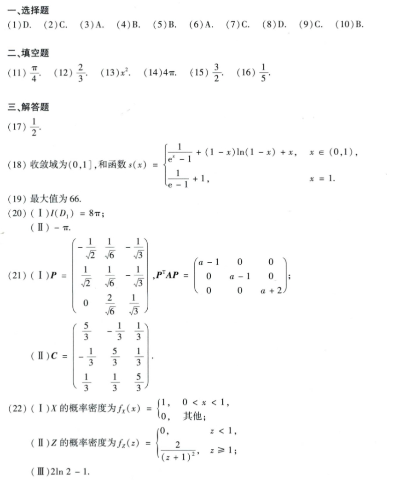

# Math 1 2021 Answers

资料类型：考研数学一答案速查  
年份：2021  
科目：数学一  
来源：本地答案速查图片 OCR/人工转写  
校对状态：待复核  

原图：

## 选择题

| 题号 | 答案 |
|---|---|
| 1 | D |
| 2 | C |
| 3 | A |
| 4 | B |
| 5 | B |
| 6 | A |
| 7 | C |
| 8 | D |
| 9 | C |
| 10 | B |

## 填空题

| 题号 | 答案 |
|---|---|
| 11 | `π/4` |
| 12 | `2/3` |
| 13 | `x^2` |
| 14 | `4π` |
| 15 | `3/2` |
| 16 | `1/5` |

## 解答题

| 题号 | 答案速查 |
|---|---|
| 17 | `1/2` |
| 18 | （1）收敛域 `(0,1]`；（2）和函数 `s(x)=1/(e^x-1)+(1-x)ln(1-x)+x (0<x<1)`，`s(1)=1/(e-1)+1` |
| 19 | 最大值 `66` |
| 20 | （1）`I(D_1)=8π`；（2）`-π` |
| 21 | （1）`P=[-1/sqrt(2), 1/sqrt(6), -1/sqrt(3); 1/sqrt(2), 1/sqrt(6), -1/sqrt(3); 0, 2/sqrt(6), 1/sqrt(3)]`，`P^TAP=diag(a-1,a-1,a+2)`；（2）`C=[5/3,-1/3,1/3; -1/3,5/3,1/3; 1/3,1/3,5/3]` |
| 22 | （1）`f_X(x)=1 (0<x<1)`；（2）`f_Z(z)=0(z<1), 2/(z+1)^2(z>=1)`；（3）`2ln2-1` |
