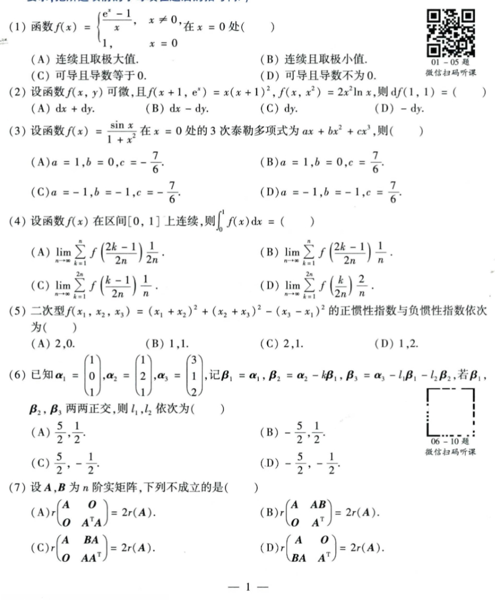
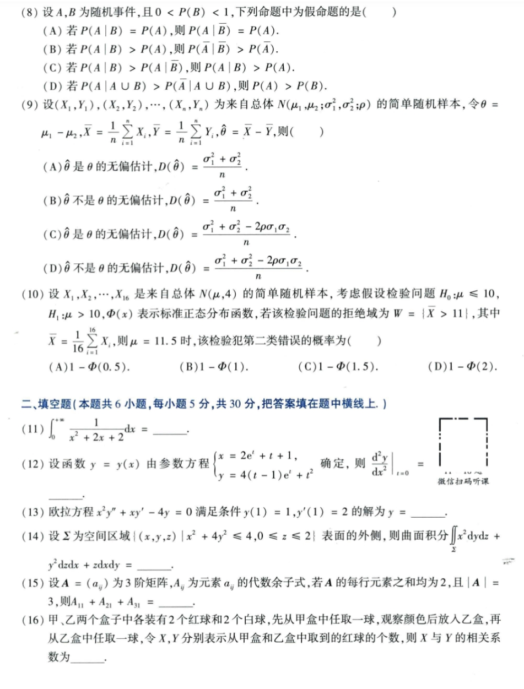
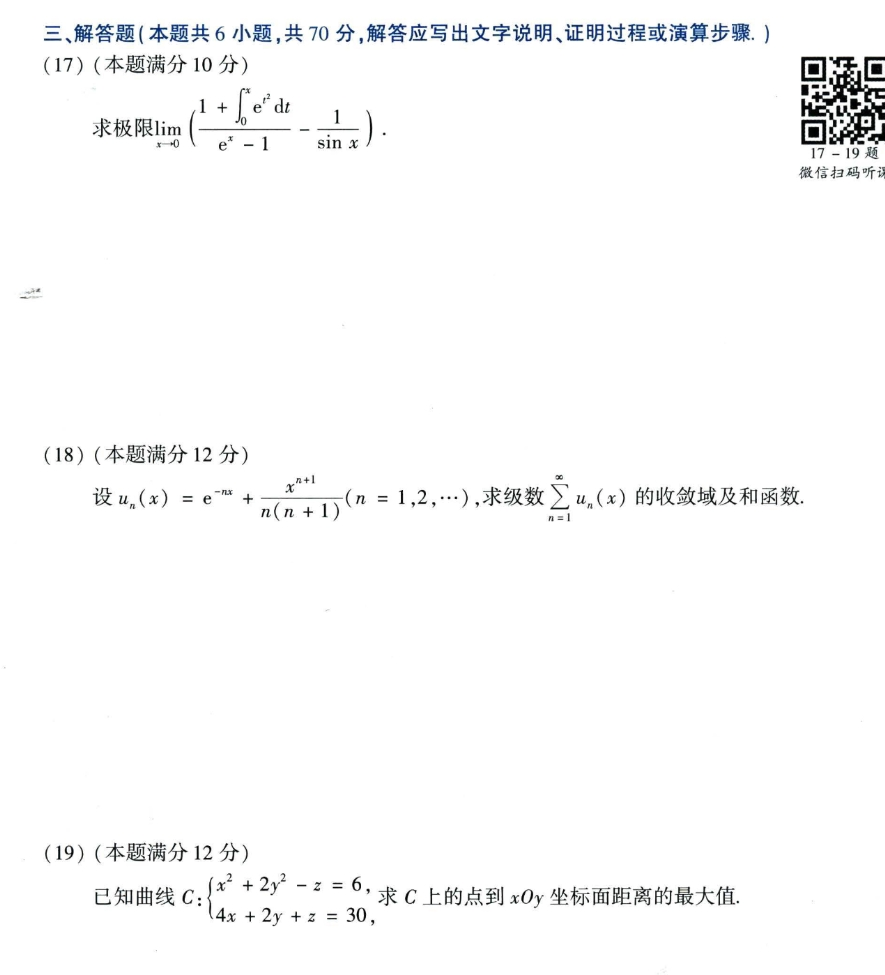
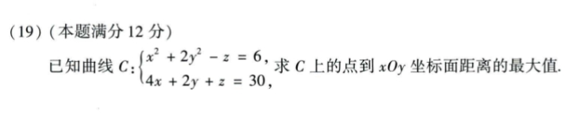
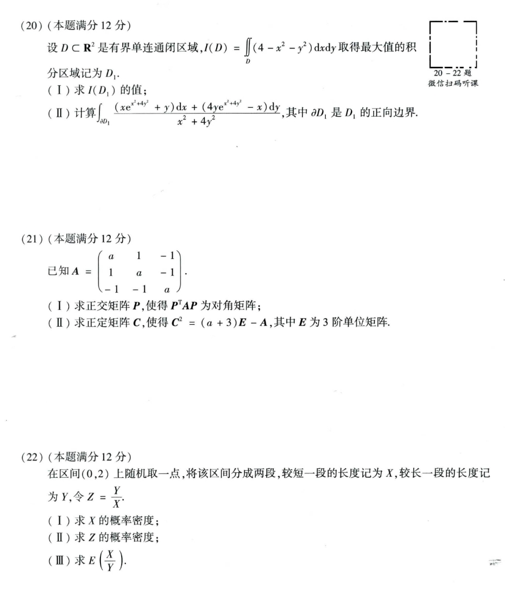

# Math 1 2021 Exam Questions

资料类型：考研数学一历年真题  
年份：2021  
科目：数学一  
整理状态：待复核  

说明：本文件根据用户提供的 2021 年真题截图整理。截图已保存到 `images/` 目录；第 19 题已根据补充截图更新。

## 2021 数一 选择题 1-7

截图：



### 第 1 题

- 题型：选择题
- 题号：1
- 分值：5
- 模块：高数
- 考点：极限、导数、积分、级数、微分方程
- 校对状态：根据截图整理

函数

```text
f(x) = {
  (e^x - 1)/x, x != 0,
  1,           x = 0
}
```

在 `x=0` 处（ ）

选项：A. 连续且取极大值。 B. 连续且取极小值。 C. 可导且导数等于 0。 D. 可导且导数不为 0。

### 第 2 题

- 题型：选择题
- 题号：2
- 分值：5
- 模块：高数
- 考点：极限、导数、积分、级数、微分方程
- 校对状态：根据截图整理

设函数 `f(x,y)` 可微，且 `f(x+1,e^x)=x(x+1)^2, f(x,x^2)=2x^2 ln x`，则 `df(1,1)=（ ）`

选项：A. `dx+dy`  B. `dx-dy`  C. `dy`  D. `-dy`

### 第 3 题

- 题型：选择题
- 题号：3
- 分值：5
- 模块：高数
- 考点：极限、导数、积分、级数、微分方程
- 校对状态：根据截图整理

设函数 `f(x)=sin x/(1+x^2)` 在 `x=0` 处的 3 次泰勒多项式为 `ax+bx^2+cx^3`，则（ ）

选项：

A. `a=1,b=0,c=-7/6`  
B. `a=1,b=0,c=7/6`  
C. `a=-1,b=-1,c=-7/6`  
D. `a=-1,b=-1,c=7/6`

### 第 4 题

- 题型：选择题
- 题号：4
- 分值：5
- 模块：高数
- 考点：极限、导数、积分、级数、微分方程
- 校对状态：根据截图整理

设函数 `f(x)` 在区间 `[0,1]` 上连续，则 `∫_0^1 f(x)dx =（ ）`

选项：

A. `lim_{n->∞} sum_{k=1}^n f((2k-1)/(2n)) * 1/(2n)`  
B. `lim_{n->∞} sum_{k=1}^n f((2k-1)/(2n)) * 1/n`  
C. `lim_{n->∞} sum_{k=1}^{2n} f((k-1)/(2n)) * 1/n`  
D. `lim_{n->∞} sum_{k=1}^{2n} f(k/(2n)) * 2/n`

### 第 5 题

- 题型：选择题
- 题号：5
- 分值：5
- 模块：线代
- 考点：矩阵、向量组、二次型
- 校对状态：根据截图整理

二次型

```text
f(x_1,x_2,x_3)=(x_1+x_2)^2+(x_2+x_3)^2-(x_3-x_1)^2
```

的正惯性指数与负惯性指数依次为（ ）

选项：A. `2,0`  B. `1,1`  C. `2,1`  D. `1,2`

### 第 6 题

- 题型：选择题
- 题号：6
- 分值：5
- 模块：线代
- 考点：矩阵、向量组、二次型
- 校对状态：根据截图整理

已知

```text
alpha_1=(1,0,1)^T, alpha_2=(1,2,1)^T, alpha_3=(3,1,2)^T
```

记 `beta_1=alpha_1, beta_2=alpha_2-k beta_1, beta_3=alpha_3-l_1 beta_1-l_2 beta_2`。若 `beta_1,beta_2,beta_3` 两两正交，则 `l_1,l_2` 依次为（ ）

选项：A. `5/2, 1/2`  B. `-5/2, 1/2`  C. `5/2, -1/2`  D. `-5/2, -1/2`

### 第 7 题

- 题型：选择题
- 题号：7
- 分值：5
- 模块：线代
- 考点：矩阵、向量组、二次型
- 校对状态：根据截图整理

设 `A,B` 为 `n` 阶实矩阵，下列不成立的是（ ）

选项：

A. `r([A O; O (A^T A)]) = 2r(A)`  
B. `r([A AB; O A^T]) = 2r(A)`  
C. `r([A BA; O AA^T]) = 2r(A)`  
D. `r([A O; BA A^T]) = 2r(A)`

## 2021 数一 选择题 8-10 与填空题 11-16

截图：



### 第 8 题

- 题型：选择题
- 题号：8
- 分值：5
- 模块：概率统计
- 考点：随机变量、概率分布、参数估计
- 校对状态：根据截图整理

设 `A,B` 为随机事件，且 `0<P(B)<1`，下列命题中为假命题的是（ ）

选项：

A. 若 `P(A|B)=P(A)`，则 `P(A|B_bar)=P(A)`。  
B. 若 `P(A|B)>P(A)`，则 `P(A_bar|B_bar)>P(A_bar)`。  
C. 若 `P(A|B)>P(A|B_bar)`，则 `P(A|B)>P(A)`。  
D. 若 `P(A|A union B)>P(A_bar|A union B)`，则 `P(A)>P(B)`。

### 第 9 题

- 题型：选择题
- 题号：9
- 分值：5
- 模块：概率统计
- 考点：随机变量、概率分布、参数估计
- 校对状态：根据截图整理

设 `(X_1,Y_1),...,(X_n,Y_n)` 为来自总体 `N(mu_1,mu_2;sigma_1^2,sigma_2^2;rho)` 的简单随机样本。令 `theta=mu_1-mu_2, X_bar=(1/n)sum X_i, Y_bar=(1/n)sum Y_i, theta_hat=X_bar-Y_bar`，则（ ）

选项：

A. `theta_hat` 是 `theta` 的无偏估计，`D(theta_hat)=(sigma_1^2+sigma_2^2)/n`。  
B. `theta_hat` 不是 `theta` 的无偏估计，`D(theta_hat)=(sigma_1^2+sigma_2^2)/n`。  
C. `theta_hat` 是 `theta` 的无偏估计，`D(theta_hat)=(sigma_1^2+sigma_2^2-2rho sigma_1 sigma_2)/n`。  
D. `theta_hat` 不是 `theta` 的无偏估计，`D(theta_hat)=(sigma_1^2+sigma_2^2-2rho sigma_1 sigma_2)/n`。

### 第 10 题

- 题型：选择题
- 题号：10
- 分值：5
- 模块：概率统计
- 考点：随机变量、概率分布、参数估计
- 校对状态：根据截图整理

设 `X_1,...,X_16` 是来自总体 `N(mu,4)` 的简单随机样本，检验 `H_0:mu<=10, H_1:mu>10`。若拒绝域为 `W={X_bar>11}`，则 `mu=11.5` 时，该检验犯第二类错误的概率为（ ）

其中 `X_bar=(1/16)sum_{i=1}^{16}X_i`。

选项：A. `1-Phi(0.5)`  B. `1-Phi(1)`  C. `1-Phi(1.5)`  D. `1-Phi(2)`

### 第 11 题

- 题型：填空题
- 题号：11
- 分值：5
- 模块：高数
- 考点：极限、导数、积分、级数、微分方程
- 校对状态：根据截图整理

```text
∫_0^(+∞) 1/(x^2+2x+2) dx = ____
```

### 第 12 题

- 题型：填空题
- 题号：12
- 分值：5
- 模块：高数
- 考点：极限、导数、积分、级数、微分方程
- 校对状态：根据截图整理

设函数 `y=y(x)` 由参数方程

```text
x = 2e^t + t + 1,
y = 4(t-1)e^t + t^2
```

确定，则 `(d²y/dx²)|_(t=0)=____`。

### 第 13 题

- 题型：填空题
- 题号：13
- 分值：5
- 模块：高数
- 考点：极限、导数、积分、级数、微分方程
- 校对状态：根据截图整理

欧拉方程 `x^2 y'' + xy' - 4y = 0` 满足条件 `y(1)=1, y'(1)=2` 的解为 `y=____`。

### 第 14 题

- 题型：填空题
- 题号：14
- 分值：5
- 模块：高数
- 考点：极限、导数、积分、级数、微分方程
- 校对状态：根据截图整理

设 `Sigma` 为空间区域 `{(x,y,z)|x^2+4y^2<=4, 0<=z<=2}` 表面的外侧，则曲面积分

```text
∯_Sigma x^2 dy dz + y^2 dz dx + z dx dy = ____
```

### 第 15 题

- 题型：填空题
- 题号：15
- 分值：5
- 模块：线代
- 考点：矩阵、向量组、二次型
- 校对状态：根据截图整理

设 `A=(a_ij)` 为 3 阶矩阵，`A_ij` 为元素 `a_ij` 的代数余子式。若 `A` 的每行元素之和均为 `2`，且 `|A|=3`，则

```text
A_11 + A_21 + A_31 = ____
```

### 第 16 题

- 题型：填空题
- 题号：16
- 分值：5
- 模块：概率统计
- 考点：随机变量、概率分布、参数估计
- 校对状态：根据截图整理

甲、乙两个盒子中各装有 2 个红球和 2 个白球，先从甲盒中任取一球，观察颜色后放入乙盒，再从乙盒中任取一球。令 `X,Y` 分别表示从甲盒和乙盒中取到的红球个数，则 `X` 与 `Y` 的相关系数为 `____`。

## 2021 数一 解答题 17-19

截图：



### 第 17 题

- 题型：解答题
- 题号：17
- 分值：10
- 模块：高数
- 考点：极限、导数、积分、级数、微分方程
- 校对状态：根据截图整理

求极限

```text
lim_{x->0} ( (1 + ∫_0^x e^(t^2) dt)/(e^x - 1) - 1/sin x )
```

### 第 18 题

- 题型：解答题
- 题号：18
- 分值：12
- 模块：高数
- 考点：极限、导数、积分、级数、微分方程
- 校对状态：根据截图整理

设

```text
u_n(x)=e^(-nx) + x^(n+1)/(n(n+1))  (n=1,2,...)
```

求级数 `sum_{n=1}^∞ u_n(x)` 的收敛域及和函数。

### 第 19 题

- 题型：解答题
- 题号：19
- 分值：12
- 模块：高数
- 考点：极限、导数、积分、级数、微分方程
- 校对状态：根据截图整理

第 19 题补充截图：



已知曲线 `C`：

```text
x^2 + 2y^2 - z = 6,
4x + 2y + z = 30
```

求 `C` 上的点到 `xOy` 坐标面距离的最大值。

## 2021 数一 解答题 20-22

截图：



### 第 20 题

- 题型：解答题
- 题号：20
- 分值：12
- 模块：高数
- 考点：极限、导数、积分、级数、微分方程
- 校对状态：根据截图整理

设 `D subset R^2` 是有界单连通闭区域，

```text
I(D)=∬_D (4-x^2-y^2) dxdy
```

取得最大值的积分区域记为 `D_1`。

1. 求 `I(D_1)` 的值；
2. 计算

```text
∮_(∂D_1) [(x e^(x^2+4y^2)+y)/(x^2+4y^2)] dx
       + [(4y e^(x^2+4y^2)-x)/(x^2+4y^2)] dy
```

其中 `∂D_1` 是 `D_1` 的正向边界。

### 第 21 题

- 题型：解答题
- 题号：21
- 分值：12
- 模块：线代
- 考点：矩阵、向量组、二次型
- 校对状态：根据截图整理

已知

```text
A = [ a  1 -1
      1  a -1
     -1 -1  a]
```

1. 求正交矩阵 `P`，使得 `P^T A P` 为对角矩阵；
2. 求正定矩阵 `C`，使得 `C^2=(a+3)E-A`，其中 `E` 为 3 阶单位矩阵。

### 第 22 题

- 题型：解答题
- 题号：22
- 分值：12
- 模块：概率统计
- 考点：随机变量、概率分布、参数估计
- 校对状态：根据截图整理

在区间 `(0,2)` 上随机取一点，将该区间分成两段，较短一段的长度记为 `X`，较长一段的长度记为 `Y`，令 `Z=Y/X`。

1. 求 `X` 的概率密度；
2. 求 `Z` 的概率密度；
3. 求 `E(X/Y)`。
