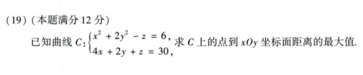

# 2021 数学一第 19 题

## 题目

第 19 题补充截图：

已知曲线 `C`：

$$
x^2 + 2y^2 - z = 6,
4x + 2y + z = 30
$$

求 `C` 上的点到 `xOy` 坐标面距离的最大值。

## 标准答案

最大值为 $66$。

## 解析

由曲线方程
$$
z=x^2+2y^2-6,\qquad z=30-4x-2y
$$
消去 $z$，得
$$
x^2+2y^2+4x+2y-36=0.
$$
配方：
$$
(x+2)^2+2\left(y+\frac{1}{2}\right)^2=\frac{81}{2}.
$$
令
$$
u=x+2,\qquad v=y+\frac{1}{2},
$$
则
$$
z=30-4x-2y=39-4u-2v.
$$
在约束
$$
u^2+2v^2=\frac{81}{2}
$$
下，线性函数 $-4u-2v$ 的最大值为
$$
\sqrt{\frac{81}{2}\left(16+\frac{(-2)^2}{2}\right)}
=\sqrt{\frac{81}{2}\cdot18}
=27.
$$
因此
$$
z_{\max}=39+27=66.
$$
曲线上 $z$ 的最小值为 $39-27=12>0$，所以到 $xOy$ 面距离的最大值就是 $z$ 的最大值，即 $66$。

## 来源

- 题目来源：`math1_2021_questions.md`
- 答案来源：`math1_2021_answers.md`
