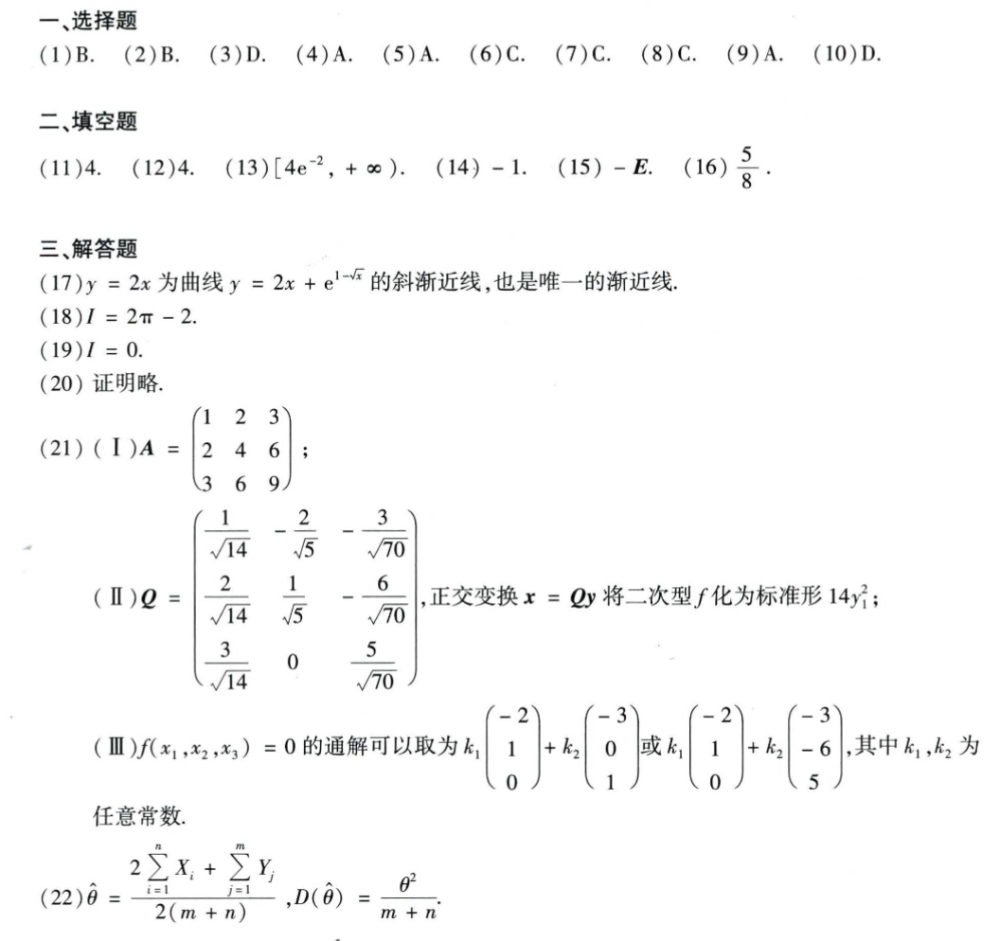

# Math 1 2022 Answers

资料类型：考研数学一答案速查  
年份：2022  
科目：数学一  
来源：本地答案速查图片 OCR/人工转写  
校对状态：待复核  

原图：

## 选择题

| 题号 | 答案 |
|---|---|
| 1 | B |
| 2 | B |
| 3 | D |
| 4 | A |
| 5 | A |
| 6 | C |
| 7 | C |
| 8 | C |
| 9 | A |
| 10 | D |

## 填空题

| 题号 | 答案 |
|---|---|
| 11 | `4` |
| 12 | `4` |
| 13 | `[4e^(-2), +∞)` |
| 14 | `-1` |
| 15 | `-E` |
| 16 | `5/8` |

## 解答题

| 题号 | 答案速查 |
|---|---|
| 17 | 渐近线 `y=2x`是`y=2x+e^(1-sqrt(x))`斜渐近线，也是唯一渐近线 |
| 18 | `I=2π-2` |
| 19 | `I=0` |
| 20 | 证明略 |
| 21 | （1）`A=[1,2,3;2,4,6;3,6,9]`；（2）`Q=[1/sqrt(14), -2/sqrt(5), -3/sqrt(70); 2/sqrt(14), 1/sqrt(5), -6/sqrt(70); 3/sqrt(14), 0, 5/sqrt(70)]`，标准形 `14y_1^2`；（3）`f=0` 的通解可取 `k_1(-2,1,0)^T+k_2(-3,0,1)^T` 或 `k_1(-2,1,0)^T+k_2(-3,-6,5)^T` |
| 22 | （1）`theta_hat=(2sum X_i + sum Y_j)/(2(m+n))`；（2）`D(theta_hat)=theta^2/(m+n)` |
