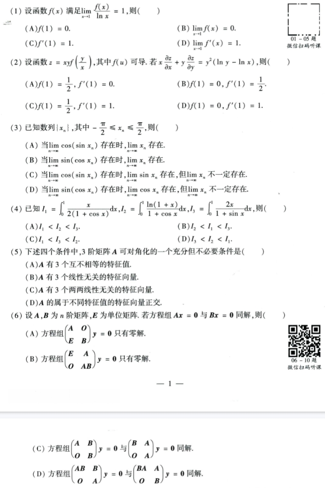
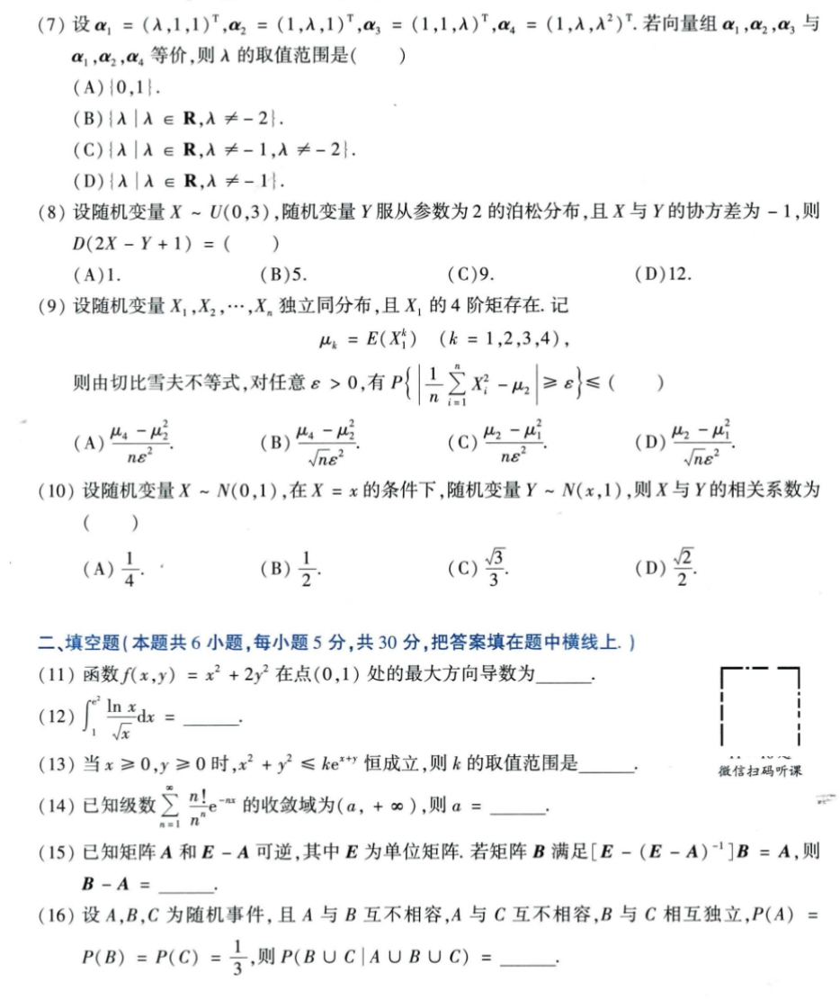
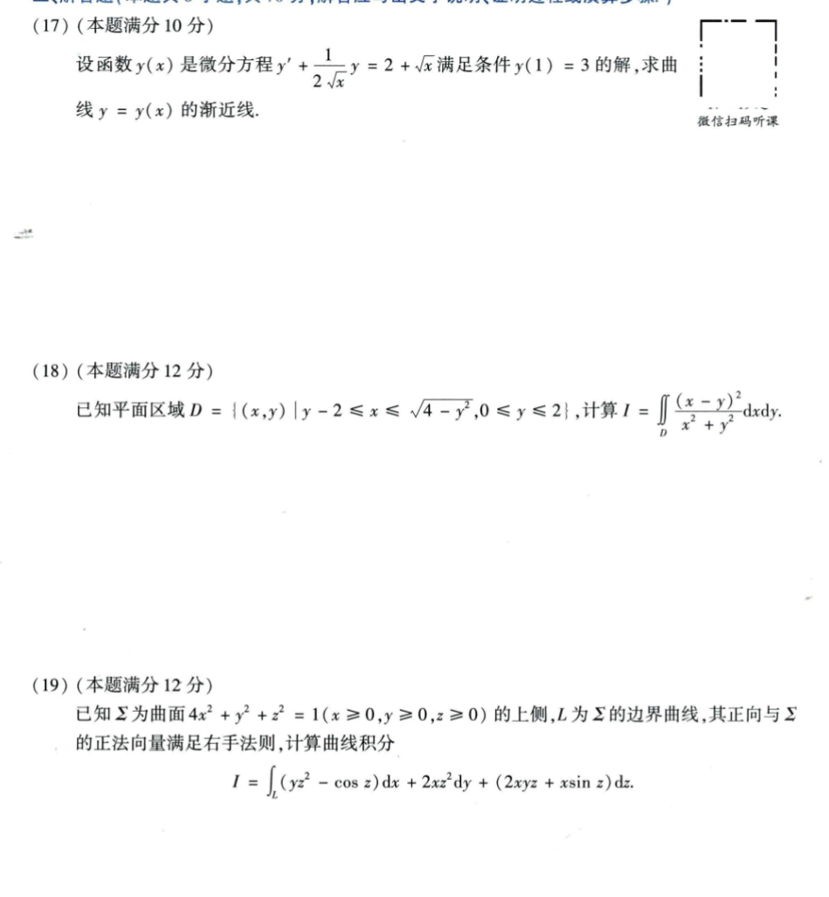
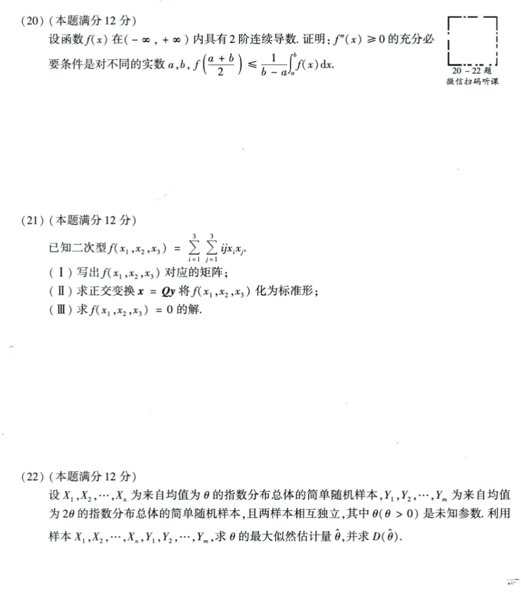

# Math 1 2022 Exam Questions

资料类型：考研数学一历年真题  
年份：2022  
科目：数学一  
整理状态：待复核  

说明：本文件根据用户提供的 2022 年真题截图整理。截图已保存到 `images/` 目录。

## 2022 数一 选择题 1-6

截图：



### 第 1 题

- 题型：选择题
- 题号：1
- 分值：5
- 模块：高数
- 考点：极限、导数、积分、级数、微分方程
- 校对状态：根据截图整理

设函数 `f(x)` 满足 `lim_{x->1} f(x)/ln x = 1`，则（ ）

选项：A. `f(1)=0`  B. `lim_{x->1} f(x)=0`  C. `f'(1)=1`  D. `lim_{x->1} f'(x)=1`

### 第 2 题

- 题型：选择题
- 题号：2
- 分值：5
- 模块：高数
- 考点：极限、导数、积分、级数、微分方程
- 校对状态：根据截图整理

设函数 `z=xy f(y/x)`，其中 `f(u)` 可导。若 `x ∂z/∂x + y ∂z/∂y = y^2(ln y - ln x)`，则（ ）

选项：

A. `f(1)=1/2, f'(1)=0`  
B. `f(1)=0, f'(1)=1/2`  
C. `f(1)=1/2, f'(1)=1`  
D. `f(1)=0, f'(1)=1`

### 第 3 题

- 题型：选择题
- 题号：3
- 分值：5
- 模块：高数
- 考点：极限、导数、积分、级数、微分方程
- 校对状态：根据截图整理

已知数列 `{x_n}`，其中 `-π/2 <= x_n <= π/2`，则（ ）

选项：

A. 当 `lim cos(sin x_n)` 存在时，`lim x_n` 存在。  
B. 当 `lim sin(cos x_n)` 存在时，`lim x_n` 存在。  
C. 当 `lim cos(sin x_n)` 存在时，`lim sin x_n` 存在，但 `lim x_n` 不一定存在。  
D. 当 `lim sin(cos x_n)` 存在时，`lim cos x_n` 存在，但 `lim x_n` 不一定存在。

### 第 4 题

- 题型：选择题
- 题号：4
- 分值：5
- 模块：高数
- 考点：极限、导数、积分、级数、微分方程
- 校对状态：根据截图整理

已知

```text
I_1 = ∫_0^1 x/[2(1+cos x)] dx,
I_2 = ∫_0^1 ln(1+x)/(1+cos x) dx,
I_3 = ∫_0^1 2x/(1+sin x) dx
```

则（ ）

选项：A. `I_1<I_2<I_3`  B. `I_2<I_1<I_3`  C. `I_1<I_3<I_2`  D. `I_3<I_2<I_1`

### 第 5 题

- 题型：选择题
- 题号：5
- 分值：5
- 模块：线代
- 考点：矩阵、向量组、二次型
- 校对状态：根据截图整理

下述四个条件中，3 阶矩阵 `A` 可对角化的一个充分但不必要条件是（ ）

选项：

A. `A` 有 3 个互不相等的特征值。  
B. `A` 有 3 个线性无关的特征向量。  
C. `A` 有 3 个两两线性无关的特征向量。  
D. `A` 的属于不同特征值的特征向量正交。

### 第 6 题

- 题型：选择题
- 题号：6
- 分值：5
- 模块：线代
- 考点：矩阵、向量组、二次型
- 校对状态：根据截图整理

设 `A,B` 为 `n` 阶矩阵，`E` 为单位矩阵。若方程组 `Ax=0` 与 `Bx=0` 同解，则（ ）

选项：

A. 方程组 `[A O; E B]y=0` 只有零解。  
B. 方程组 `[E A; O AB]y=0` 只有零解。  
C. 方程组 `[A B; O B]y=0` 与 `[B A; O A]y=0` 同解。  
D. 方程组 `[AB B; O A]y=0` 与 `[BA A; O B]y=0` 同解。

## 2022 数一 选择题 7-10 与填空题 11-16

截图：



### 第 7 题

- 题型：选择题
- 题号：7
- 分值：5
- 模块：线代
- 考点：矩阵、向量组、二次型
- 校对状态：根据截图整理

设

```text
alpha_1=(lambda,1,1)^T,
alpha_2=(1,lambda,1)^T,
alpha_3=(1,1,lambda)^T,
alpha_4=(1,lambda,lambda^2)^T
```

若向量组 `alpha_1,alpha_2,alpha_3` 与 `alpha_1,alpha_2,alpha_4` 等价，则 `lambda` 的取值范围是（ ）

选项：

A. `{0,1}`  
B. `{lambda | lambda in R, lambda != -2}`  
C. `{lambda | lambda in R, lambda != -1, lambda != -2}`  
D. `{lambda | lambda in R, lambda != -1}`

### 第 8 题

- 题型：选择题
- 题号：8
- 分值：5
- 模块：概率统计
- 考点：随机变量、概率分布、参数估计
- 校对状态：根据截图整理

设随机变量 `X~U(0,3)`，随机变量 `Y` 服从参数为 2 的泊松分布，且 `X` 与 `Y` 的协方差为 `-1`，则 `D(2X-Y+1)=（ ）`

选项：A. `1`  B. `5`  C. `9`  D. `12`

### 第 9 题

- 题型：选择题
- 题号：9
- 分值：5
- 模块：概率统计
- 考点：随机变量、概率分布、参数估计
- 校对状态：根据截图整理

设随机变量 `X_1,...,X_n` 独立同分布，且 `X_1` 的 4 阶矩存在。记

```text
mu_k = E(X_1^k), k=1,2,3,4
```

则由切比雪夫不等式，对任意 `epsilon>0`，有

```text
P{|(1/n)sum X_i^2 - mu_2| >= epsilon} <= ( )
```

选项：

A. `(mu_4-mu_2^2)/(n epsilon^2)`  
B. `(mu_4-mu_2^2)/(sqrt(n) epsilon^2)`  
C. `(mu_2-mu_1^2)/(n epsilon^2)`  
D. `(mu_2-mu_1^2)/(sqrt(n) epsilon^2)`

### 第 10 题

- 题型：选择题
- 题号：10
- 分值：5
- 模块：概率统计
- 考点：随机变量、概率分布、参数估计
- 校对状态：根据截图整理

设随机变量 `X~N(0,1)`，在 `X=x` 的条件下，随机变量 `Y~N(x,1)`，则 `X` 与 `Y` 的相关系数为（ ）

选项：A. `1/4`  B. `1/2`  C. `sqrt(3)/3`  D. `sqrt(2)/2`

### 第 11 题

- 题型：填空题
- 题号：11
- 分值：5
- 模块：高数
- 考点：极限、导数、积分、级数、微分方程
- 校对状态：根据截图整理

函数 `f(x,y)=x^2+2y^2` 在点 `(0,1)` 处的最大方向导数为 `____`。

### 第 12 题

- 题型：填空题
- 题号：12
- 分值：5
- 模块：高数
- 考点：极限、导数、积分、级数、微分方程
- 校对状态：根据截图整理

```text
∫_1^(e^2) (ln x)/sqrt(x) dx = ____
```

### 第 13 题

- 题型：填空题
- 题号：13
- 分值：5
- 模块：高数
- 考点：极限、导数、积分、级数、微分方程
- 校对状态：根据截图整理

当 `x>=0,y>=0` 时，`x^2+y^2<=k e^(x+y)` 恒成立，则 `k` 的取值范围是 `____`。

### 第 14 题

- 题型：填空题
- 题号：14
- 分值：5
- 模块：高数
- 考点：极限、导数、积分、级数、微分方程
- 校对状态：根据截图整理

已知级数

```text
sum_{n=1}^∞ (n!/n^n) e^(-nx)
```

的收敛域为 `(a,+∞)`，则 `a=____`。

### 第 15 题

- 题型：填空题
- 题号：15
- 分值：5
- 模块：线代
- 考点：矩阵、向量组、二次型
- 校对状态：根据截图整理

已知矩阵 `A` 和 `E-A` 可逆，其中 `E` 为单位矩阵。若矩阵 `B` 满足

```text
[E-(E-A)^(-1)]B=A
```

则 `B-A=____`。

### 第 16 题

- 题型：填空题
- 题号：16
- 分值：5
- 模块：概率统计
- 考点：随机变量、概率分布、参数估计
- 校对状态：根据截图整理

设 `A,B,C` 为随机事件，且 `A` 与 `B` 互不相容，`A` 与 `C` 互不相容，`B` 与 `C` 相互独立，`P(A)=P(B)=P(C)=1/3`，则

```text
P(B union C | A union B union C) = ____
```

## 2022 数一 解答题 17-19

截图：



### 第 17 题

- 题型：解答题
- 题号：17
- 分值：10
- 模块：高数
- 考点：极限、导数、积分、级数、微分方程
- 校对状态：根据截图整理

设函数 `y(x)` 是微分方程

```text
y' + 1/(2sqrt(x)) y = 2 + sqrt(x)
```

满足条件 `y(1)=3` 的解，求曲线 `y=y(x)` 的渐近线。

### 第 18 题

- 题型：解答题
- 题号：18
- 分值：12
- 模块：高数
- 考点：极限、导数、积分、级数、微分方程
- 校对状态：根据截图整理

已知平面区域

```text
D={(x,y)| y-2 <= x <= sqrt(4-y^2), 0<=y<=2}
```

计算

```text
I=∬_D ((x-y)^2)/(x^2+y^2) dxdy
```

### 第 19 题

- 题型：解答题
- 题号：19
- 分值：12
- 模块：高数
- 考点：极限、导数、积分、级数、微分方程
- 校对状态：根据截图整理

已知 `Sigma` 为曲面 `4x^2+y^2+z^2=1 (x>=0,y>=0,z>=0)` 的上侧，`L` 为 `Sigma` 的边界曲线，其正向与 `Sigma` 的正法向量满足右手法则，计算曲线积分

```text
I = ∫_L (yz^2 - cos z) dx + 2xz^2 dy + (2xyz + x sin z) dz
```

## 2022 数一 解答题 20-22

截图：



### 第 20 题

- 题型：解答题
- 题号：20
- 分值：12
- 模块：高数
- 考点：极限、导数、积分、级数、微分方程
- 校对状态：根据截图整理

设函数 `f(x)` 在 `(-∞,+∞)` 内具有 2 阶连续导数。证明：`f''(x)>=0` 的充分必要条件是对不同的实数 `a,b`，

```text
f((a+b)/2) <= 1/(b-a) ∫_a^b f(x) dx
```

### 第 21 题

- 题型：解答题
- 题号：21
- 分值：12
- 模块：线代
- 考点：矩阵、向量组、二次型
- 校对状态：根据截图整理

已知二次型

```text
f(x_1,x_2,x_3)=sum_{i=1}^3 sum_{j=1}^3 ij x_i x_j
```

1. 写出 `f(x_1,x_2,x_3)` 对应的矩阵；
2. 求正交变换 `x=Qy` 将 `f` 化为标准形；
3. 求 `f(x_1,x_2,x_3)=0` 的解。

### 第 22 题

- 题型：解答题
- 题号：22
- 分值：12
- 模块：概率统计
- 考点：随机变量、概率分布、参数估计
- 校对状态：根据截图整理

设 `X_1,...,X_n` 为来自均值为 `theta` 的指数分布总体的简单随机样本，`Y_1,...,Y_m` 为来自均值为 `2theta` 的指数分布总体的简单随机样本，且两样本相互独立，其中 `theta(theta>0)` 是未知参数。利用样本 `X_1,...,X_n,Y_1,...,Y_m`，求 `theta` 的最大似然估计量 `theta_hat`，并求 `D(theta_hat)`。
