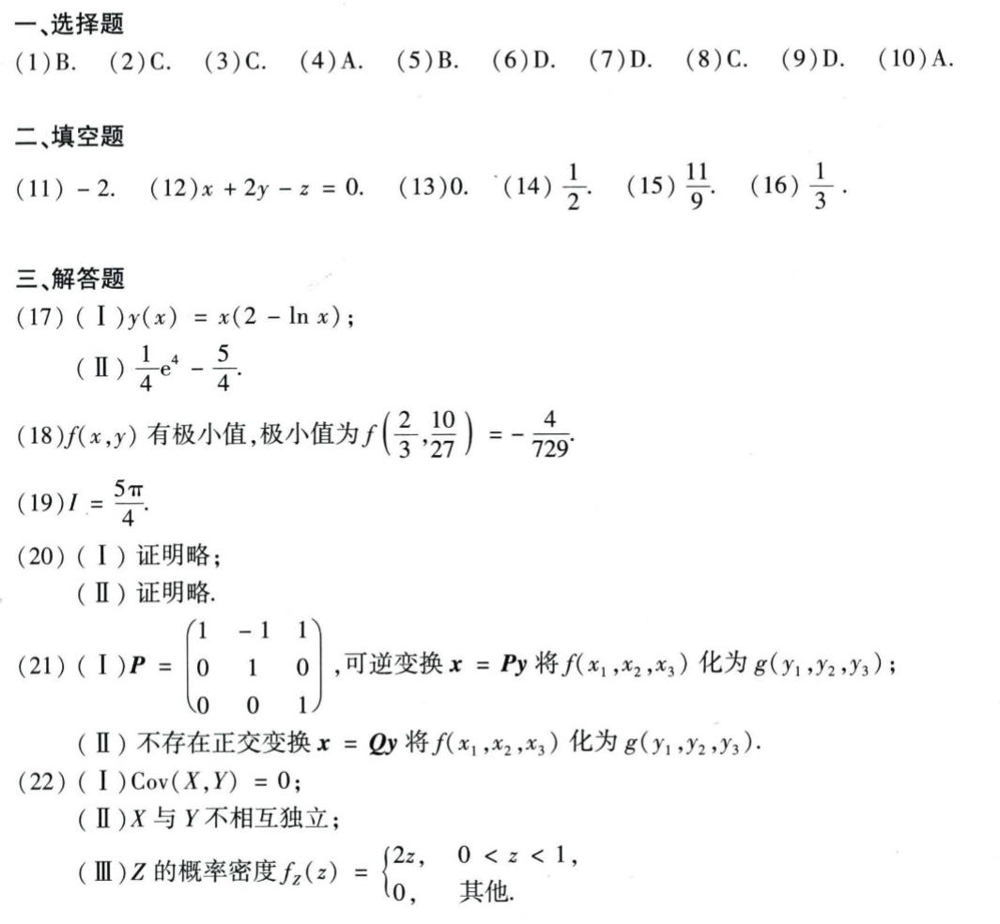

# Math 1 2023 Answers

资料类型：考研数学一答案速查  
年份：2023  
科目：数学一  
来源：本地答案速查图片 OCR/人工转写  
校对状态：待复核  

原图：

## 选择题

| 题号 | 答案 |
|---|---|
| 1 | B |
| 2 | C |
| 3 | C |
| 4 | A |
| 5 | B |
| 6 | D |
| 7 | D |
| 8 | C |
| 9 | D |
| 10 | A |

## 填空题

| 题号 | 答案 |
|---|---|
| 11 | `-2` |
| 12 | `x+2y-z=0` |
| 13 | `0` |
| 14 | `1/2` |
| 15 | `11/9` |
| 16 | `1/3` |

## 解答题

| 题号 | 答案速查 |
|---|---|
| 17 | （1）`y(x)=x(2-ln x)`；（2）最大值 `e^4/4 - 5/4` |
| 18 | 极小值 `f(2/3,10/27)=-4/729` |
| 19 | `I=5π/4` |
| 20 | 证明略 |
| 21 | （1）可逆变换 `P=[1,-1,1;0,1,0;0,0,1]`；（2）不存在正交变换 |
| 22 | （1）`Cov(X,Y)=0`；（2）不相互独立；（3）`f_Z(z)=2z (0<z<1), 0(其他)` |
