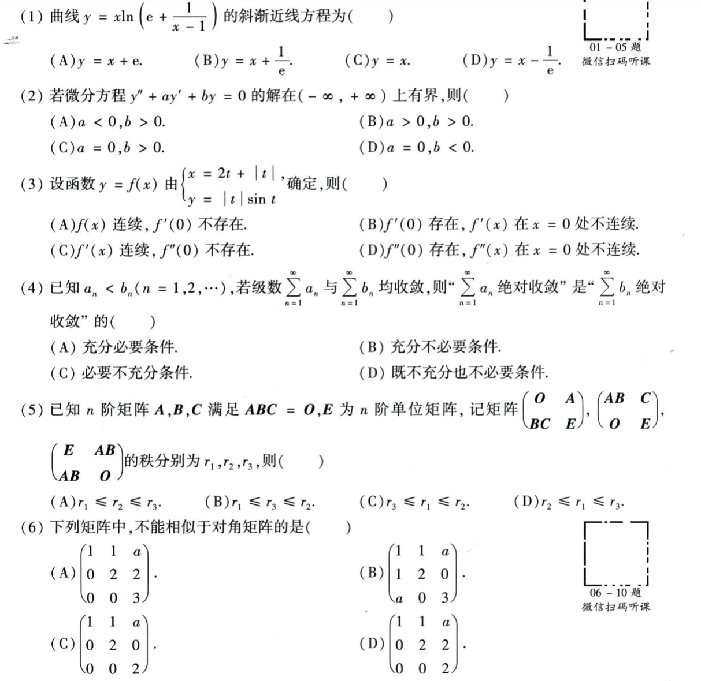
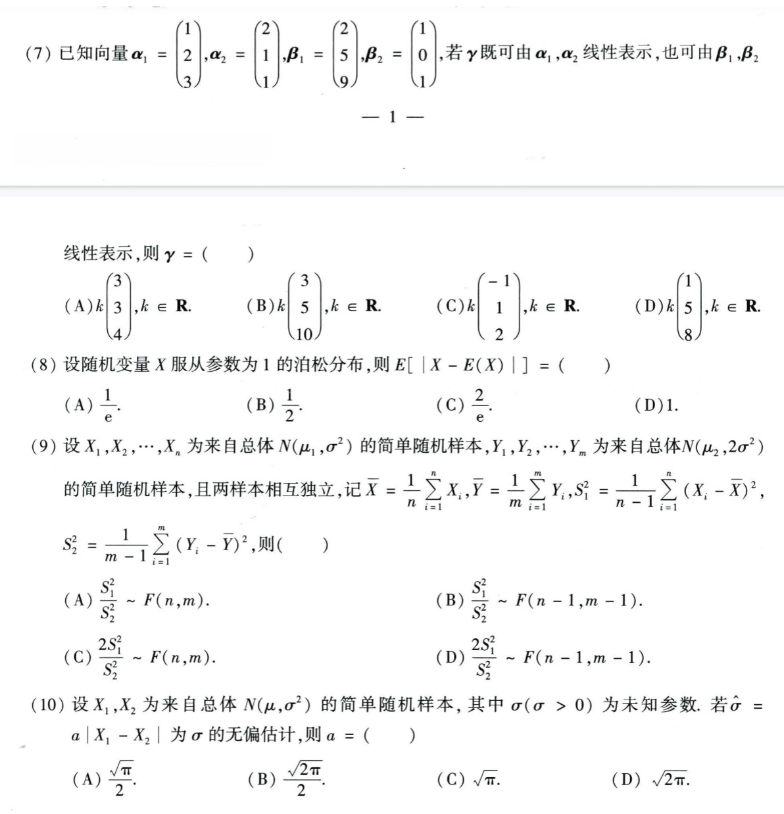
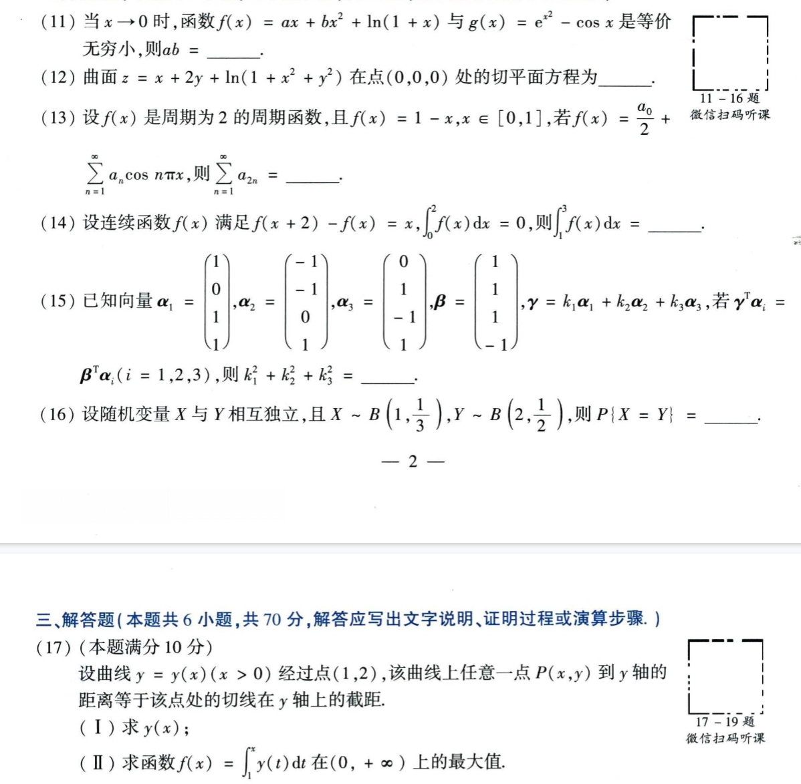
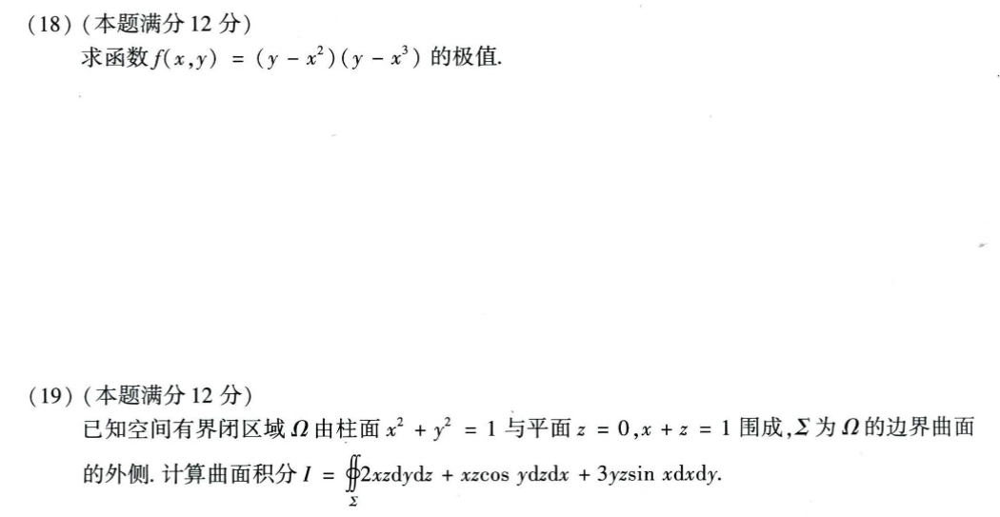
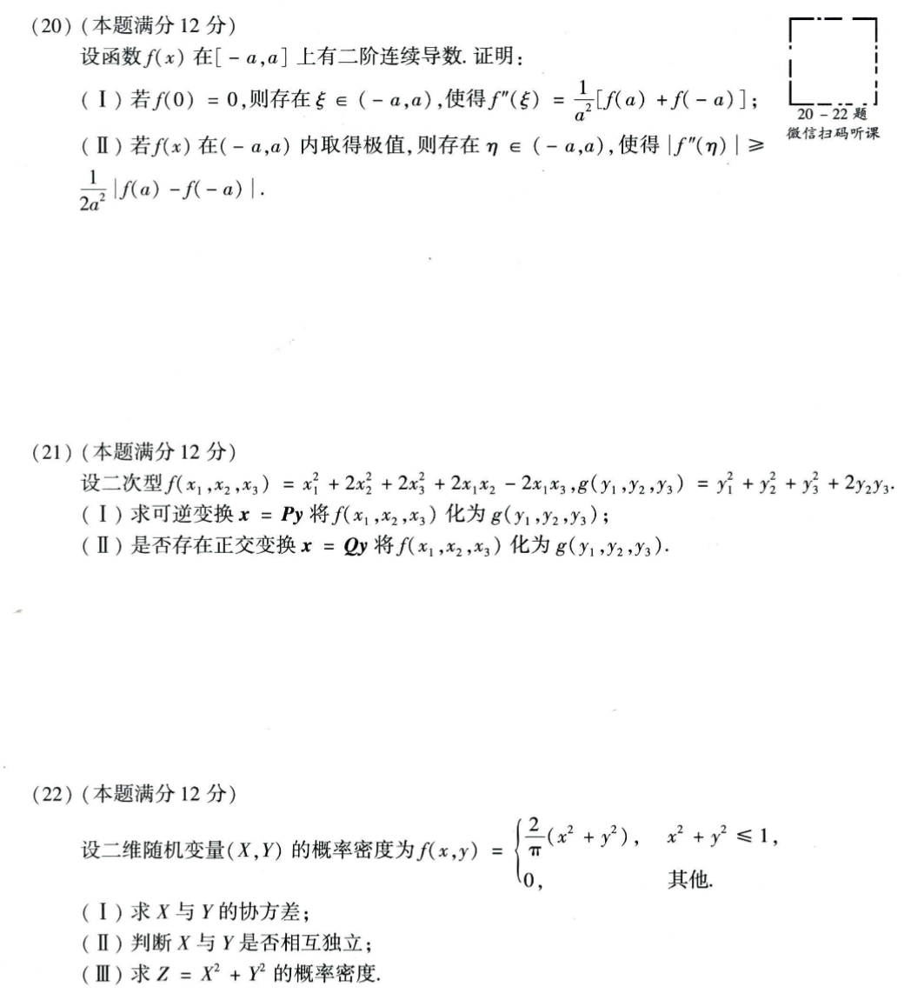

# Math 1 2023 Exam Questions

资料类型：考研数学一历年真题  
年份：2023  
科目：数学一  
整理状态：待复核  

说明：本文件根据用户提供的 2023 年真题截图整理。截图已保存到 `images/` 目录；本套截图显示至第 22 题。

## 2023 数一 选择题 1-6

截图：



### 第 1 题

- 题型：选择题
- 题号：1
- 分值：5
- 模块：高数
- 考点：极限、导数、积分、级数、微分方程
- 校对状态：根据截图整理

曲线

```text
y = x ln(e + 1/(x-1))
```

的斜渐近线方程为（ ）

选项：A. `y=x+e`  B. `y=x+1/e`  C. `y=x`  D. `y=x-1/e`

### 第 2 题

- 题型：选择题
- 题号：2
- 分值：5
- 模块：高数
- 考点：极限、导数、积分、级数、微分方程
- 校对状态：根据截图整理

若微分方程 `y''+ay'+by=0` 的解在 `(-∞,+∞)` 上有界，则（ ）

选项：A. `a<0,b>0`  B. `a>0,b>0`  C. `a=0,b>0`  D. `a=0,b<0`

### 第 3 题

- 题型：选择题
- 题号：3
- 分值：5
- 模块：高数
- 考点：极限、导数、积分、级数、微分方程
- 校对状态：根据截图整理

设函数 `y=f(x)` 由参数方程

```text
x = 2t + |t|,
y = |t| sin t
```

确定，则（ ）

选项：

A. `f(x)` 连续，`f'(0)` 不存在。  
B. `f'(0)` 存在，`f'(x)` 在 `x=0` 处不连续。  
C. `f'(x)` 连续，`f''(0)` 不存在。  
D. `f''(0)` 存在，`f''(x)` 在 `x=0` 处不连续。

### 第 4 题

- 题型：选择题
- 题号：4
- 分值：5
- 模块：高数
- 考点：极限、导数、积分、级数、微分方程
- 校对状态：根据截图整理

已知 `a_n<b_n (n=1,2,...)`，若级数 `sum a_n` 与 `sum b_n` 均收敛，则“`sum a_n` 绝对收敛”是“`sum b_n` 绝对收敛”的（ ）

选项：A. 充分必要条件。 B. 充分不必要条件。 C. 必要不充分条件。 D. 既不充分也不必要条件。

### 第 5 题

- 题型：选择题
- 题号：5
- 分值：5
- 模块：线代
- 考点：矩阵、向量组、二次型
- 校对状态：根据截图整理

已知 `n` 阶矩阵 `A,B,C` 满足 `ABC=O`，`E` 为 `n` 阶单位矩阵，记矩阵

```text
M1 = [O  A
      BC E],
M2 = [AB C
      O  E],
M3 = [E  AB
      AB O]
```

的秩分别为 `r_1,r_2,r_3`，则（ ）

选项：A. `r_1<=r_2<=r_3`  B. `r_1<=r_3<=r_2`  C. `r_3<=r_1<=r_2`  D. `r_2<=r_1<=r_3`

### 第 6 题

- 题型：选择题
- 题号：6
- 分值：5
- 模块：线代
- 考点：矩阵、向量组、二次型
- 校对状态：根据截图整理

下列矩阵中，不能相似于对角矩阵的是（ ）

选项：

A. `[1 1 a; 0 2 2; 0 0 3]`  
B. `[1 1 a; 1 2 0; a 0 3]`  
C. `[1 1 a; 0 2 0; 0 0 2]`  
D. `[1 1 a; 0 2 2; 0 0 2]`

## 2023 数一 选择题 7-10

截图：



### 第 7 题

- 题型：选择题
- 题号：7
- 分值：5
- 模块：线代
- 考点：矩阵、向量组、二次型
- 校对状态：根据截图整理

已知向量

```text
alpha_1=(1,2,3)^T, alpha_2=(2,1,1)^T,
beta_1=(2,5,9)^T, beta_2=(1,0,1)^T
```

若 `gamma` 既可由 `alpha_1,alpha_2` 线性表示，也可由 `beta_1,beta_2` 线性表示，则 `gamma=（ ）`

选项：

A. `k(3,3,4)^T, k in R`  
B. `k(3,5,10)^T, k in R`  
C. `k(-1,1,2)^T, k in R`  
D. `k(1,5,8)^T, k in R`

### 第 8 题

- 题型：选择题
- 题号：8
- 分值：5
- 模块：概率统计
- 考点：随机变量、概率分布、参数估计
- 校对状态：根据截图整理

设随机变量 `X` 服从参数为 1 的泊松分布，则

```text
E[ |X-E(X)| ] = ( )
```

选项：A. `1/e`  B. `1/2`  C. `2/e`  D. `1`

### 第 9 题

- 题型：选择题
- 题号：9
- 分值：5
- 模块：概率统计
- 考点：随机变量、概率分布、参数估计
- 校对状态：根据截图整理

设 `X_1,...,X_n` 为来自总体 `N(mu_1,sigma^2)` 的简单随机样本，`Y_1,...,Y_m` 为来自总体 `N(mu_2,2sigma^2)` 的简单随机样本，且两样本相互独立，记

```text
X_bar=(1/n)sum X_i, Y_bar=(1/m)sum Y_i,
S_1^2=1/(n-1)sum(X_i-X_bar)^2,
S_2^2=1/(m-1)sum(Y_i-Y_bar)^2
```

则（ ）

选项：

A. `S_1^2/S_2^2 ~ F(n,m)`  
B. `S_1^2/S_2^2 ~ F(n-1,m-1)`  
C. `2S_1^2/S_2^2 ~ F(n,m)`  
D. `2S_1^2/S_2^2 ~ F(n-1,m-1)`

### 第 10 题

- 题型：选择题
- 题号：10
- 分值：5
- 模块：概率统计
- 考点：随机变量、概率分布、参数估计
- 校对状态：根据截图整理

设 `X_1,X_2` 为来自总体 `N(mu,sigma^2)` 的简单随机样本，其中 `sigma(sigma>0)` 为未知参数。若 `sigma_hat=a|X_1-X_2|` 为 `sigma` 的无偏估计，则 `a=（ ）`

选项：A. `sqrt(pi)/2`  B. `sqrt(2pi)/2`  C. `sqrt(pi)`  D. `sqrt(2pi)`

## 2023 数一 填空题 11-16 与解答题 17

截图：



### 第 11 题

- 题型：填空题
- 题号：11
- 分值：5
- 模块：高数
- 考点：极限、导数、积分、级数、微分方程
- 校对状态：根据截图整理

当 `x->0` 时，函数 `f(x)=ax+bx^2+ln(1+x)` 与 `g(x)=e^(x^2)-cos x` 是等价无穷小，则 `ab=____`。

### 第 12 题

- 题型：填空题
- 题号：12
- 分值：5
- 模块：高数
- 考点：极限、导数、积分、级数、微分方程
- 校对状态：根据截图整理

曲面

```text
z=x+2y+ln(1+x^2+y^2)
```

在点 `(0,0,0)` 处的切平面方程为 `____`。

### 第 13 题

- 题型：填空题
- 题号：13
- 分值：5
- 模块：高数
- 考点：极限、导数、积分、级数、微分方程
- 校对状态：根据截图整理

设 `f(x)` 是周期为 2 的周期函数，且 `f(x)=1-x, x in [0,1]`。若

```text
f(x)=a_0/2 + sum_{n=1}^∞ a_n cos(nπx)
```

则 `sum_{n=1}^∞ a_{2n}=____`。

### 第 14 题

- 题型：填空题
- 题号：14
- 分值：5
- 模块：高数
- 考点：极限、导数、积分、级数、微分方程
- 校对状态：根据截图整理

设连续函数 `f(x)` 满足 `f(x+2)-f(x)=x, ∫_0^2 f(x)dx=0`，则 `∫_1^3 f(x)dx=____`。

### 第 15 题

- 题型：填空题
- 题号：15
- 分值：5
- 模块：线代
- 考点：矩阵、向量组、二次型
- 校对状态：根据截图整理

已知向量

```text
alpha_1=(1,0,1,1)^T,
alpha_2=(-1,-1,0,1)^T,
alpha_3=(0,1,-1,1)^T,
beta=(1,1,1,-1)^T
```

`gamma=k_1 alpha_1+k_2 alpha_2+k_3 alpha_3`。若 `gamma^T alpha_i = beta^T alpha_i (i=1,2,3)`，则 `k_1^2+k_2^2+k_3^2=____`。

### 第 16 题

- 题型：填空题
- 题号：16
- 分值：5
- 模块：概率统计
- 考点：随机变量、概率分布、参数估计
- 校对状态：根据截图整理

设随机变量 `X` 与 `Y` 相互独立，且 `X~B(1,1/3), Y~B(2,1/2)`，则 `P{X=Y}=____`。

### 第 17 题

- 题型：解答题
- 题号：17
- 分值：10
- 模块：高数
- 考点：极限、导数、积分、级数、微分方程
- 校对状态：根据截图整理

设曲线 `y=y(x) (x>0)` 经过点 `(1,2)`，该曲线上任意一点 `P(x,y)` 到 `y` 轴的距离等于该点处的切线在 `y` 轴上的截距。

1. 求 `y(x)`；
2. 求函数 `f(x)=∫_1^x y(t)dt` 在 `(0,+∞)` 上的最大值。

## 2023 数一 解答题 18-19

截图：



### 第 18 题

- 题型：解答题
- 题号：18
- 分值：12
- 模块：高数
- 考点：极限、导数、积分、级数、微分方程
- 校对状态：根据截图整理

求函数

```text
f(x,y)=(y-x^2)(y-x^3)
```

的极值。

### 第 19 题

- 题型：解答题
- 题号：19
- 分值：12
- 模块：高数
- 考点：极限、导数、积分、级数、微分方程
- 校对状态：根据截图整理

已知空间有界闭区域 `Omega` 由柱面 `x^2+y^2=1` 与平面 `z=0, x+z=1` 围成，`Sigma` 为 `Omega` 的边界曲面的外侧，计算曲面积分

```text
I = ∯_Sigma 2xz dy dz + xz cos y dz dx + 3yz sin x dx dy
```

## 2023 数一 解答题 20-22

截图：



### 第 20 题

- 题型：解答题
- 题号：20
- 分值：12
- 模块：高数
- 考点：极限、导数、积分、级数、微分方程
- 校对状态：根据截图整理

设函数 `f(x)` 在 `[-a,a]` 上有二阶连续导数。证明：

1. 若 `f(0)=0`，则存在 `xi in (-a,a)`，使得 `f''(xi)=1/a^2 [f(a)+f(-a)]`；
2. 若 `f(x)` 在 `(-a,a)` 内取得极值，则存在 `eta in (-a,a)`，使得 `|f''(eta)| >= 1/(2a^2)|f(a)-f(-a)|`。

### 第 21 题

- 题型：解答题
- 题号：21
- 分值：12
- 模块：线代
- 考点：矩阵、向量组、二次型
- 校对状态：根据截图整理

设二次型

```text
f(x_1,x_2,x_3)=x_1^2+2x_2^2+2x_3^2+2x_1x_2-2x_1x_3
g(y_1,y_2,y_3)=y_1^2+y_2^2+y_3^2+2y_2y_3
```

1. 求可逆变换 `x=Py` 将 `f` 化为 `g`；
2. 是否存在正交变换 `x=Qy` 将 `f` 化为 `g`？

### 第 22 题

- 题型：解答题
- 题号：22
- 分值：12
- 模块：概率统计
- 考点：随机变量、概率分布、参数估计
- 校对状态：根据截图整理

设二维随机变量 `(X,Y)` 的概率密度为

```text
f(x,y) = {
  2/pi * (x^2+y^2), x^2+y^2 <= 1,
  0,                其他
}
```

1. 求 `X` 与 `Y` 的协方差；
2. 判断 `X` 与 `Y` 是否相互独立；
3. 求 `Z=X^2+Y^2` 的概率密度。
