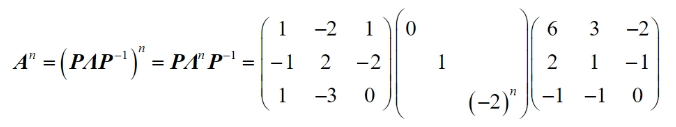
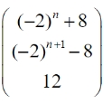

# Math 1 2024 Answers

资料类型：考研数学一答案速查  
年份：2024  
科目：数学一  
来源：用户提供答案速查与补充截图  
校对状态：用户确认  

## 选择题

| 题号 | 答案 |
|---|---|
| 1 | C |
| 2 | A |
| 3 | A |
| 4 | B |
| 5 | B |
| 6 | D |
| 7 | A |
| 8 | B |
| 9 | D |
| 10 | D |

## 填空题

| 题号 | 答案 |
|---|---|
| 11 | `a=6` |
| 12 | `5` |
| 13 | `-1/π` |
| 14 | `arctan(x+y)=y+π/4` |
| 15 | `a>=0` |
| 16 | `p=2/3` |

## 解答题

| 题号 | 答案速查 |
|---|---|
| 17 | `ln(sqrt(2)+1)+sqrt(2)-1` |
| 18 | `(1) x+y+z=3`；`(2) 最大值 f(0,3)=f(3,0)=21，最小值 f(4/3,4/3)=17/27` |
| 19 | 证明略 |
| 20 | 积分结果 `4sqrt(5)π/25` |
| 21 | `(1) A=[-2 0 2; 0 -2 -2; -6 -3 3]`；`(2) A^n` 与 `x_n,y_n,z_n` 见下方补充图 |
| 22 | `(1) c=(n+1)/n`；`(2) c=(n+2)/(n+1)` 时 `h(c)` 最小 |

## 第 21 题补充图

`A^n`：

`x_n,y_n,z_n`：

