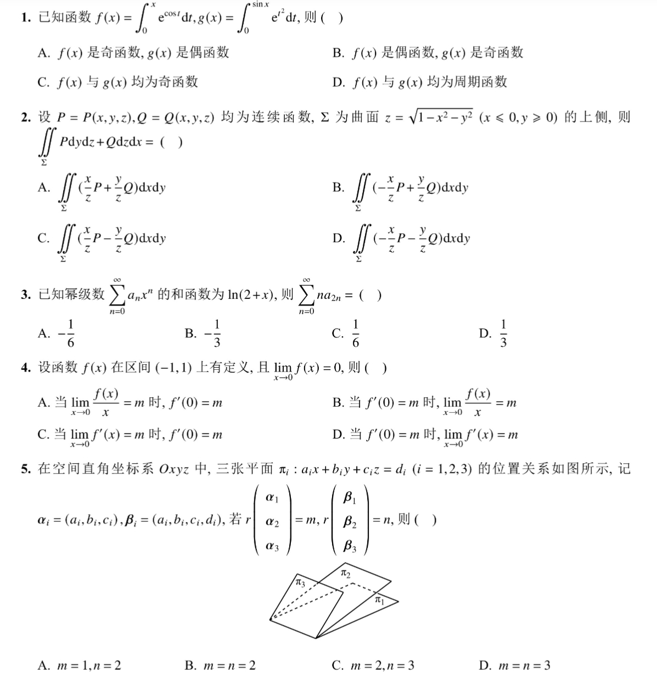
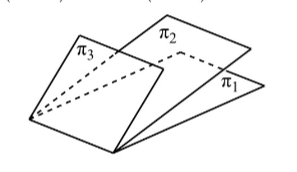
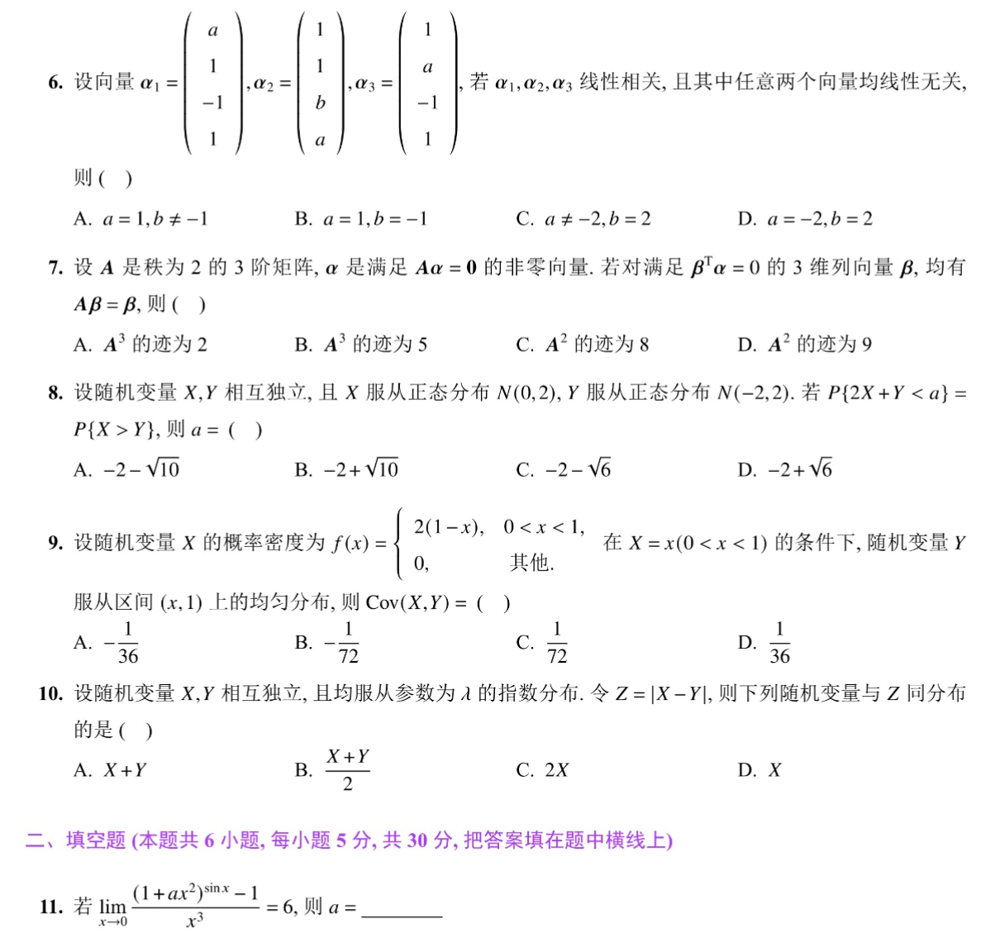
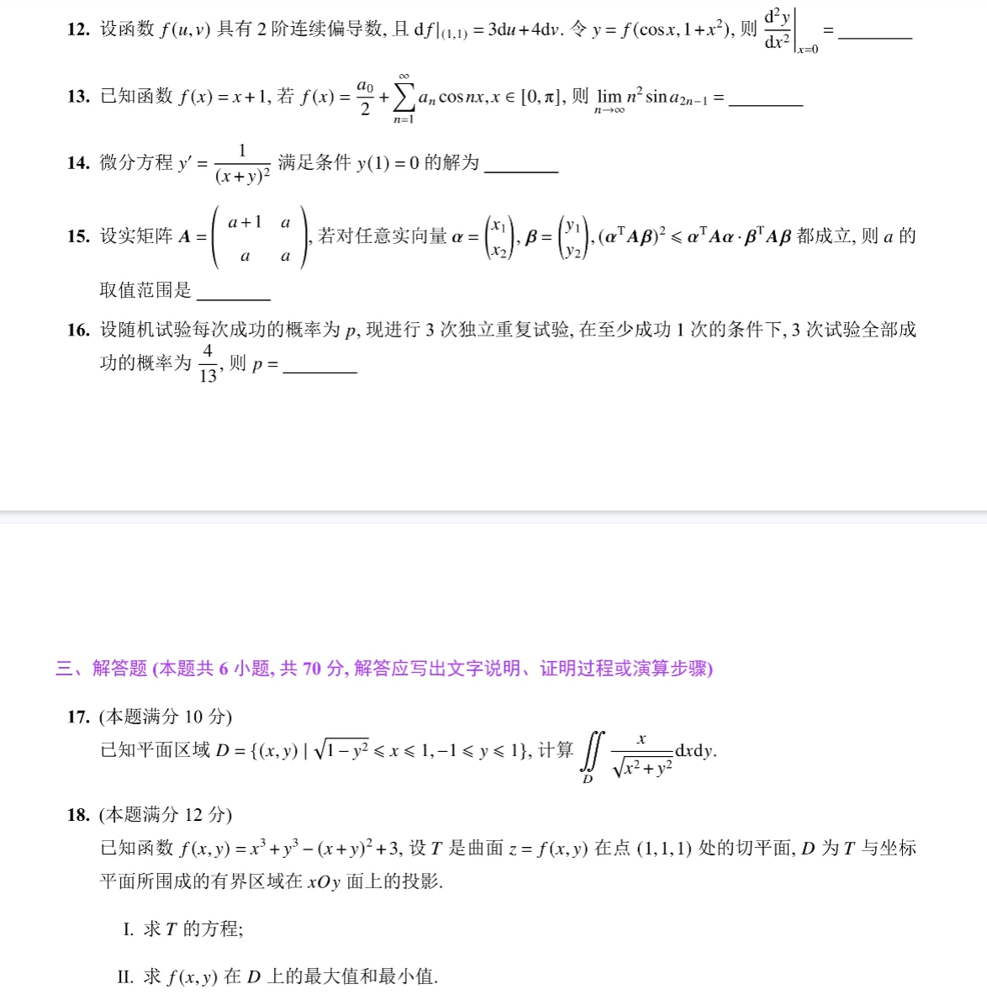
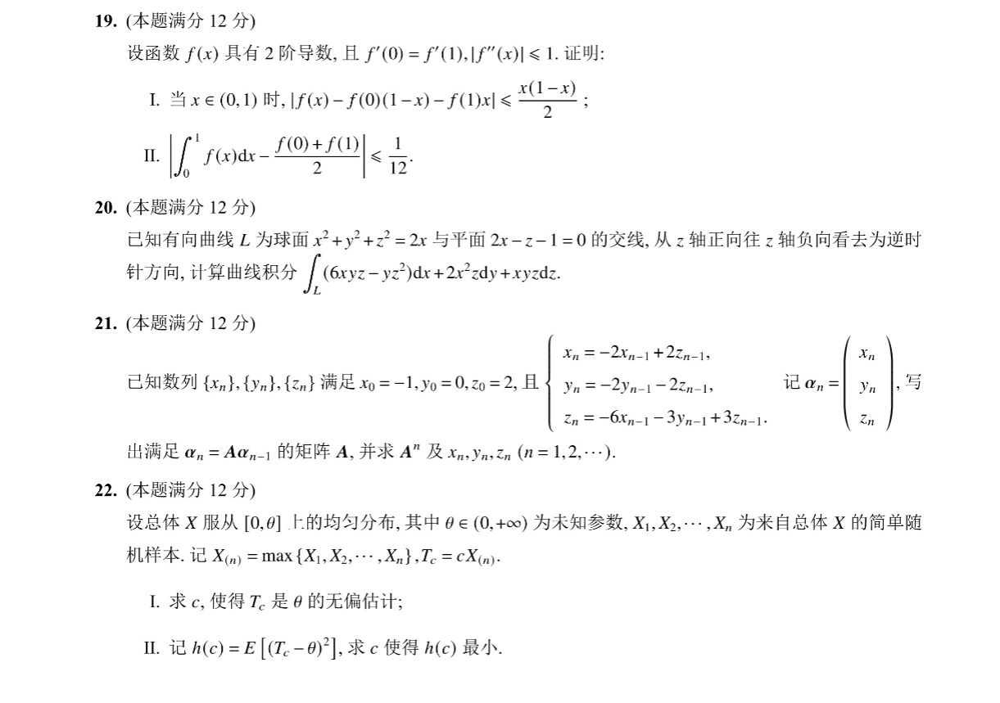

# Math 1 2024 Exam Questions

资料类型：考研数学一历年真题  
年份：2024  
科目：数学一  
整理状态：待复核  

说明：本文件根据用户提供的 2024 年真题截图整理。截图已保存到 `images/` 目录；本套截图显示至第 22 题。

## 2024 数一 选择题 1-5

截图：



### 第 1 题

- 题型：选择题
- 题号：1
- 分值：5
- 模块：高数
- 考点：极限、导数、积分、级数、微分方程
- 校对状态：根据截图整理

已知函数

```text
f(x)=∫_0^x e^(cos t) dt,
g(x)=∫_0^(sin x) e^(t^2) dt
```

则（ ）

选项：

A. `f(x)` 是奇函数，`g(x)` 是偶函数。  
B. `f(x)` 是偶函数，`g(x)` 是奇函数。  
C. `f(x)` 与 `g(x)` 均为奇函数。  
D. `f(x)` 与 `g(x)` 均为周期函数。

### 第 2 题

- 题型：选择题
- 题号：2
- 分值：5
- 模块：高数
- 考点：极限、导数、积分、级数、微分方程
- 校对状态：根据截图整理

设 `P=P(x,y,z), Q=Q(x,y,z)` 均为连续函数，`Sigma` 为曲面 `z=sqrt(1-x^2-y^2) (x<=0,y>=0)` 的上侧，则

```text
∬_Sigma P dy dz + Q dz dx = ( )
```

选项：

A. `∬ (x/z P + y/z Q) dxdy`  
B. `∬ (-x/z P + y/z Q) dxdy`  
C. `∬ (x/z P - y/z Q) dxdy`  
D. `∬ (-x/z P - y/z Q) dxdy`

### 第 3 题

- 题型：选择题
- 题号：3
- 分值：5
- 模块：高数
- 考点：极限、导数、积分、级数、微分方程
- 校对状态：根据截图整理

已知幂级数 `sum_{n=0}^∞ a_n x^n` 的和函数为 `ln(2+x)`，则 `sum_{n=0}^∞ n a_{2n}=（ ）`

选项：A. `-1/6`  B. `-1/3`  C. `1/6`  D. `1/3`

### 第 4 题

- 题型：选择题
- 题号：4
- 分值：5
- 模块：高数
- 考点：极限、导数、积分、级数、微分方程
- 校对状态：根据截图整理

设函数 `f(x)` 在区间 `(-1,1)` 上有定义，且 `lim_{x->0} f(x)=0`，则（ ）

选项：

A. 当 `lim_{x->0} f(x)/x=m` 时，`f'(0)=m`。  
B. 当 `f'(0)=m` 时，`lim_{x->0} f(x)/x=m`。  
C. 当 `lim_{x->0} f'(x)=m` 时，`f'(0)=m`。  
D. 当 `f'(0)=m` 时，`lim_{x->0} f'(x)=m`。

### 第 5 题

- 题型：选择题
- 题号：5
- 分值：5
- 模块：线代
- 考点：矩阵、向量组、二次型
- 校对状态：根据截图整理

在空间直角坐标系 `Oxyz` 中，三张平面 `pi_i:a_i x+b_i y+c_i z=d_i (i=1,2,3)` 的位置关系如图所示，记

```text
alpha_i=(a_i,b_i,c_i), beta_i=(a_i,b_i,c_i,d_i)
```

若 `r(alpha_1,alpha_2,alpha_3)=m, r(beta_1,beta_2,beta_3)=n`，则（ ）

配图：



选项：A. `m=1,n=2`  B. `m=n=2`  C. `m=2,n=3`  D. `m=n=3`

## 2024 数一 选择题 6-10 与填空题 11

截图：



### 第 6 题

- 题型：选择题
- 题号：6
- 分值：5
- 模块：线代
- 考点：矩阵、向量组、二次型
- 校对状态：根据截图整理

设向量

```text
alpha_1=(a,1,-1,1)^T,
alpha_2=(1,1,b,a)^T,
alpha_3=(1,a,-1,1)^T
```

若 `alpha_1,alpha_2,alpha_3` 线性相关，且其中任意两个向量均线性无关，则（ ）

选项：A. `a=1,b!=-1`  B. `a=1,b=-1`  C. `a!=-2,b=2`  D. `a=-2,b=2`

### 第 7 题

- 题型：选择题
- 题号：7
- 分值：5
- 模块：线代
- 考点：矩阵、向量组、二次型
- 校对状态：根据截图整理

设 `A` 是秩为 2 的 3 阶矩阵，`alpha` 是满足 `A alpha=0` 的非零向量。若对满足 `beta^T alpha=0` 的 3 维列向量 `beta`，均有 `A beta=beta`，则（ ）

选项：A. `A^3` 的迹为 2。 B. `A^3` 的迹为 5。 C. `A^2` 的迹为 8。 D. `A^2` 的迹为 9。

### 第 8 题

- 题型：选择题
- 题号：8
- 分值：5
- 模块：概率统计
- 考点：随机变量、概率分布、参数估计
- 校对状态：根据截图整理

设随机变量 `X,Y` 相互独立，且 `X~N(0,2), Y~N(-2,2)`。若 `P{2X+Y<a}=P{X>Y}`，则 `a=（ ）`

选项：A. `-2-sqrt(10)`  B. `-2+sqrt(10)`  C. `-2-sqrt(6)`  D. `-2+sqrt(6)`

### 第 9 题

- 题型：选择题
- 题号：9
- 分值：5
- 模块：概率统计
- 考点：随机变量、概率分布、参数估计
- 校对状态：根据截图整理

设随机变量 `X` 的概率密度为

```text
f(x)={
  2(1-x), 0<x<1,
  0,      其他
}
```

在 `X=x (0<x<1)` 的条件下，随机变量 `Y` 服从区间 `(x,1)` 上的均匀分布，则 `Cov(X,Y)=（ ）`

选项：A. `-1/36`  B. `-1/72`  C. `1/72`  D. `1/36`

### 第 10 题

- 题型：选择题
- 题号：10
- 分值：5
- 模块：概率统计
- 考点：随机变量、概率分布、参数估计
- 校对状态：根据截图整理

设随机变量 `X,Y` 相互独立，且均服从参数为 `lambda` 的指数分布。令 `Z=|X-Y|`，则下列随机变量与 `Z` 同分布的是（ ）

选项：A. `X+Y`  B. `(X+Y)/2`  C. `2X`  D. `X`

### 第 11 题

- 题型：填空题
- 题号：11
- 分值：5
- 模块：高数
- 考点：极限、导数、积分、级数、微分方程
- 校对状态：根据截图整理

若

```text
lim_{x->0} ((1+a x^2)^(sin x)-1)/x^3 = 6
```

则 `a=____`。

## 2024 数一 填空题 12-16 与解答题 17-18

截图：



### 第 12 题

- 题型：填空题
- 题号：12
- 分值：5
- 模块：高数
- 考点：极限、导数、积分、级数、微分方程
- 校对状态：根据截图整理

设函数 `f(u,v)` 具有 2 阶连续偏导数，且 `df|(1,1)=3du+4dv`。令 `y=f(cos x,1+x^2)`，则 `(d²y/dx²)|_(x=0)=____`。

### 第 13 题

- 题型：填空题
- 题号：13
- 分值：5
- 模块：高数
- 考点：极限、导数、积分、级数、微分方程
- 校对状态：根据截图整理

已知函数 `f(x)=x+1`，若

```text
f(x)=a_0/2 + sum_{n=1}^∞ a_n cos(nx), x in [0,π]
```

则

```text
lim_{n->∞} n^2 sin a_{2n-1} = ____
```

### 第 14 题

- 题型：填空题
- 题号：14
- 分值：5
- 模块：高数
- 考点：极限、导数、积分、级数、微分方程
- 校对状态：根据截图整理

微分方程

```text
y' = 1/(x+y)^2
```

满足条件 `y(1)=0` 的解为 `____`。

### 第 15 题

- 题型：填空题
- 题号：15
- 分值：5
- 模块：线代
- 考点：矩阵、向量组、二次型
- 校对状态：根据截图整理

设实矩阵

```text
A = [a+1  a
     a    a]
```

若对任意实向量 `alpha=(x_1,x_2)^T, beta=(y_1,y_2)^T`，`(alpha^T A beta)^2 <= alpha^T A alpha · beta^T A beta` 都成立，则 `a` 的取值范围是 `____`。

### 第 16 题

- 题型：填空题
- 题号：16
- 分值：5
- 模块：概率统计
- 考点：随机变量、概率分布、参数估计
- 校对状态：根据截图整理

设随机试验每次成功的概率为 `p`，现进行 3 次独立重复试验，在至少成功 1 次的条件下，3 次试验全部成功的概率为 `4/13`，则 `p=____`。

### 第 17 题

- 题型：解答题
- 题号：17
- 分值：10
- 模块：高数
- 考点：极限、导数、积分、级数、微分方程
- 校对状态：根据截图整理

已知平面区域

```text
D={(x,y)| sqrt(1-y^2)<=x<=1, -1<=y<=1}
```

计算

```text
∬_D x/sqrt(x^2+y^2) dxdy
```

### 第 18 题

- 题型：解答题
- 题号：18
- 分值：12
- 模块：高数
- 考点：极限、导数、积分、级数、微分方程
- 校对状态：根据截图整理

已知函数 `f(x,y)=x^3+y^3-(x+y)^2+3`，设 `T` 是曲面 `z=f(x,y)` 在点 `(1,1,1)` 处的切平面，`D` 为 `T` 与坐标平面所围成的有界区域在 `xOy` 面上的投影。

1. 求 `T` 的方程；
2. 求 `f(x,y)` 在 `D` 上的最大值和最小值。

## 2024 数一 解答题 19-22

截图：



### 第 19 题

- 题型：解答题
- 题号：19
- 分值：12
- 模块：高数
- 考点：极限、导数、积分、级数、微分方程
- 校对状态：根据截图整理

设函数 `f(x)` 具有 2 阶导数，且 `f'(0)=f'(1), |f''(x)|<=1`。证明：

1. 当 `x in (0,1)` 时，`|f(x)-f(0)(1-x)-f(1)x| <= x(1-x)/2`；
2. `|∫_0^1 f(x)dx - (f(0)+f(1))/2| <= 1/12`。

### 第 20 题

- 题型：解答题
- 题号：20
- 分值：12
- 模块：高数
- 考点：极限、导数、积分、级数、微分方程
- 校对状态：根据截图整理

已知有向曲线 `L` 为球面 `x^2+y^2+z^2=2x` 与平面 `2x-z-1=0` 的交线，从 `z` 轴正向往 `z` 轴负向看去为逆时针方向，计算曲线积分

```text
∫_L (6xyz-yz^2) dx + 2x^2z dy + xyz dz
```

### 第 21 题

- 题型：解答题
- 题号：21
- 分值：12
- 模块：线代
- 考点：矩阵、向量组、二次型
- 校对状态：根据截图整理

已知数列 `{x_n},{y_n},{z_n}` 满足 `x_0=-1,y_0=0,z_0=2`，且

```text
x_n = -2x_{n-1}+2z_{n-1}
y_n = -2y_{n-1}-2z_{n-1}
z_n = -6x_{n-1}-3y_{n-1}+3z_{n-1}
```

记 `alpha_n=(x_n,y_n,z_n)^T`，写出满足 `alpha_n=A alpha_{n-1}` 的矩阵 `A`，并求 `A^n` 及 `x_n,y_n,z_n (n=1,2,...)`。

### 第 22 题

- 题型：解答题
- 题号：22
- 分值：12
- 模块：概率统计
- 考点：随机变量、概率分布、参数估计
- 校对状态：根据截图整理

设总体 `X` 服从 `[0,theta]` 上的均匀分布，其中 `theta in (0,+∞)` 为未知参数，`X_1,...,X_n` 为来自总体 `X` 的简单随机样本。记 `X_(n)=max{X_1,...,X_n}, T_c=cX_(n)`。

1. 求 `c`，使得 `T_c` 是 `theta` 的无偏估计；
2. 记 `h(c)=E[(T_c-theta)^2]`，求 `c` 使得 `h(c)` 最小。
