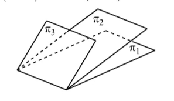

# 2024 数学一第 5 题

## 相关图片

## 题目

在空间直角坐标系 $Oxyz$ 中，三张平面
$$
\pi_i:a_ix+b_iy+c_iz=d_i,\qquad i=1,2,3
$$
的位置关系如图所示。记
$$
\alpha_i=(a_i,b_i,c_i),\qquad \beta_i=(a_i,b_i,c_i,d_i).
$$
若
$$
r(\alpha_1,\alpha_2,\alpha_3)=m,\qquad r(\beta_1,\beta_2,\beta_3)=n,
$$
则（ ）。

A. $m=1,n=2$
B. $m=n=2$
C. $m=2,n=3$
D. $m=n=3$

## 标准答案

B

## 解析

由图可知三平面交于同一条直线，但三平面不重合。于是方程组有无穷多解，且解集是一条直线。

因此系数矩阵秩为 $2$，增广矩阵秩也为 $2$：
$$
m=r(\alpha_1,\alpha_2,\alpha_3)=2,\qquad
n=r(\beta_1,\beta_2,\beta_3)=2.
$$
故选 B。

## 来源

- 题目来源：math1_2024_questions.md
- 答案来源：math1_2024_answers.md
