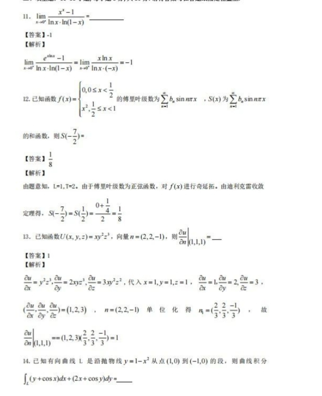
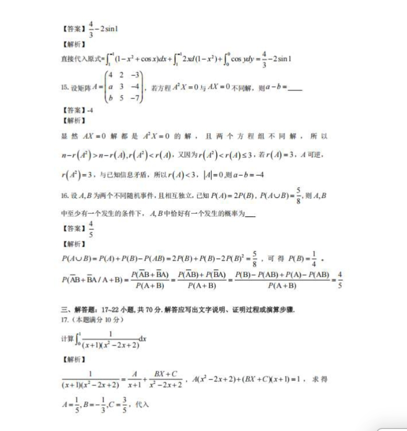
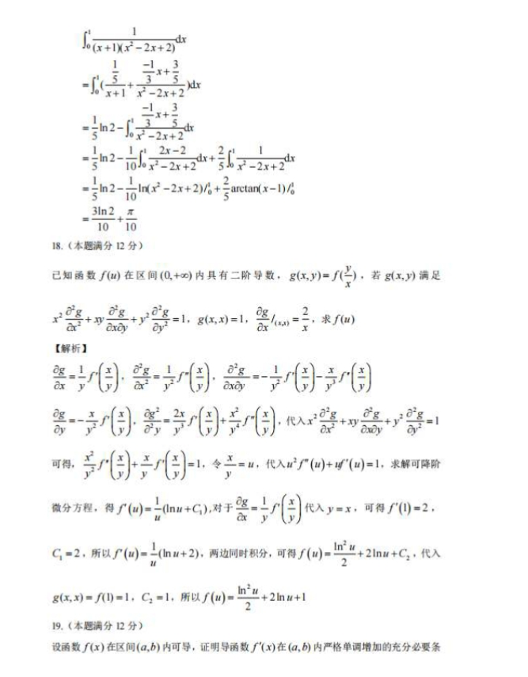
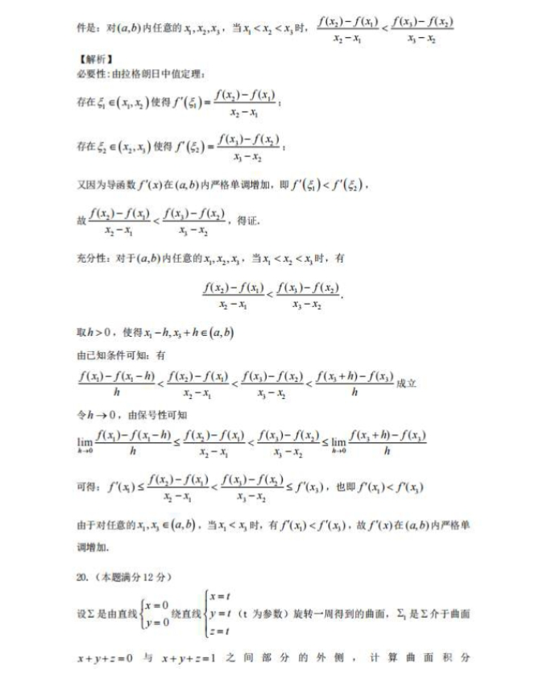
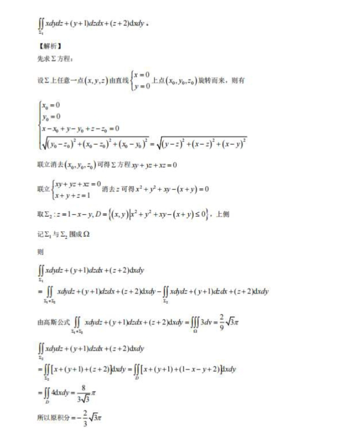
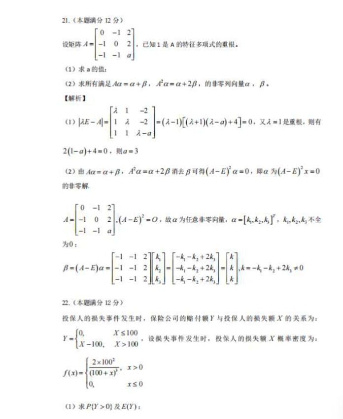

# Math 1 2025 Answers

资料类型：考研数学一答案速查  
年份：2025  
科目：数学一  
来源：用户提供答案与答案解析截图  
校对状态：用户确认  

## 选择题

| 题号 | 答案 |
|---|---|
| 1 | B |
| 2 | B |
| 3 | D |
| 4 | A |
| 5 | B |
| 6 | D |
| 7 | A |
| 8 | C |
| 9 | C |
| 10 | D |

## 填空题

| 题号 | 答案 |
|---|---|
| 11 | `-1` |
| 12 | `1/8` |
| 13 | `1` |
| 14 | `4/3 - 2sin1` |
| 15 | `-4` |
| 16 | `4/5` |

## 解答题

| 题号 | 答案速查 |
|---|---|
| 17 | `3ln2/10 + π/10` |
| 18 | `f(u)=(ln^2 u)/2 + 2ln u + 1` |
| 19 | 证明略 |
| 20 | 积分结果 `-2sqrt(3)π/3` |
| 21 | （1）`a=3`；（2）`alpha=(k1,k2,k3)^T`，`k1,k2,k3` 不全为 0；`beta=(-k1-k2+2k3, -k1-k2+2k3, -k1-k2+2k3)^T`，且 `-k1-k2+2k3 != 0` |
| 22 | 第 22 题答案见补充截图，待从后续截图补全 |

## 答案解析截图

以下图片为第 11-22 题答案与解析原图，仅用于校验；本文件正文只保留答案速查。

