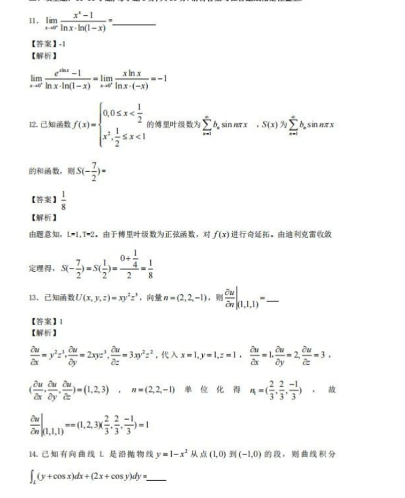
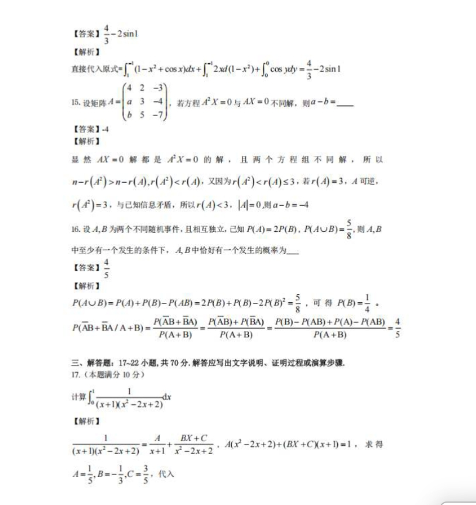
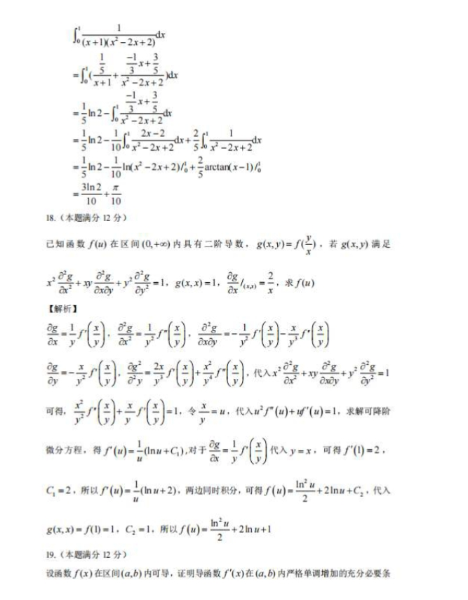
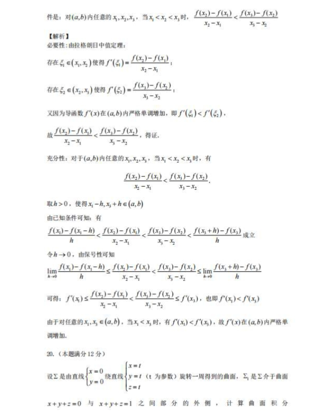
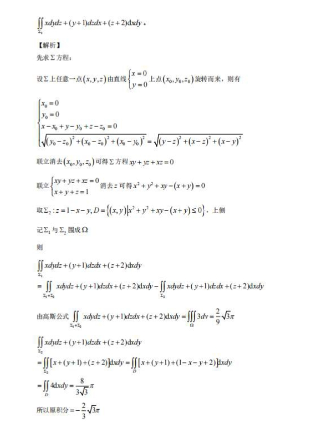
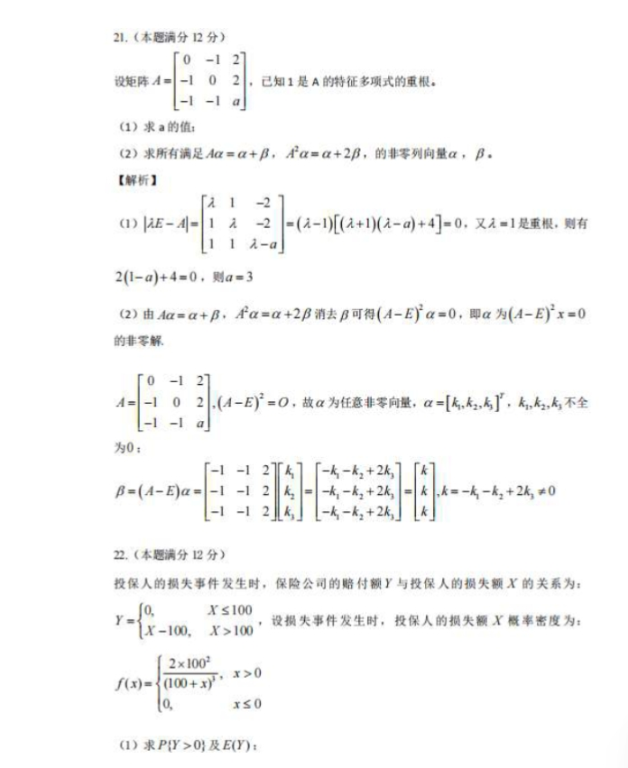

# Math 1 2025 Answers

资料类型：考研数学一答案解析
年份：2025
科目：数学一
来源：题干截图与第 11-22 题答案解析截图；第 1-10 题按题干逐题推导校验。
整理状态：已补齐标准答案与详细解析

## 答案速查

| 题号 | 题型 | 答案 |
|---|---|---|
| 1 | 选择题 | B |
| 2 | 选择题 | B |
| 3 | 选择题 | D |
| 4 | 选择题 | A |
| 5 | 选择题 | B |
| 6 | 选择题 | D |
| 7 | 选择题 | A |
| 8 | 选择题 | C |
| 9 | 选择题 | C |
| 10 | 选择题 | D |
| 11 | 填空题 | $-1$ |
| 12 | 填空题 | $\frac{1}{8}$ |
| 13 | 填空题 | $1$ |
| 14 | 填空题 | $\frac{4}{3}-2\sin1$ |
| 15 | 填空题 | $-4$ |
| 16 | 填空题 | $\frac{4}{5}$ |
| 17 | 解答题 | $\displaystyle \frac{3\ln2}{10}+\frac{\pi}{10}$ |
| 18 | 解答题 | $\displaystyle f(u)=\frac{\ln^2u}{2}+2\ln u+1$ |
| 19 | 解答题 | 充分必要条件成立。 |
| 20 | 解答题 | $\displaystyle -\frac{2\sqrt{3}\pi}{3}$ |
| 21 | 解答题 | （1）$a=3$；（2）$\alpha=(k_1,k_2,k_3)^T$，$-k_1-k_2+2k_3\ne0$，$\beta=(-k_1-k_2+2k_3)(1,1,1)^T$。 |
| 22 | 解答题 | （1）$P\{Y>0\}=\frac{1}{4}$，$EY=50$；（2）$M\sim P(2)$，即 $P\{M=m\}=e^{-2}\frac{2^m}{m!}$，$m=0,1,2,\ldots$。 |

## 详细解析

### 第 1 题

**答案：** B

由变上限积分求导，
$$
f'(x)=e^{x^2}\sin x.
$$
在 $x=0$ 的左侧 $\sin x<0$，右侧 $\sin x>0$，所以 $f'(x)$ 由负变正，$x=0$ 是 $f(x)$ 的极小值点。

又
$$
f''(x)=e^{x^2}(2x\sin x+\cos x),\qquad f''(0)=1\ne0,
$$
因而 $(0,0)$ 不是曲线 $y=f(x)$ 的拐点。

记 $h(x)=\int_0^x e^{t^2}\,dt$。当 $x\to0$ 时，
$$
h(x)=x+O(x^3),\qquad \sin^2x=x^2+O(x^4),
$$
故
$$
g(x)=h(x)\sin^2x=x^3+O(x^5).
$$
于是 $g''(x)=6x+O(x^3)$ 在 $0$ 的两侧变号，所以 $(0,0)$ 是曲线 $y=g(x)$ 的拐点；同时 $g(x)$ 在 $0$ 的两侧异号，$x=0$ 不是 $g(x)$ 的极值点。故选 B。

### 第 2 题

**答案：** B

对①，
$$
\frac{n^3}{n^2+1}=n-\frac{n}{n^2+1},
$$
因而
$$
\sin\frac{n^3\pi}{n^2+1}
=\sin\left(n\pi-\frac{n\pi}{n^2+1}\right)
=(-1)^{n+1}\sin\frac{n\pi}{n^2+1}.
$$
其中 $\sin\frac{n\pi}{n^2+1}\sim\frac{\pi}{n}$，故①按交错级数判别法收敛，但其绝对值级数与调和级数同阶而发散，所以①条件收敛。

对②，令 $u_n=n^{-\frac{2}{3}}$。由 $\tan u=u+\frac{u^3}{3}+O(u^5)$，得
$$
u_n-\tan u_n=-\frac{u_n^3}{3}+O(u_n^5)
=-\frac{1}{3n^2}+O\left(n^{-\frac{10}{3}}\right).
$$
因此②的通项绝对值与 $\frac{1}{n^2}$ 同阶，②绝对收敛。故选 B。

### 第 3 题

**答案：** D

若 $\lim_{x\to+\infty}f(x)=A$，由连续型 Cesaro 平均结论可得
$$
\lim_{x\to+\infty}\frac{1}{x}\int_0^x f(t)\,dt=A,
$$
因而 D 正确。

其余选项可用反例排除。取 $f(x)=\frac{\sin x^2}{x+1}$，则 $f(x)\to0$，但 $f'(x)$ 含快速振荡项，极限不存在，排除 A。取 $f(x)=\ln(x+1)$，则 $f'(x)=\frac{1}{x+1}\to0$，而 $f(x)\to+\infty$，排除 B。取 $f(x)=\sin x$，则
$$
\frac{1}{x}\int_0^x\sin t\,dt=\frac{1-\cos x}{x}\to0,
$$
但 $f(x)$ 本身无极限，排除 C。故选 D。

### 第 4 题

**答案：** A

原积分区域为
$$
-2\le x\le2,\qquad 4-x^2\le y\le4.
$$
由 $4-x^2\le y$ 得 $x^2\ge4-y$。固定 $y\in[0,4]$ 时，$x$ 的取值为
$$
-2\le x\le-\sqrt{4-y},
\qquad
\sqrt{4-y}\le x\le2.
$$
因此换序后为
$$
\int_0^4\left[\int_{-2}^{-\sqrt{4-y}} f(x,y)\,dx+\int_{\sqrt{4-y}}^2 f(x,y)\,dx\right]dy.
$$
故选 A。

### 第 5 题

**答案：** B

配方得
$$
f=x_1^2+2x_1(x_2+x_3)
=(x_1+x_2+x_3)^2-(x_2+x_3)^2.
$$
经过可逆线性变换后，二次型的规范形含一个正平方项、一个负平方项和一个零平方项。因此正惯性指数为 $1$，故选 B。

### 第 6 题

**答案：** D

因为 $\alpha_1,\alpha_2$ 线性无关，而 $\alpha_1,\alpha_2,\alpha_3$ 线性相关，所以存在常数 $p,q$ 使
$$
\alpha_3=p\alpha_1+q\alpha_2.
$$
又由 $\alpha_1+\alpha_2+\alpha_4=0$ 得 $\alpha_4=-\alpha_1-\alpha_2$。代入方程组，得
$$
(x+pz)\alpha_1+(y+qz)\alpha_2=-\alpha_1-\alpha_2.
$$
由 $\alpha_1,\alpha_2$ 线性无关，必有
$$
x+pz=-1,
\qquad
y+qz=-1.
$$
这是三维坐标空间中两个不重合平面的交线，即一条直线。原点不满足原方程，因为 $\alpha_4=-\alpha_1-\alpha_2\ne0$，所以该直线不过原点。故选 D。

### 第 7 题

**答案：** A

由 Frobenius 秩不等式，
$$
r(AB)\ge r(A)+r(B)-n,
$$
且
$$
r(ABC)\ge r(AB)+r(C)-n.
$$
两式合并得
$$
r(ABC)\ge r(A)+r(B)+r(C)-2n.
$$
题设右端正好等于 $r(ABC)$，因此上述不等式必须都取等号。于是
$$
r(AB)=r(A)+r(B)-n,
$$
即 II 正确；并且
$$
r(ABC)=r(AB)+r(C)-n,
$$
即 I 正确。

III、IV 不必成立。例如 $n=1$ 时取 $A=0,B=C=1$，满足题设，但 $A$ 不满秩，且 $AB=BC$ 不同时满秩。故选 A。

### 第 8 题

**答案：** C

因为 $DX=DY=1$，$\operatorname{Cov}(X,Y)=\rho$，所以
$$
D(aX+bY)=a^2DX+b^2DY+2ab\operatorname{Cov}(X,Y)
=a^2+b^2+2\rho ab=1+2\rho ab.
$$
在 $a^2+b^2=1$ 下，$ab\in\left[-\frac{1}{2},\frac{1}{2}\right]$。当 $\rho>0$ 时取 $ab=\frac{1}{2}$ 达到最大值；当 $\rho<0$ 时取 $ab=-\frac{1}{2}$ 达到最大值。故最大值为
$$
1+|\rho|.
$$
选 C。

### 第 9 题

**答案：** C

因为 $X_i\sim B(1,0.1)$，所以
$$
T=\sum_{i=1}^{20}X_i\sim B(20,0.1).
$$
用泊松近似时参数为 $\lambda=np=20\times0.1=2$。因此
$$
P\{T\le1\}\approx P\{Z\le1\}
=e^{-2}\left(1+2\right)=\frac{3}{e^2},
$$
其中 $Z\sim P(2)$。故选 C。

### 第 10 题

**答案：** D

已知总体方差为 $2$，所以
$$
\bar X\sim N\left(\mu,\frac{2}{n}\right).
$$
对右侧检验 $H_0:\mu\le1$，临界点取边界 $\mu=1$，检验统计量为
$$
\frac{\bar X-1}{\sqrt{\frac{2}{n}}}.
$$
显著性水平为 $\alpha$ 的拒绝域为
$$
\frac{\bar X-1}{\sqrt{\frac{2}{n}}}>Z_\alpha,
$$
即
$$
\bar X>1+\sqrt{\frac{2}{n}}Z_\alpha.
$$
故选 D。

### 第 11 题

**答案：** $-1$

因为 $x^x=e^{x\ln x}$，且 $x\ln x\to0$，所以
$$
x^x-1=e^{x\ln x}-1\sim x\ln x.
$$
又 $\ln(1-x)\sim -x$，故
$$
\lim_{x\to0^+}\frac{x^x-1}{\ln x\cdot\ln(1-x)}
=\lim_{x\to0^+}\frac{x\ln x}{\ln x\cdot(-x)}=-1.
$$

### 第 12 题

**答案：** $\frac{1}{8}$

正弦级数对应 $f(x)$ 在 $[-1,1]$ 上的奇延拓，并作周期为 $2$ 的周期延拓。因此
$$
S\left(-\frac{7}{2}\right)=S\left(\frac{1}{2}\right).
$$
在 $x=\frac{1}{2}$ 处，原函数左极限为 $0$，右极限为 $\left(\frac{1}{2}\right)^2=\frac{1}{4}$。由傅里叶级数收敛定理，和函数在跳跃点取左右极限平均值，故
$$
S\left(\frac{1}{2}\right)=\frac{0+\frac{1}{4}}{2}=\frac{1}{8}.
$$

### 第 13 题

**答案：** $1$

方向导数中的方向应取单位向量。先求梯度：
$$
\nabla u=(y^2z^3,\ 2xyz^3,\ 3xy^2z^2).
$$
在 $(1,1,1)$ 处，
$$
\nabla u(1,1,1)=(1,2,3).
$$
又 $|\boldsymbol n|=3$，单位方向向量为
$$
\boldsymbol n_0=\left(\frac{2}{3},\frac{2}{3},-\frac{1}{3}\right).
$$
因此
$$
\left.\frac{\partial u}{\partial \boldsymbol n}\right|_{(1,1,1)}
=\nabla u(1,1,1)\cdot\boldsymbol n_0
=\frac{2}{3}+\frac{4}{3}-1=1.
$$

### 第 14 题

**答案：** $\frac{4}{3}-2\sin1$

沿曲线取参数 $x$，则 $y=1-x^2$，方向为 $x:1\to-1$，且 $dy=-2x\,dx$。原积分拆为
$$
\int_L y\,dx+\int_L \cos x\,dx+\int_L 2x\,dy+\int_L \cos y\,dy.
$$
分别计算：
$$
\int_1^{-1}(1-x^2)\,dx=-\frac{4}{3},
\qquad
\int_1^{-1}\cos x\,dx=-2\sin1,
$$
$$
\int_1^{-1}2x(-2x)\,dx=\frac{8}{3},
\qquad
\int_L\cos y\,dy=\sin y\bigg|_0^0=0.
$$
所以所求积分为
$$
-\frac{4}{3}-2\sin1+\frac{8}{3}=\frac{4}{3}-2\sin1.
$$

### 第 15 题

**答案：** $-4$

若 $A\boldsymbol x=0$，则必有 $A^2\boldsymbol x=0$，所以 $A\boldsymbol x=0$ 的解空间包含在 $A^2\boldsymbol x=0$ 的解空间中。题设说两个方程组不同解，故
$$
\dim\ker A^2>\dim\ker A,
$$
即
$$
r(A^2)<r(A).
$$
若 $A$ 可逆，则 $A^2$ 也可逆，不可能有 $r(A^2)<r(A)$。因此 $A$ 必不可逆，$\det A=0$。

计算行列式：
$$
\det A=\begin{vmatrix}
4&2&-3\\
a&3&-4\\
b&5&-7
\end{vmatrix}=b-a-4.
$$
由 $\det A=0$ 得 $b-a-4=0$，所以
$$
a-b=-4.
$$

### 第 16 题

**答案：** $\frac{4}{5}$

设 $P(B)=p$，则 $P(A)=2p$。由独立性，
$$
P(A\cup B)=P(A)+P(B)-P(A)P(B)=3p-2p^2=\frac{5}{8}.
$$
解得 $p=\frac{1}{4}$，另一根不符合概率取值。因此
$$
P(B)=\frac{1}{4},\qquad P(A)=\frac{1}{2}.
$$
恰有一个发生的概率为
$$
P(A\bar B)+P(\bar A B)=P(A)(1-P(B))+(1-P(A))P(B)
=\frac{1}{2}\cdot\frac{3}{4}+\frac{1}{2}\cdot\frac{1}{4}=\frac{1}{2}.
$$
条件概率为
$$
\frac{P(A\bar B)+P(\bar A B)}{P(A\cup B)}
=\frac{\frac{1}{2}}{\frac{5}{8}}=\frac{4}{5}.
$$

### 第 17 题

**答案：** $\displaystyle \frac{3\ln2}{10}+\frac{\pi}{10}$

作部分分式分解：
$$
\frac{1}{(x+1)(x^2-2x+2)}=\frac{A}{x+1}+\frac{Bx+C}{x^2-2x+2}.
$$
比较系数得
$$
A=\frac{1}{5},\qquad B=-\frac{1}{5},\qquad C=\frac{3}{5}.
$$
因此
$$
\begin{aligned}
I&=\int_0^1\frac{1}{(x+1)(x^2-2x+2)}\,dx\\
&=\frac{1}{5}\int_0^1\frac{dx}{x+1}
+\frac{1}{5}\int_0^1\frac{-x+3}{x^2-2x+2}\,dx.
\end{aligned}
$$
又
$$
-x+3=-\frac{1}{2}(2x-2)+2,
$$
所以
$$
\begin{aligned}
I&=\frac{1}{5}\ln2-\frac{1}{10}\ln(x^2-2x+2)\bigg|_0^1
+\frac{2}{5}\arctan(x-1)\bigg|_0^1\\
&=\frac{1}{5}\ln2+\frac{1}{10}\ln2+\frac{\pi}{10}
=\frac{3\ln2}{10}+\frac{\pi}{10}.
\end{aligned}
$$

### 第 18 题

**答案：** $\displaystyle f(u)=\frac{\ln^2u}{2}+2\ln u+1$

记 $u=\frac{x}{y}$。由链式法则，
$$
g_x=\frac{1}{y}f'(u),\qquad
g_{xx}=\frac{1}{y^2}f''(u),
$$
$$
g_{xy}=-\frac{1}{y^2}f'(u)-\frac{x}{y^3}f''(u),
$$
$$
g_y=-\frac{x}{y^2}f'(u),\qquad
g_{yy}=\frac{2x}{y^3}f'(u)+\frac{x^2}{y^4}f''(u).
$$
代入题设方程并化简，得
$$
u^2f''(u)+uf'(u)=1.
$$
令 $w(u)=f'(u)$，则
$$
u^2w'(u)+uw(u)=1,
$$
即
$$
(uw(u))'=\frac{1}{u}.
$$
积分得
$$
uf'(u)=\ln u+C_1,
\qquad
f'(u)=\frac{\ln u+C_1}{u}.
$$
由
$$
\left.g_x\right|_{(x,x)}=\frac{1}{x}f'(1)=\frac{2}{x}
$$
得 $f'(1)=2$，故 $C_1=2$。再积分，
$$
f(u)=\frac{\ln^2u}{2}+2\ln u+C_2.
$$
由 $g(x,x)=f(1)=1$ 得 $C_2=1$。所以
$$
f(u)=\frac{\ln^2u}{2}+2\ln u+1.
$$

### 第 19 题

**答案：** 充分必要条件成立。

先证必要性。若 $f'(x)$ 在 $(a,b)$ 内严格单调增加，对任意 $x_1<x_2<x_3$，由拉格朗日中值定理，存在
$$
\xi_1\in(x_1,x_2),\qquad \xi_2\in(x_2,x_3),
$$
使得
$$
\frac{f(x_2)-f(x_1)}{x_2-x_1}=f'(\xi_1),
\qquad
\frac{f(x_3)-f(x_2)}{x_3-x_2}=f'(\xi_2).
$$
因为 $\xi_1<\xi_2$ 且 $f'$ 严格单调增加，所以
$$
f'(\xi_1)<f'(\xi_2),
$$
即题设割线斜率不等式成立。

再证充分性。设题设不等式对任意 $x_1<x_2<x_3$ 成立。任取 $x_1<x_3$，再取 $x_2\in(x_1,x_3)$，并取充分小的 $h>0$，使 $x_1-h,x_3+h\in(a,b)$。对三组点
$$
x_1-h<x_1<x_2,
\qquad
x_1<x_2<x_3,
\qquad
x_2<x_3<x_3+h
$$
分别应用题设不等式，得
$$
\frac{f(x_1)-f(x_1-h)}{h}
<\frac{f(x_2)-f(x_1)}{x_2-x_1}
<\frac{f(x_3)-f(x_2)}{x_3-x_2}
<\frac{f(x_3+h)-f(x_3)}{h}.
$$
令 $h\to0^+$，得到
$$
f'(x_1)\le\frac{f(x_2)-f(x_1)}{x_2-x_1}
<\frac{f(x_3)-f(x_2)}{x_3-x_2}\le f'(x_3).
$$
因而 $f'(x_1)<f'(x_3)$。由于 $x_1<x_3$ 任意，$f'(x)$ 在 $(a,b)$ 内严格单调增加。充分性得证。

### 第 20 题

**答案：** $\displaystyle -\frac{2\sqrt{3}\pi}{3}$

旋转轴为直线 $x=y=z$。旋转保持点到该轴的距离以及在轴方向上的投影。记 $s=x+y+z$。原直线 $x=0,y=0$ 上的点为 $(0,0,s)$，它到轴的距离平方为 $\frac{2s^2}{3}$。空间点 $(x,y,z)$ 到轴的距离平方为
$$
x^2+y^2+z^2-\frac{s^2}{3}.
$$
令二者相等，得
$$
x^2+y^2+z^2=s^2,
$$
即旋转曲面方程为
$$
xy+yz+zx=0.
$$

设 $\Sigma_2$ 为平面 $x+y+z=1$ 截得的上端盖，$\Omega$ 为 $\Sigma_1$ 与 $\Sigma_2$ 围成的立体。向量场
$$
\boldsymbol F=(x,y+1,z+2)
$$
的散度为
$$
\operatorname{div}\boldsymbol F=3.
$$
由高斯公式，
$$
\iint_{\Sigma_1}\boldsymbol F\cdot d\boldsymbol S+
\iint_{\Sigma_2}\boldsymbol F\cdot d\boldsymbol S
=3V(\Omega).
$$

该曲面是圆锥面。轴向高度为 $H=\frac{1}{\sqrt{3}}$，上端截面半径为 $R=\sqrt{2}H=\sqrt{\frac{2}{3}}$，故
$$
V(\Omega)=\frac{1}{3}\pi R^2H
=\frac{1}{3}\pi\cdot\frac{2}{3}\cdot\frac{1}{\sqrt{3}}
=\frac{2\pi}{9\sqrt{3}}.
$$
因而
$$
3V(\Omega)=\frac{2\pi}{3\sqrt{3}}.
$$

在 $\Sigma_2$ 上，$z=1-x-y$，外法向量面元为 $(1,1,1)\,dx\,dy$。投影区域 $D$ 满足
$$
x^2+y^2+xy-x-y\le0.
$$
令 $u=x+y,\ v=x-y$，则
$$
x^2+y^2+xy-x-y\le0
\iff
3\left(u-\frac{2}{3}\right)^2+v^2\le\frac{4}{3},
$$
且 $dx\,dy=\frac{1}{2}du\,dv$。所以
$$
S_D=\frac{2\pi}{3\sqrt{3}}.
$$
又在 $\Sigma_2$ 上
$$
\boldsymbol F\cdot(1,1,1)=x+(y+1)+(z+2)=4,
$$
因而
$$
\iint_{\Sigma_2}\boldsymbol F\cdot d\boldsymbol S
=4S_D=\frac{8\pi}{3\sqrt{3}}.
$$
故
$$
I=\frac{2\pi}{3\sqrt{3}}-\frac{8\pi}{3\sqrt{3}}
=-\frac{2\pi}{\sqrt{3}}
=-\frac{2\sqrt{3}\pi}{3}.
$$

### 第 21 题

**答案：** （1）$a=3$；（2）$\alpha=(k_1,k_2,k_3)^T$，$-k_1-k_2+2k_3\ne0$，$\beta=(-k_1-k_2+2k_3)(1,1,1)^T$。

（1）计算特征多项式：
$$
\det(\lambda E-A)
=\begin{vmatrix}
\lambda&1&-2\\
1&\lambda&-2\\
1&1&\lambda-a
\end{vmatrix}
=(\lambda-1)[(\lambda+1)(\lambda-a)+4].
$$
已知 $1$ 是重根，所以第二个因子在 $\lambda=1$ 时也为 $0$，即
$$
2(1-a)+4=0.
$$
因此
$$
a=3.
$$

（2）当 $a=3$ 时，由 $A\alpha=\alpha+\beta$ 得
$$
\beta=(A-E)\alpha.
$$
再代入 $A^2\alpha=\alpha+2\beta$，得
$$
A^2\alpha=\alpha+2(A-E)\alpha=(2A-E)\alpha,
$$
即
$$
(A-E)^2\alpha=0.
$$
此时
$$
A-E=\begin{pmatrix}
-1&-1&2\\
-1&-1&2\\
-1&-1&2
\end{pmatrix},
\qquad
(A-E)^2=O.
$$
因此任意非零 $\alpha=(k_1,k_2,k_3)^T$ 都满足 $(A-E)^2\alpha=0$，而
$$
\beta=(A-E)\alpha
=(-k_1-k_2+2k_3)\begin{pmatrix}1\\1\\1\end{pmatrix}.
$$
题目要求 $\alpha,\beta$ 均为非零向量，所以还需
$$
-k_1-k_2+2k_3\ne0.
$$
综上，所有解为
$$
\alpha=\begin{pmatrix}k_1\\k_2\\k_3\end{pmatrix},
\qquad
\beta=(-k_1-k_2+2k_3)\begin{pmatrix}1\\1\\1\end{pmatrix},
$$
其中 $-k_1-k_2+2k_3\ne0$。

### 第 22 题

**答案：** （1）$P\{Y>0\}=\frac{1}{4}$，$EY=50$；（2）$M\sim P(2)$，即 $P\{M=m\}=e^{-2}\frac{2^m}{m!}$，$m=0,1,2,\ldots$。

（1）因为 $Y>0$ 当且仅当 $X>100$，所以
$$
P\{Y>0\}=P\{X>100\}
=\int_{100}^{+\infty}\frac{2\cdot100^2}{(100+x)^3}\,dx.
$$
令 $u=100+x$，得
$$
P\{Y>0\}=\int_{200}^{+\infty}\frac{20000}{u^3}\,du
=\frac{10000}{200^2}=\frac{1}{4}.
$$
又
$$
EY=E[(X-100)^+]
=\int_{100}^{+\infty}(x-100)\frac{2\cdot100^2}{(100+x)^3}\,dx.
$$
仍令 $u=100+x$，则 $x-100=u-200$，于是
$$
\begin{aligned}
EY&=20000\int_{200}^{+\infty}\left(\frac{1}{u^2}-\frac{200}{u^3}\right)du\\
&=20000\left(\frac{1}{200}-\frac{1}{400}\right)=50.
\end{aligned}
$$

（2）由（1）知 $p=\frac{1}{4}$。对 $m=0,1,2,\ldots$，用全概率公式求 $M$ 的分布：
$$
\begin{aligned}
P\{M=m\}
&=\sum_{n=m}^{\infty}P\{M=m\mid N=n\}P\{N=n\}\\
&=\sum_{n=m}^{\infty}\binom{n}{m}\left(\frac{1}{4}\right)^m
\left(\frac{3}{4}\right)^{n-m}e^{-8}\frac{8^n}{n!}.
\end{aligned}
$$
令 $k=n-m$，化简得
$$
\begin{aligned}
P\{M=m\}
&=e^{-8}\frac{(8\cdot\frac{1}{4})^m}{m!}
\sum_{k=0}^{\infty}\frac{(8\cdot\frac{3}{4})^k}{k!}\\
&=e^{-8}\frac{2^m}{m!}e^6
=e^{-2}\frac{2^m}{m!}.
\end{aligned}
$$
因此 $M$ 服从参数为 $2$ 的泊松分布，即
$$
M\sim P(2).
$$

## 答案解析截图

以下图片为第 11-22 题答案与解析原图，用于人工校验。第 22 题截图只显示题干开头，解析已按题干独立推导补齐。

