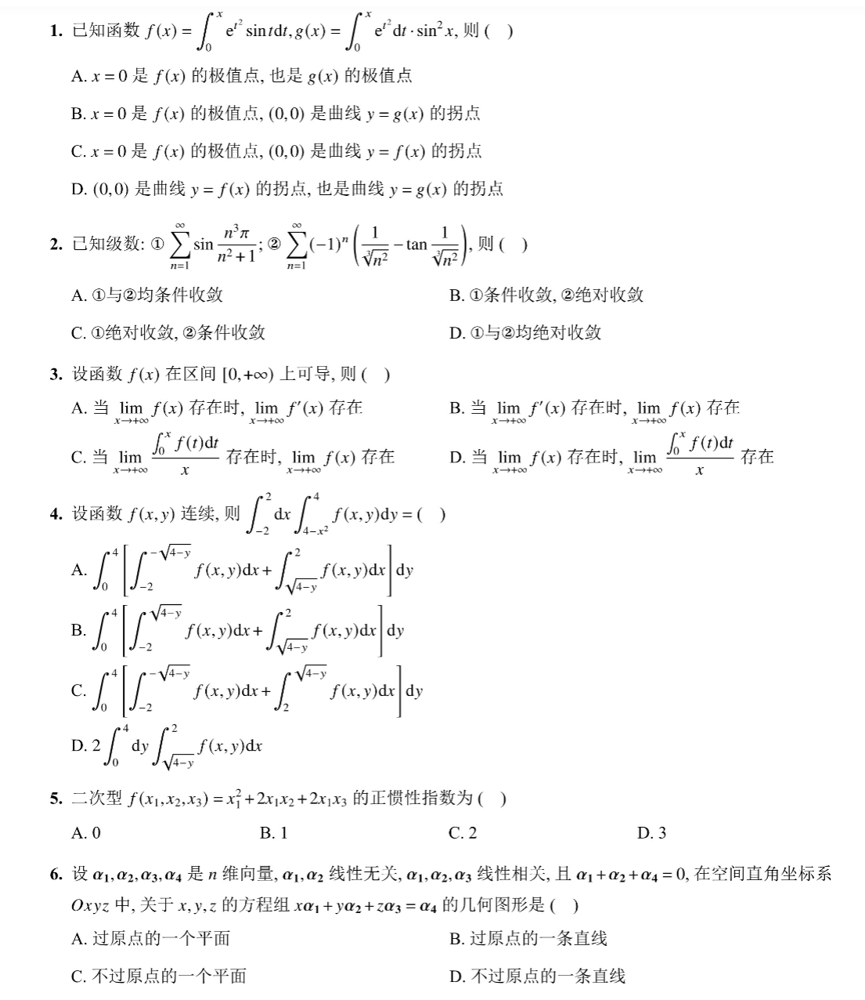
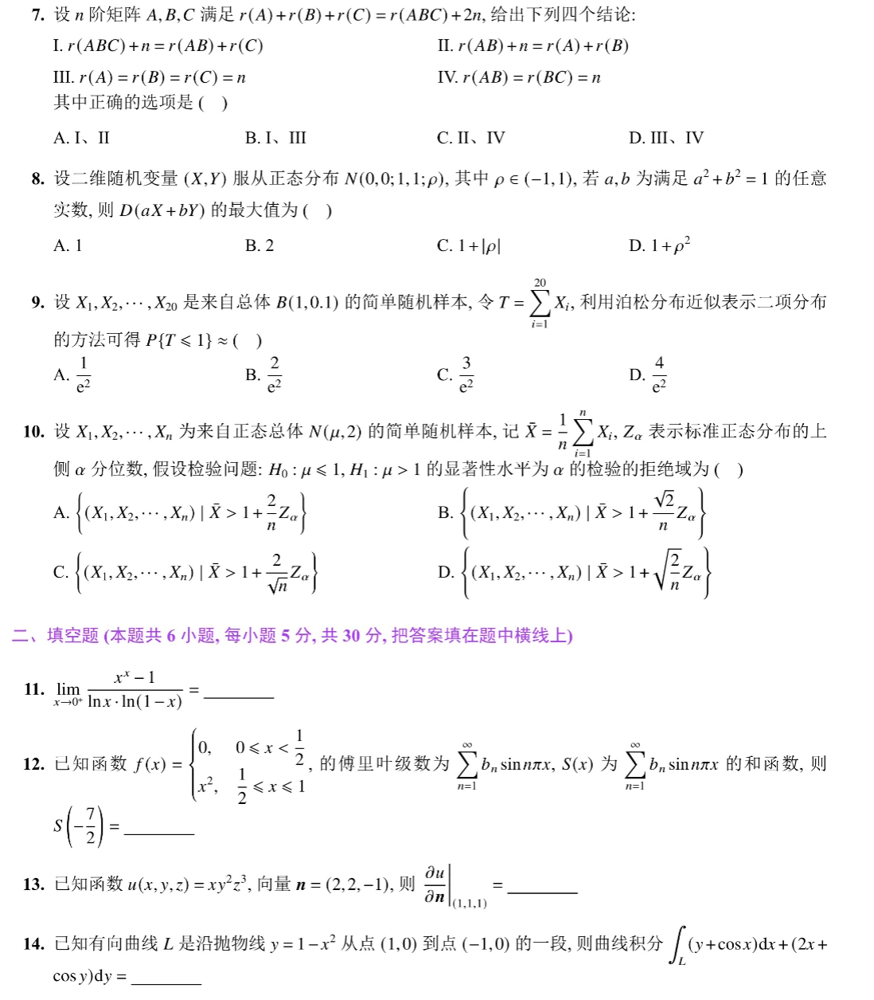
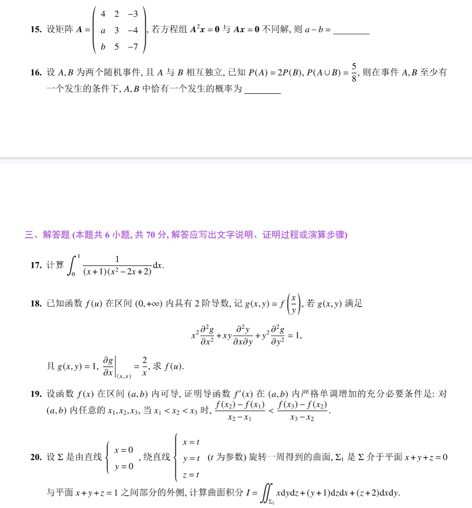
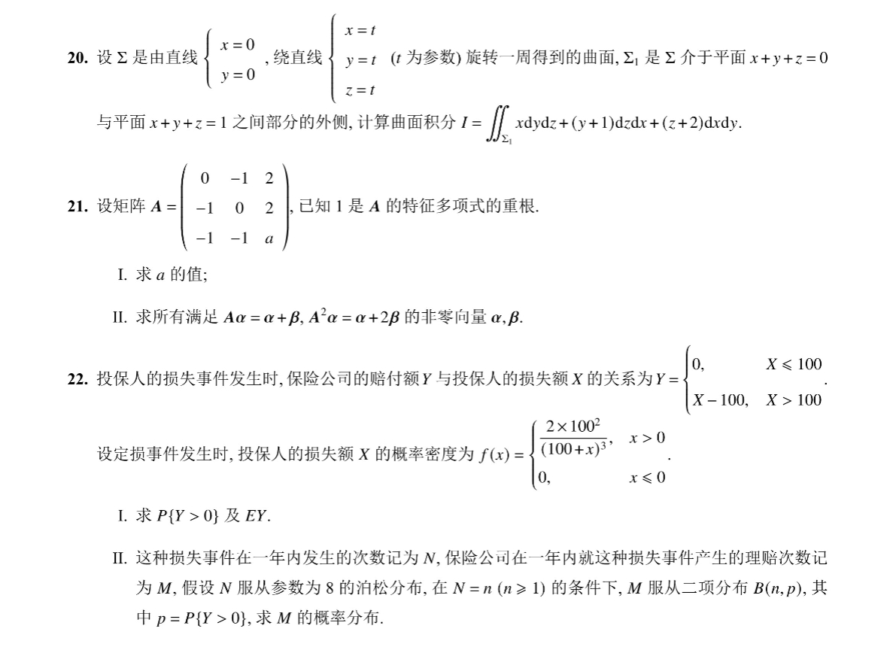

# Math 1 2025 Exam Questions

资料类型：考研数学一历年真题  
年份：2025  
科目：数学一  
整理状态：待复核  

说明：本文件根据用户提供的 2025 年真题截图整理。截图已保存到 `images/` 目录；本套截图显示至第 22 题。

## 2025 数一 选择题 1-6

截图：



### 第 1 题

- 题型：选择题
- 题号：1
- 分值：5
- 模块：高数
- 考点：极限、导数、积分、级数、微分方程
- 校对状态：根据截图整理

已知函数

```text
f(x)=∫_0^x e^(t^2) sin t dt,
g(x)=∫_0^x e^(t^2) dt · sin^2 x
```

则（ ）

选项：

A. `x=0` 是 `f(x)` 的极值点，也是 `g(x)` 的极值点。  
B. `x=0` 是 `f(x)` 的极值点，`(0,0)` 是曲线 `y=g(x)` 的拐点。  
C. `x=0` 是 `f(x)` 的极值点，`(0,0)` 是曲线 `y=f(x)` 的拐点。  
D. `(0,0)` 是曲线 `y=f(x)` 的拐点，也是曲线 `y=g(x)` 的拐点。

### 第 2 题

- 题型：选择题
- 题号：2
- 分值：5
- 模块：高数
- 考点：极限、导数、积分、级数、微分方程
- 校对状态：根据截图整理

已知级数：

```text
① sum_{n=1}^∞ sin(n^3 π/(n^2+1))
② sum_{n=1}^∞ (-1)^n (1/root(n^2,3) - tan(1/root(n^2,3)))
```

则（ ）

选项：

A. ①与②均条件收敛。  
B. ①条件收敛，②绝对收敛。  
C. ①绝对收敛，②条件收敛。  
D. ①与②均绝对收敛。

### 第 3 题

- 题型：选择题
- 题号：3
- 分值：5
- 模块：高数
- 考点：极限、导数、积分、级数、微分方程
- 校对状态：根据截图整理

设函数 `f(x)` 在区间 `[0,+∞)` 上可导，则（ ）

选项：

A. 当 `lim_{x->+∞} f(x)` 存在时，`lim_{x->+∞} f'(x)` 存在。  
B. 当 `lim_{x->+∞} f'(x)` 存在时，`lim_{x->+∞} f(x)` 存在。  
C. 当 `lim_{x->+∞} (∫_0^x f(t)dt)/x` 存在时，`lim_{x->+∞} f(x)` 存在。  
D. 当 `lim_{x->+∞} f(x)` 存在时，`lim_{x->+∞} (∫_0^x f(t)dt)/x` 存在。

### 第 4 题

- 题型：选择题
- 题号：4
- 分值：5
- 模块：高数
- 考点：极限、导数、积分、级数、微分方程
- 校对状态：根据截图整理

设函数 `f(x,y)` 连续，则

```text
∫_{-2}^2 dx ∫_{4-x^2}^4 f(x,y)dy = ( )
```

选项：

A. `∫_0^4 [∫_{-2}^{-sqrt(4-y)} f(x,y)dx + ∫_{sqrt(4-y)}^2 f(x,y)dx]dy`  
B. `∫_0^4 [∫_{-2}^{sqrt(4-y)} f(x,y)dx + ∫_{sqrt(4-y)}^2 f(x,y)dx]dy`  
C. `∫_0^4 [∫_{-2}^{-sqrt(4-y)} f(x,y)dx + ∫_2^{sqrt(4-y)} f(x,y)dx]dy`  
D. `2∫_0^4 dy ∫_{sqrt(4-y)}^2 f(x,y)dx`

### 第 5 题

- 题型：选择题
- 题号：5
- 分值：5
- 模块：线代
- 考点：矩阵、向量组、二次型
- 校对状态：根据截图整理

二次型

```text
f(x_1,x_2,x_3)=x_1^2+2x_1x_2+2x_1x_3
```

的正惯性指数为（ ）

选项：A. `0`  B. `1`  C. `2`  D. `3`

### 第 6 题

- 题型：选择题
- 题号：6
- 分值：5
- 模块：线代
- 考点：矩阵、向量组、二次型
- 校对状态：根据截图整理

设 `alpha_1,alpha_2,alpha_3,alpha_4` 是 `n` 维向量，`alpha_1,alpha_2` 线性无关，`alpha_1,alpha_2,alpha_3` 线性相关，且 `alpha_1+alpha_2+alpha_4=0`，在空间直角坐标系 `Oxyz` 中，关于 `x,y,z` 的方程组

```text
x alpha_1 + y alpha_2 + z alpha_3 = alpha_4
```

的几何图形是（ ）

选项：A. 过原点的一个平面。 B. 过原点的一条直线。 C. 不过原点的一个平面。 D. 不过原点的一条直线。

## 2025 数一 选择题 7-10 与填空题 11-14

截图：



### 第 7 题

- 题型：选择题
- 题号：7
- 分值：5
- 模块：线代
- 考点：矩阵、向量组、二次型
- 校对状态：根据截图整理

设 `n` 阶矩阵 `A,B,C` 满足

```text
r(A)+r(B)+r(C)=r(ABC)+2n
```

给出下列四个结论：

```text
I.   r(ABC)+n = r(AB)+r(C)
II.  r(AB)+n = r(A)+r(B)
III. r(A)=r(B)=r(C)=n
IV.  r(AB)=r(BC)=n
```

其中正确的选项是（ ）

选项：A. `I,II`  B. `I,III`  C. `II,IV`  D. `III,IV`

### 第 8 题

- 题型：选择题
- 题号：8
- 分值：5
- 模块：概率统计
- 考点：随机变量、概率分布、参数估计
- 校对状态：根据截图整理

设二维随机变量 `(X,Y)` 服从正态分布 `N(0,0;1,1;rho)`，其中 `rho in (-1,1)`。若 `a,b` 为满足 `a^2+b^2=1` 的任意实数，则 `D(aX+bY)` 的最大值为（ ）

选项：A. `1`  B. `2`  C. `1+|rho|`  D. `1+rho^2`

### 第 9 题

- 题型：选择题
- 题号：9
- 分值：5
- 模块：概率统计
- 考点：随机变量、概率分布、参数估计
- 校对状态：根据截图整理

设 `X_1,...,X_20` 是来自总体 `B(1,0.1)` 的简单随机样本，令 `T=sum_{i=1}^{20}X_i`，利用泊松分布近似表示二项分布的方法可得 `P{T<=1}` 约为（ ）

选项：A. `1/e^2`  B. `2/e^2`  C. `3/e^2`  D. `4/e^2`

### 第 10 题

- 题型：选择题
- 题号：10
- 分值：5
- 模块：概率统计
- 考点：随机变量、概率分布、参数估计
- 校对状态：根据截图整理

设 `X_1,...,X_n` 为来自正态总体 `N(mu,2)` 的简单随机样本，记 `X_bar=(1/n)sum X_i`，`Z_alpha` 表示标准正态分布的上侧 `alpha` 分位数，假设检验问题 `H_0:mu<=1, H_1:mu>1` 的显著性水平为 `alpha` 的检验的拒绝域为（ ）

选项：

A. `{(X_1,...,X_n)|X_bar>1+(2/n)Z_alpha}`  
B. `{(X_1,...,X_n)|X_bar>1+(sqrt(2)/n)Z_alpha}`  
C. `{(X_1,...,X_n)|X_bar>1+(2/sqrt(n))Z_alpha}`  
D. `{(X_1,...,X_n)|X_bar>1+sqrt(2/n)Z_alpha}`

### 第 11 题

- 题型：填空题
- 题号：11
- 分值：5
- 模块：高数
- 考点：极限、导数、积分、级数、微分方程
- 校对状态：根据截图整理

```text
lim_{x->0+} (x^x - 1)/(ln x · ln(1-x)) = ____
```

### 第 12 题

- 题型：填空题
- 题号：12
- 分值：5
- 模块：高数
- 考点：极限、导数、积分、级数、微分方程
- 校对状态：根据截图整理

已知函数

```text
f(x)={
  0,   0<=x<1/2,
  x^2, 1/2<=x<1
}
```

的傅里叶级数为 `sum_{n=1}^∞ b_n sin(nπx)`，`S(x)` 为该级数的和函数，则 `S(-7/2)=____`。

### 第 13 题

- 题型：填空题
- 题号：13
- 分值：5
- 模块：高数
- 考点：极限、导数、积分、级数、微分方程
- 校对状态：根据截图整理

已知函数 `u(x,y,z)=xy^2z^3`，向量 `n=(2,2,-1)`，则

```text
(∂u/∂n)|_(1,1,1) = ____
```

### 第 14 题

- 题型：填空题
- 题号：14
- 分值：5
- 模块：高数
- 考点：极限、导数、积分、级数、微分方程
- 校对状态：根据截图整理

已知有向曲线 `L` 是沿抛物线 `y=1-x^2` 从点 `(1,0)` 到点 `(-1,0)` 的一段，则曲线积分

```text
∫_L (y+cos x)dx + (2x+cos y)dy = ____
```

## 2025 数一 填空题 15-16 与解答题 17-20

截图：



### 第 15 题

- 题型：填空题
- 题号：15
- 分值：5
- 模块：线代
- 考点：矩阵、向量组、二次型
- 校对状态：根据截图整理

设矩阵

```text
A = [4 2 -3
     a 3 -4
     b 5 -7]
```

若方程组 `A^2 x=0` 与 `Ax=0` 不同解，则 `a-b=____`。

### 第 16 题

- 题型：填空题
- 题号：16
- 分值：5
- 模块：概率统计
- 考点：随机变量、概率分布、参数估计
- 校对状态：根据截图整理

设 `A,B` 为两个随机事件，且 `A` 与 `B` 相互独立，已知 `P(A)=2P(B), P(A union B)=5/8`，则在事件 `A,B` 至少有一个发生的条件下，`A,B` 中恰有一个发生的概率为 `____`。

### 第 17 题

- 题型：解答题
- 题号：17
- 分值：10
- 模块：高数
- 考点：极限、导数、积分、级数、微分方程
- 校对状态：根据截图整理

计算

```text
∫_0^1 1/[(x+1)(x^2-2x+2)] dx
```

### 第 18 题

- 题型：解答题
- 题号：18
- 分值：12
- 模块：高数
- 考点：极限、导数、积分、级数、微分方程
- 校对状态：根据截图整理

已知函数 `f(u)` 在区间 `(0,+∞)` 内具有 2 阶导数，记 `g(x,y)=f(x/y)`。若 `g(x,y)` 满足

```text
x^2 ∂²g/∂x² + xy ∂²g/∂x∂y + y^2 ∂²g/∂y² = 1
```

且 `g(x,y)=1, (∂g/∂x)|(x,x)=2/x`，求 `f(u)`。

### 第 19 题

- 题型：解答题
- 题号：19
- 分值：12
- 模块：高数
- 考点：极限、导数、积分、级数、微分方程
- 校对状态：根据截图整理

设函数 `f(x)` 在区间 `(a,b)` 内可导，证明导函数 `f'(x)` 在 `(a,b)` 内严格单调增加的充分必要条件是：对 `(a,b)` 内任意的 `x_1,x_2,x_3`，当 `x_1<x_2<x_3` 时，

```text
[f(x_2)-f(x_1)]/(x_2-x_1) < [f(x_3)-f(x_2)]/(x_3-x_2)
```

### 第 20 题

- 题型：解答题
- 题号：20
- 分值：12
- 模块：高数
- 考点：极限、导数、积分、级数、微分方程
- 校对状态：根据截图整理

设 `Sigma` 是由直线

```text
x=0, y=0
```

绕直线

```text
x=t, y=t, z=t
```

旋转一周得到的曲面，`Sigma_1` 是 `Sigma` 介于平面 `x+y+z=0` 与平面 `x+y+z=1` 之间部分的外侧，计算曲面积分

```text
I = ∬_Sigma1 x dy dz + (y+1) dz dx + (z+2) dx dy
```

## 2025 数一 解答题 20-22

截图：



### 第 21 题

- 题型：解答题
- 题号：21
- 分值：12
- 模块：线代
- 考点：矩阵、向量组、二次型
- 校对状态：根据截图整理

设矩阵

```text
A = [ 0 -1 2
     -1  0 2
     -1 -1 a]
```

已知 `1` 是 `A` 的特征多项式的重根。

1. 求 `a` 的值；
2. 求所有满足 `A alpha=alpha+beta, A^2 alpha=alpha+2beta` 的非零向量 `alpha,beta`。

### 第 22 题

- 题型：解答题
- 题号：22
- 分值：12
- 模块：概率统计
- 考点：随机变量、概率分布、参数估计
- 校对状态：根据截图整理

投保人的损失事件发生时，保险公司的赔付额 `Y` 与投保人的损失额 `X` 的关系为

```text
Y = {
  0,       X <= 100,
  X - 100, X > 100
}
```

设定损事件发生时，投保人的损失额 `X` 的概率密度为

```text
f(x)={
  2*100^2/(100+x)^3, x>0,
  0,                 x<=0
}
```

1. 求 `P{Y>0}` 及 `EY`；
2. 这种损失事件在一年内发生的次数记为 `N`，保险公司在一年内就这种损失事件产生的理赔次数记为 `M`。假设 `N` 服从参数为 8 的泊松分布，在 `N=n (n>=1)` 的条件下，`M` 服从二项分布 `B(n,p)`，其中 `p=P{Y>0}`，求 `M` 的概率分布。
