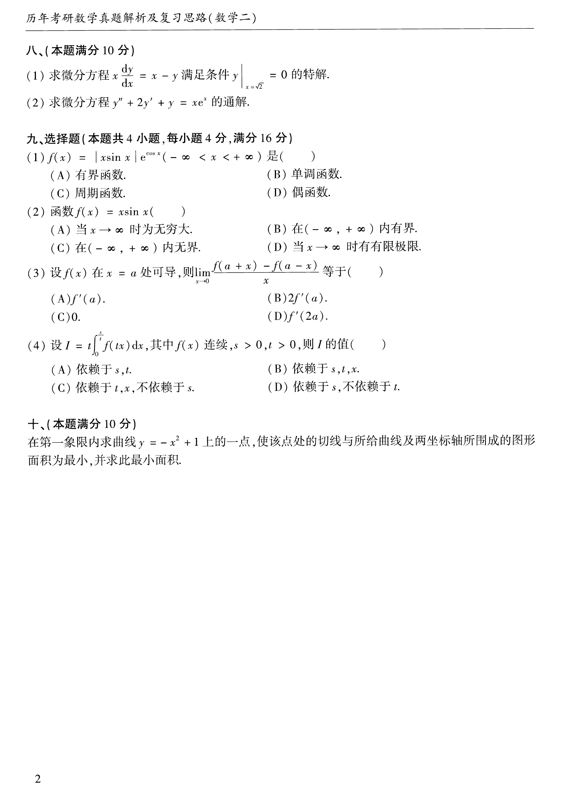

# 1987 年数学二真题

**第 1-7 题题图**

## 第 1 题

- 题型：fill_blank
- 分值：3

设 $y=\ln(1+ax)$，其中 $a$ 为非零常数，则 $y'$=______，$y''$=______。

## 第 2 题

- 题型：fill_blank
- 分值：3

曲线 $y=\arctan x$ 在横坐标为 $1$ 的点处的切线方程是______；法线方程是______。

## 第 3 题

- 题型：fill_blank
- 分值：3

积分中值定理的条件是______，结论是______。

## 第 4 题

- 题型：fill_blank
- 分值：3

$\lim_{n\to\infty}\left(\dfrac{n-2}{n+1}\right)^n=$______。

## 第 5 题

- 题型：fill_blank
- 分值：3

$\int f'(x)\,dx=$______，$\int_a^b f'(2x)\,dx=$______。

## 第 6 题

- 题型：solution
- 分值：6

求极限 $\lim_{x\to0}\left(\dfrac{1}{x}-\dfrac{1}{e^x-1}\right)$。

## 第 7 题

- 题型：solution
- 分值：7

设 $\begin{cases}x=5(t-\sin t),\\ y=5(1-\cos t),\end{cases}$，求 $\dfrac{dy}{dx}$，$\dfrac{d^2y}{dx^2}$。

**第 8-10 题题图**

## 第 8 题

- 题型：solution
- 分值：10

(1) 求微分方程 $x\dfrac{dy}{dx}=x-y$ 满足条件 $y\big|_{x=\sqrt{2}}=0$ 的特解；

(2) 求微分方程 $y''+2y'+y=xe^x$ 的通解。

## 第 9 题

- 题型：single_choice
- 分值：16

选择题共 4 小题：

(1) $f(x)=|x\sin x|e^{\cos x}$ 是（A.有界函数 B.单调函数 C.周期函数 D.偶函数）；

(2) 函数 $f(x)=x\sin x$（A.当 $x\to\infty$ 时为无穷大 B.当 $x\to\infty$ 时有极限 C.在 $(-\infty,+\infty)$ 内有界 D.在 $(-\infty,+\infty)$ 内无界）；

(3) 设 $f(x)$ 在 $x=a$ 处可导，则 $\lim_{x\to0}\dfrac{f(a+x)-f(a-x)}x$ 等于（A.$f'(a)$ B.$2f'(a)$ C.0 D.$f'(2a)$）；

(4) 设 $A$ 为 $n$ 阶方阵且 $|A|=a\ne0$，$A^*$ 为伴随矩阵，则 $|A^*|=$（A.$a$ B.$1/a$ C.$a^{n-1}$ D.$a^n$）。

## 第 10 题

- 题型：solution
- 分值：10

在第一象限内，求曲线 $y=-x^2+1$ 上的一点，使该点处的切线与所给曲线及两坐标轴所围成的图形面积为最小，并求此最小面积。
