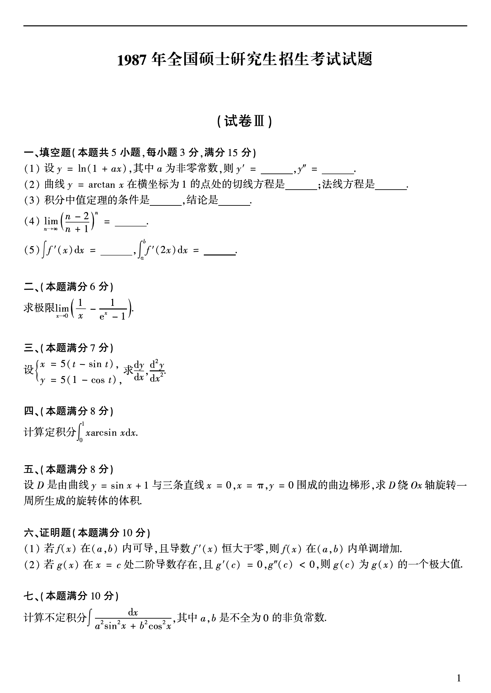

# 1987 数学二第 5 题
## 题目

$\int f'(x)\,dx=$\underline{\qquad}，$\int_a^b f'(2x)\,dx=$\underline{\qquad}。

## 标准答案

$f(x)+C$；$\dfrac{1}{2}f(2b)-\dfrac{1}{2}f(2a)$

## 解析

第一空由原函数定义直接得到。第二空令 $u=2x$，则积分化为 $\dfrac{1}{2}\int_{2a}^{2b}f'(u)\,du$。

## 来源

- 题目来源：`math2_1987_questions.md`
- 答案来源：`math2_1987_answers.md`
