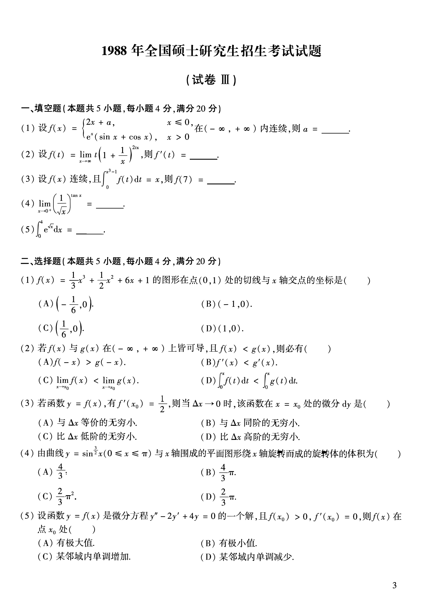

# 1988 数学二第 4 题
## 题目

$\lim_{x\to0^+}\left(\dfrac{1}{\sqrt{x}}\right)^{\tan x}=$______。

## 标准答案

$1$

## 解析

取对数，得 $\tan x\ln x^{-1/2}$。由 $\tan x\sim x$ 且 $x\ln x\to0$，可知对数趋于 $0$，故原极限为 $1$。

## 来源

- 题目来源：`math2_1988_questions.md`
- 答案来源：`math2_1988_answers.md`
