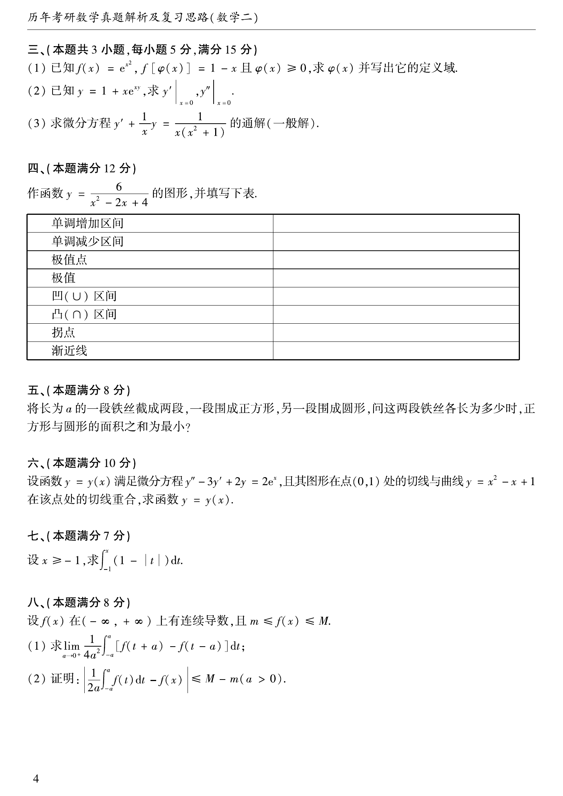

# 1988 数学二第 8 题
## 题目

后续大题：

(1) 作函数 $y=\dfrac{6}{x^2-2x+4}$ 的图形，并填写单调区间、极值、凹凸区间、拐点和渐近线；

(2) 将长为 $a$ 的一段铁丝截成两段，一段围成正方形，另一段围成圆形，问这两段铁丝各长为多少时，正方形与圆形的面积之和最小；

(3) 设函数 $y=y(x)$ 满足微分方程 $y''-3y'+2y=2e^x$，且其图形在点 $(0,1)$ 处的切线与曲线 $y=x^2-x+1$ 在该点处的切线重合，求函数 $y=y(x)$；

(4) 设 $x\ge-1$，求 $\int_{-1}^x(1-|t|)dt$；

(5) 设 $f(x)$ 在 $(-\infty,+\infty)$ 上有连续导数，且 $m\le f(x)\le M$，
(i) 求 $\lim_{a\to0^+}\dfrac{1}{4a^2}\int_{-a}^a[f(t+a)-f(t-a)]dt$；
(ii) 证明 $\left|\dfrac{1}{2a}\int_{-a}^af(t)dt-f(x)\right|\le M-m\ (a>0)$。

## 标准答案

(1) 单调增区间 $(-\infty,1)$，单调减区间 $(1,+\infty)$，极值点 $x=1$，极值 $2$，凹区间 $(-\infty,0)\cup(2,+\infty)$，凸区间 $(0,2)$，拐点 $(0,3/2)$、$(2,3/2)$，渐近线 $y=0$；(2) 圆的周长 $\dfrac{\pi a}{4+\pi}$，正方形的周长 $\dfrac{4a}{4+\pi}$；(3) $y=(1-2x)e^{2x}$；(4) 当 $-1\le x<0$ 时为 $\dfrac{1}{2}(1+x)^2$，当 $x\ge0$ 时为 $1-\dfrac{1}{2}(1-x)^2$；(5) 极限为 $f'(0)$，且不等式成立。

## 解析

第一问用一、二阶导数分析。第二问把面积和写成一元二次函数。第三问解常系数线性方程并用初始条件确定常数。第四问按 $x<0$ 与 $x\ge0$ 分段积分。第五问用积分中值定理与有界估计。

## 来源

- 题目来源：`math2_1988_questions.md`
- 答案来源：`math2_1988_answers.md`
