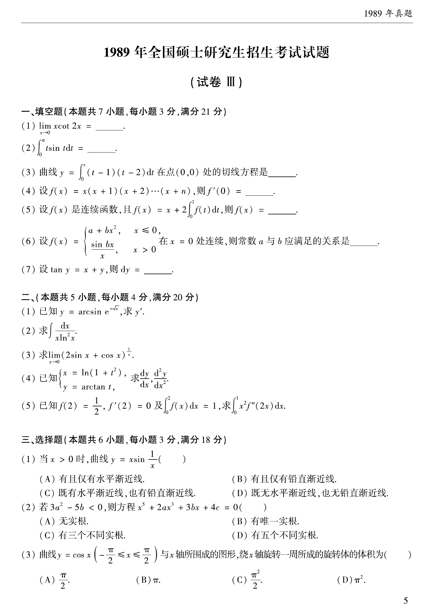

# 1989 数学二第 3 题
## 题目

选择题共 6 小题：

(1) 当 $x>0$ 时，曲线 $y=x\sin\dfrac{1}{x}$ 的渐近线情况；
(2) 若 $3a^2-5b<0$，则方程 $x^5+2ax^3+3bx+4c=0$ 的实根个数；
(3) 曲线 $y=\cos x\;(-\pi/2\le x\le\pi/2)$ 与 $x$ 轴所围成图形绕 $x$ 轴旋转一周所得旋转体体积；
(4) 设两函数 $f(x)$ 和 $g(x)$ 都在 $x=a$ 处取得极大值，则函数 $F(x)=f(x)g(x)$ 在 $x=a$ 处；
(5) 微分方程 $y''-y=e^x+1$ 的一个特解应具有的形式；
(6) 设 $f(x)$ 在点 $x=a$ 的某个邻域内有定义，则 $f(x)$ 在 $x=a$ 处可导的一个充分条件。

## 标准答案

(1) A；(2) B；(3) C；(4) D；(5) B；(6) D

## 解析

(1) 当 $x\to+\infty$ 时，$\sin\frac{1}{x}\sim\frac{1}{x}$，故 $x\sin\frac{1}{x}\to1$，有且仅有水平渐近线 $y=1$，选 A。

(2) 设
$$
P(x)=x^5+2ax^3+3bx+4c.
$$
则
$$
P'(x)=5x^4+6ax^2+3b.
$$
把 $x^2$ 看作变量时，其判别式为
$$
\Delta=(6a)^2-4\cdot5\cdot3b=12(3a^2-5b)<0.
$$
又首项系数为正，所以 $P'(x)>0$ 恒成立，$P(x)$ 严格递增，方程有唯一实根，选 B。

(3) 旋转体体积为
$$
V=\pi\int_{-\pi/2}^{\pi/2}\cos^2x\,dx=\frac{\pi^2}{2},
$$
选 C。

(4) 两个函数都在 $x=a$ 处取得极大值时，乘积是否取极值还与函数值符号有关，不能确定，选 D。

(5) 方程 $y''-y=e^x+1$ 的齐次特征根为 $\pm1$，$e^x$ 与齐次解共振，因此对应特解应乘以 $x$；常数项取常数特解即可，选 $axe^x+b$，即 B。

(6)
$$
\lim_{h\to0}\frac{f(a)-f(a-h)}{h}
=\lim_{t\to0}\frac{f(a+t)-f(a)}{t}\quad(t=-h),
$$
该极限存在正是导数存在的充分条件，选 D。

## 来源

- 题目来源：`math2_1989_questions.md`
- 答案来源：`math2_1989_answers.md`
