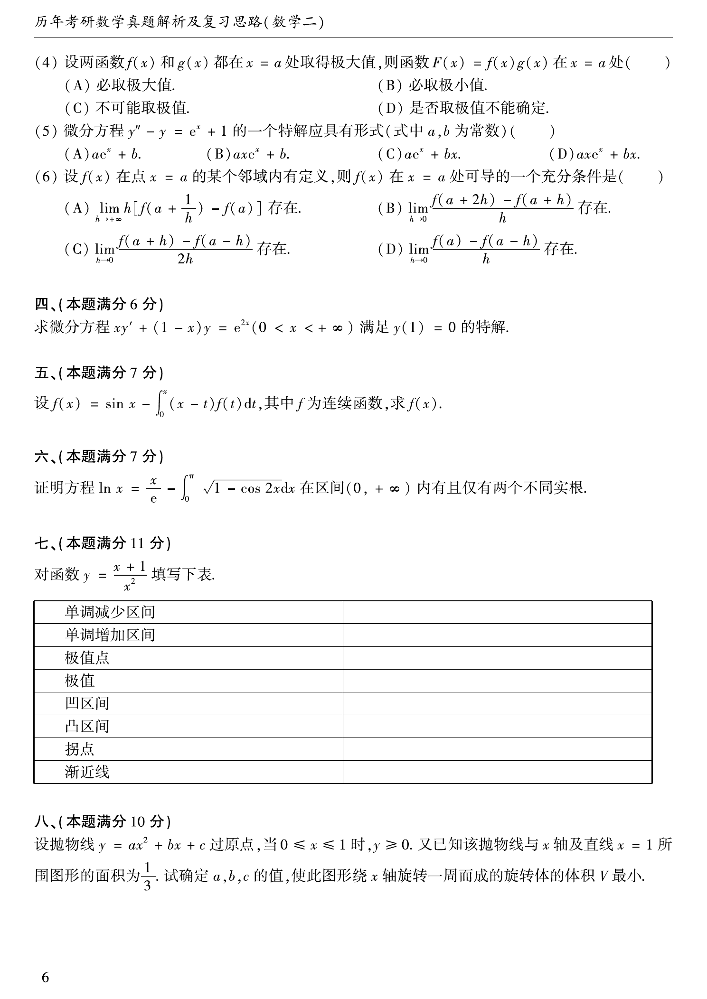

# 1989 数学二第 6 题
## 题目

证明方程 $\ln x=\dfrac{x}{e}-\int_0^\pi\sqrt{1-\cos2x}\,dx$ 在区间 $(0,+\infty)$ 内有且仅有两个不同实根。

## 标准答案

在 $(0,+\infty)$ 内有且仅有两个不同实根。

## 解析

设 $k=\int_0^\pi\sqrt{1-\cos2x}\,dx>0$，令 $F(x)=\ln x-x/e+k$。则 $F'(x)=1/x-1/e$，故在 $(0,e)$ 上递增，在 $(e,+\infty)$ 上递减；且 $F(e)=k>0$，两端都趋于 $-\infty$，因此各区间内恰有一个零点。

## 来源

- 题目来源：`math2_1989_questions.md`
- 答案来源：`math2_1989_answers.md`
