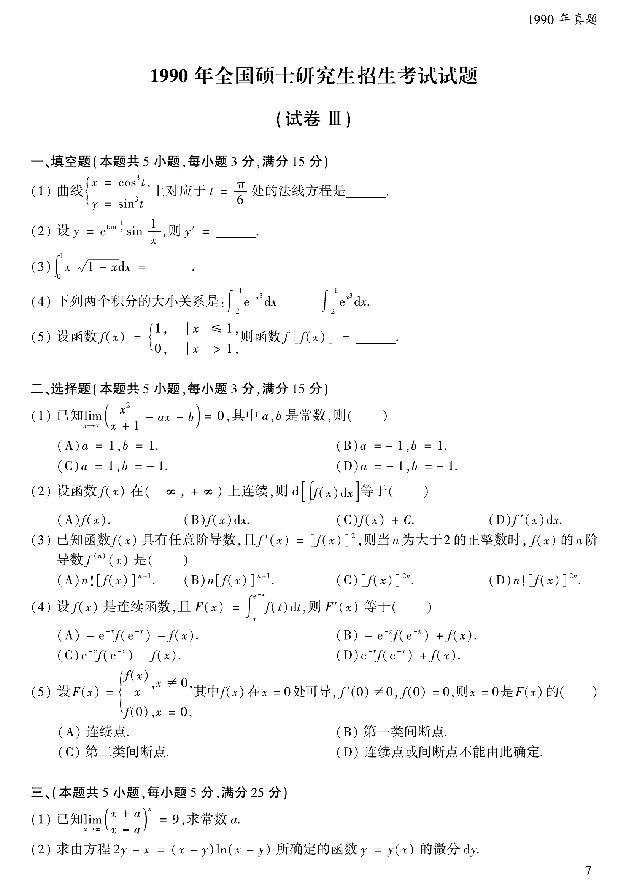

# 1990 数学二第 9 题

## 题目

设 $f(x)$ 是连续函数，且

$$
F(x)=\int_x^{e^{-x}}f(t)\,dt,
$$

则 $F'(x)$ 等于（ ）

A. $-e^{-x}f(e^{-x})-f(x)$

B. $-e^{-x}f(e^{-x})+f(x)$

C. $e^{-x}f(e^{-x})-f(x)$

D. $e^{-x}f(e^{-x})+f(x)$

## 标准答案

A

## 解析

用变上限积分求导公式：

$$
F'(x)=f(e^{-x})(e^{-x})'-f(x)\cdot 1=-e^{-x}f(e^{-x})-f(x).
$$

## 来源

- 题目来源：`math2_1990_questions.md`
- 答案来源：`math2_1990_answers.md`
