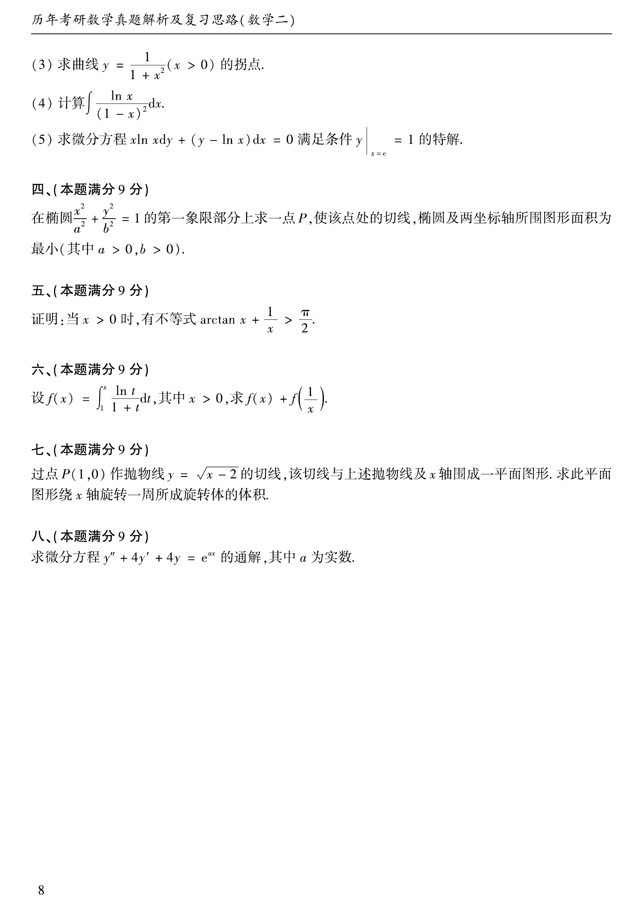

# 1990 数学二第 16 题

## 题目

在椭圆

$$
\frac{x^2}{a^2}+\frac{y^2}{b^2}=1
$$

的第一象限部分上求一点 $P$，使该点处切线、椭圆及两坐标轴所围图形面积最小（其中 $a>0,b>0$）。

## 标准答案

$P=\left(\dfrac{a}{\sqrt{2}},\dfrac{b}{\sqrt{2}}\right)$

## 解析

设切点为 $(x,y)$。椭圆在该点的切线可写成

$$
\frac{xX}{a^2}+\frac{yY}{b^2}=1。
$$

它在坐标轴上的截距分别为 $\dfrac{a^2}{x}$ 与 $\dfrac{b^2}{y}$，所围梯形面积等于常数倍 $\dfrac{1}{xy}$，因此只需使 $xy$ 最大。由椭圆约束可得 $xy$ 在第一象限最大时 $x^2/a^2=y^2/b^2=\dfrac{1}{2}$，故

$$
P=\left(\frac{a}{\sqrt{2}},\frac{b}{\sqrt{2}}\right).
$$

## 来源

- 题目来源：`math2_1990_questions.md`
- 答案来源：`math2_1990_answers.md`
