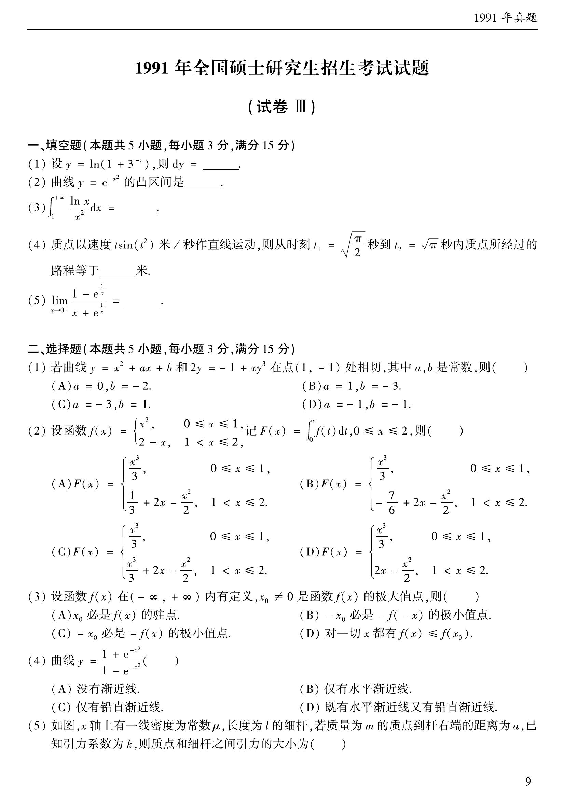

# 1991 数学二第 5 题

## 题目

求极限

$$
\lim_{x\to0^+}\frac{1-e^{1/x}}{x+e^{1/x}}=\underline{\qquad}。
$$

## 标准答案

$-1$

## 解析

分子分母同时乘以 $e^{-1/x}$，得

$$
\frac{e^{-1/x}-1}{xe^{-1/x}+1}.
$$

当 $x\to0^+$ 时，$e^{-1/x}\to0$，故极限为 $\dfrac{-1}{1}=-1$。

## 来源

- 题目来源：`math2_1991_questions.md`
- 答案来源：`math2_1991_answers.md`
