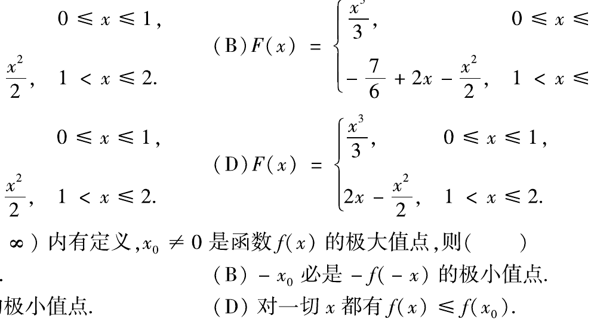

# 1991 数学二第 10 题

## 题目

如图，$x$ 轴上有一线密度为常数 $\mu$、长度为 $l$ 的细杆，若质量为 $m$ 的质点到杆右端的距离为 $a$，已知引力系数为 $k$，则质点和细杆之间引力的大小为（ ）

A. $\displaystyle\int_{-l}^{0}\frac{k m\mu}{(a-x)^2}dx$

B. $\displaystyle\int_{0}^{l}\frac{k m\mu}{(a-x)^2}dx$

C. $\displaystyle 2\int_{-l/2}^{0}\frac{k m\mu}{(a+x)^2}dx$

D. $\displaystyle 2\int_0^{l/2}\frac{k m\mu}{(a+x)^2}dx$

## 标准答案

A

## 解析

以杆右端为原点，杆位于区间 $[-l,0]$。长度元 $dx$ 的质量为 $\mu dx$，与质点的距离为 $a-x$，故微元引力为

$$
dF=\frac{k m\mu}{(a-x)^2}dx.
$$

沿整根细杆积分即可，故选 A。

## 来源

- 题目来源：`math2_1991_questions.md`
- 答案来源：`math2_1991_answers.md`
