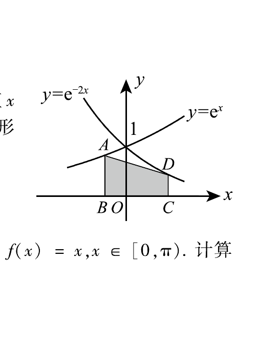

# 1991 数学二第 19 题

## 题目

如图，$A$ 和 $D$ 分别是曲线 $y=e^x$ 和 $y=e^{-2x}$ 上的点，$AB$ 和 $DC$ 均垂直 $x$ 轴，且 $|AB|:|DC|=2:1$，$|AB|<1$。求点 $B$ 和 $C$ 的横坐标，使梯形 $ABCD$ 的面积最大。

## 标准答案

$x_B=\dfrac{\ln2}{3}-1,\quad x_C=\dfrac{1+\ln2}{3}$

## 解析

设 $C$ 的横坐标为 $x>0$，则由 $e^{x_B}=2e^{-2x}$ 得 $x_B=\ln2-2x$。梯形面积可表示为

$$
S(x)=\frac{e^{-2x}+2e^{-2x}}2\,(x-x_B)=\frac{3}{2}e^{-2x}(3x-\ln2).
$$

求导得唯一极大点 $x=\dfrac{1+\ln2}{3}$，于是

$$
x_B=\ln2-2x=\frac{\ln2}{3}-1.
$$

## 来源

- 题目来源：`math2_1991_questions.md`
- 答案来源：`math2_1991_answers.md`
