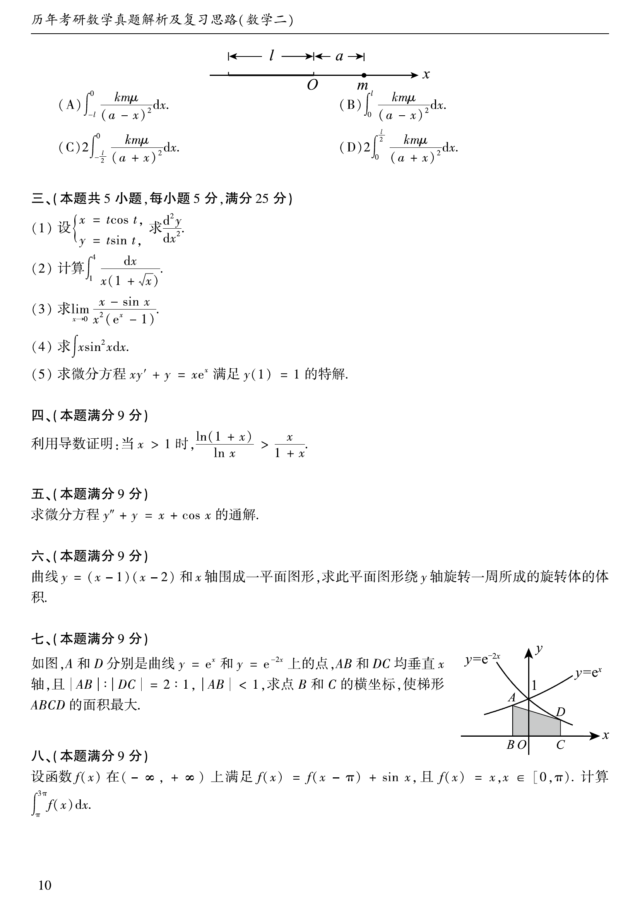

# 1991 数学二第 20 题

## 题目

设函数 $f(x)$ 在 $(-\infty,+\infty)$ 上满足

$$
f(x)=f(x-\pi)+\sin x,
$$

且 $f(x)=x\ (x\in[0,\pi))$。计算

$$
\int_\pi^{3\pi}f(x)dx.
$$

## 标准答案

$\pi^2-2$

## 解析

当 $x\in[\pi,2\pi)$ 时，

$$
f(x)=x-\pi+\sin x;
$$

当 $x\in[2\pi,3\pi)$ 时，再递推一次得 $f(x)=x-2\pi$。故

$$
\int_\pi^{3\pi}f(x)dx=\int_\pi^{2\pi}(x-\pi+\sin x)dx+\int_{2\pi}^{3\pi}(x-2\pi)dx=\pi^2-2.
$$

## 来源

- 题目来源：`math2_1991_questions.md`
- 答案来源：`math2_1991_answers.md`
