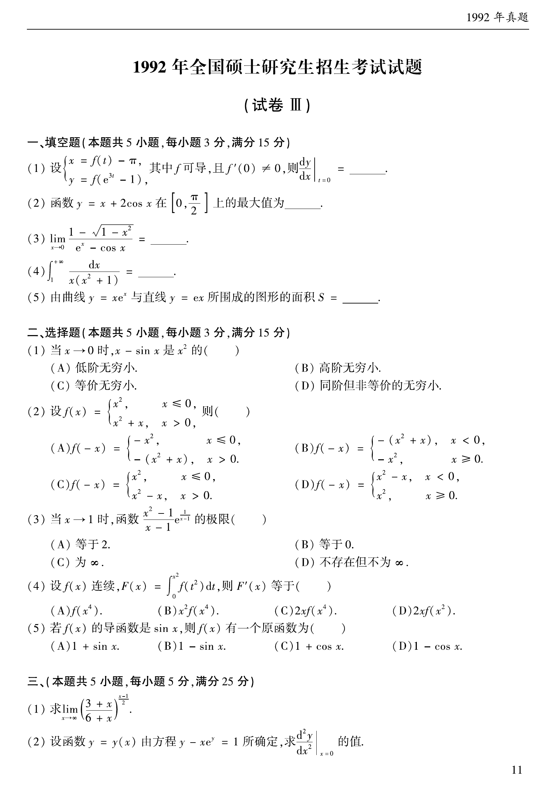

# 1992 数学二第 7 题

## 题目

设

$$
f(x)=\begin{cases}x^2,&x\le0,\\x^2+x,&x>0,\end{cases}
$$

则（ ）

A. $f(-x)=\begin{cases}-x^2,&x\le0,\\-(x^2+x),&x>0,\end{cases}$

B. $f(-x)=\begin{cases}-(x^2+x),&x<0,\\-x^2,&x\ge0,\end{cases}$

C. $f(-x)=\begin{cases}x^2,&x\le0,\\x^2-x,&x>0,\end{cases}$

D. $f(-x)=\begin{cases}x^2-x,&x<0,\\x^2,&x\ge0.\end{cases}$

## 标准答案

D

## 解析

当 $x<0$ 时，$-x>0$，所以 $f(-x)=(-x)^2+(-x)=x^2-x$；当 $x\ge0$ 时，$-x\le0$，所以 $f(-x)=(-x)^2=x^2$。故选 D。

## 来源

- 题目来源：`math2_1992_questions.md`
- 答案来源：`math2_1992_answers.md`
