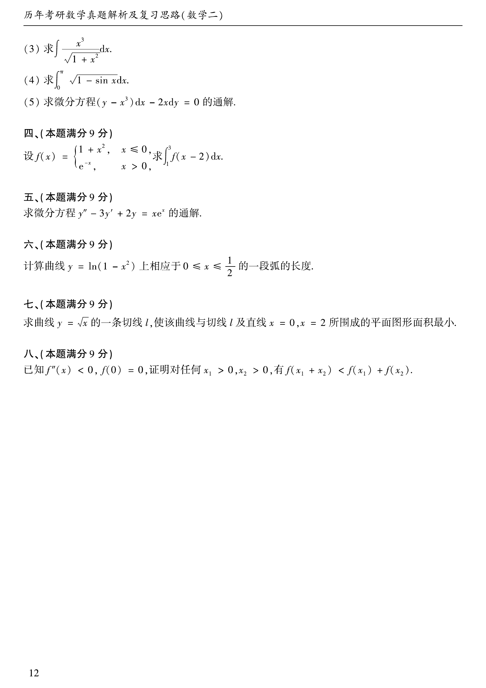

# 1992 数学二第 17 题

## 题目

求微分方程

$$
y''-3y'+2y=xe^x
$$

的通解。

## 标准答案

$y=C_1e^x+C_2e^{2x}-\left(\dfrac{x^2}{2}+x\right)e^x$

## 解析

对应齐次方程特征根为 $1,2$，所以齐次通解为 $C_1e^x+C_2e^{2x}$。设特解为 $y_p=e^x x(ax+b)$，代入原方程可得 $a=-\dfrac{1}{2},b=-1$。故通解为

$$
y=C_1e^x+C_2e^{2x}-\left(\frac{x^2}{2}+x\right)e^x.
$$

## 来源

- 题目来源：`math2_1992_questions.md`
- 答案来源：`math2_1992_answers.md`
