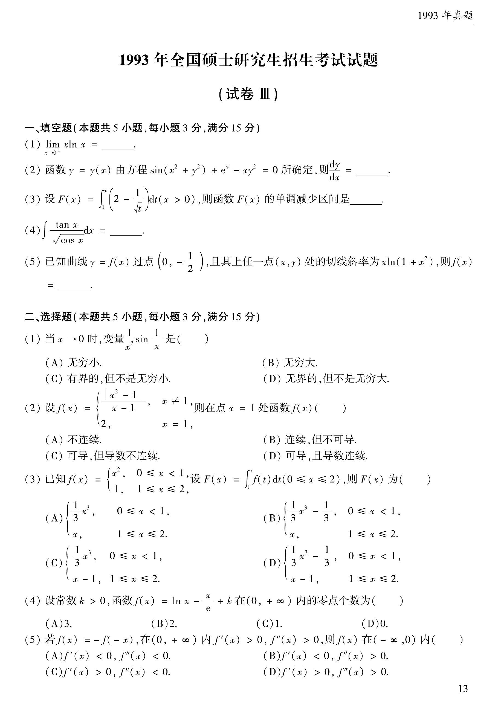

# 1993 数学二第 4 题
## 题目

计算
$$
\int \frac{\tan x}{\sqrt{\cos x}}dx=\underline{\qquad}.
$$

## 标准答案

$\dfrac{2}{\sqrt{\cos x}}+C$

## 解析

原式化为
$$
\int \sin x\,(\cos x)^{-3/2}dx.
$$
令 $u=\cos x$，则 $du=-\sin x\,dx$，
$$
\int \frac{\tan x}{\sqrt{\cos x}}dx=-\int u^{-3/2}du=2u^{-1/2}+C=\frac{2}{\sqrt{\cos x}}+C.
$$

## 来源

- 题目来源：`math2_1993_questions.md`
- 答案来源：`math2_1993_answers.md`
