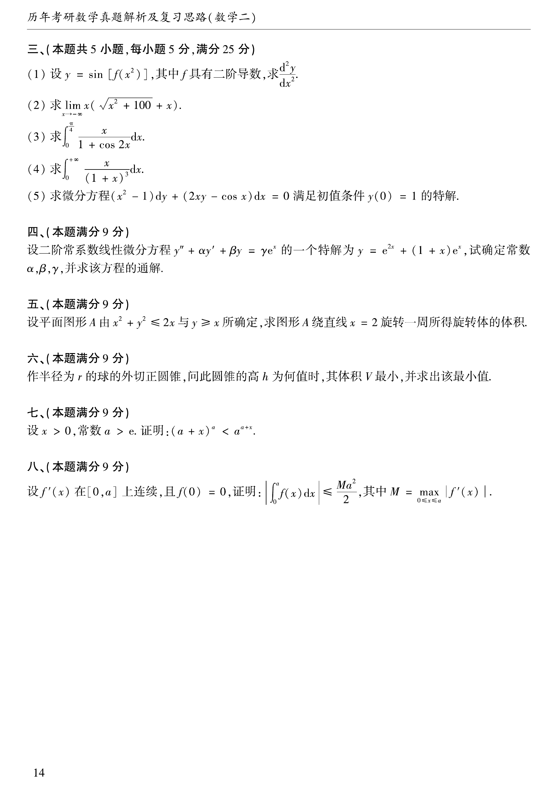

# 1993 数学二第 15 题
## 题目

求微分方程
$$
(x^2-1)dy+(2xy-\cos x)dx=0
$$
满足初值条件 $y(0)=1$ 的特解。

## 标准答案

$y=\dfrac{1-\sin x}{1-x^2}$

## 解析

方程化为
$$
y'+\frac{2x}{x^2-1}y=\frac{\cos x}{x^2-1}.
$$
积分因子为
$$
\mu(x)=\exp\int\frac{2x}{x^2-1}dx=x^2-1.
$$
因此
$$
\bigl((x^2-1)y\bigr)'=\cos x,
$$
积分得
$$
(x^2-1)y=\sin x+C.
$$
由 $y(0)=1$ 得 $-1=C$，所以
$$
y=\frac{\sin x-1}{x^2-1}=\frac{1-\sin x}{1-x^2}.
$$

## 来源

- 题目来源：`math2_1993_questions.md`
- 答案来源：`math2_1993_answers.md`
