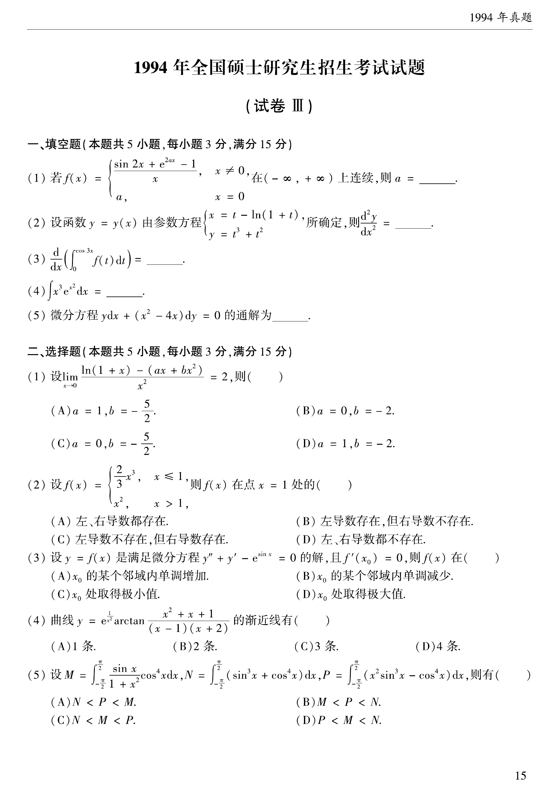

# 1994 数学二第 7 题

## 题目

设
$$
f(x)=\begin{cases}
\dfrac{2}{3}x^3,&x\le 1,\\
x^2,&x>1,
\end{cases}
$$
则 $f(x)$ 在点 $x=1$ 处的（  ）

A. 左、右导数都存在

B. 左导数存在，但右导数不存在

C. 左导数不存在，但右导数存在

D. 左、右导数都不存在

## 标准答案

B

## 解析

左侧函数可导，且
$$
f'_-(1)=\left(\frac{2}{3}x^3\right)'\bigg|_{x=1}=2.
$$
又有
$$
f(1)=\frac{2}{3},\qquad \lim_{x\to1^+}f(x)=1\ne f(1),
$$
故 $f$ 在 $x=1$ 右侧不连续，从而右导数不存在，选 B。

## 来源

- 题目来源：`math2_1994_questions.md`
- 答案来源：`math2_1994_answers.md`
