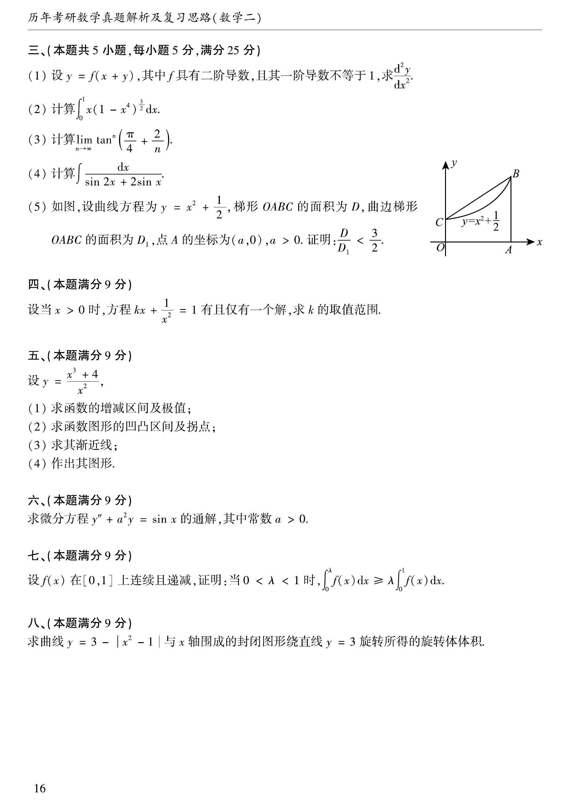

# 1994 数学二第 11 题

## 题目

设 $y=f(x+y)$，其中 $f$ 具有二阶导数，且其一阶导数不等于 1，求 $\dfrac{d^2y}{dx^2}$。

## 标准答案

$y''=\dfrac{f''}{(1-f')^3}$

## 解析

对方程 $y=f(x+y)$ 两边对 $x$ 求导，得
$$
y'=f'(1+y').
$$
故
$$
y'=\frac{f'}{1-f'}.
$$
再求导，有
$$
y''=f''(1+y')^2+f'y''.
$$
移项得
$$
(1-f')y''=f''(1+y')^2.
$$
而
$$
1+y'=1+\frac{f'}{1-f'}=\frac{1}{1-f'},
$$
所以
$$
y''=\frac{f''}{(1-f')^3}.
$$

## 来源

- 题目来源：`math2_1994_questions.md`
- 答案来源：`math2_1994_answers.md`
