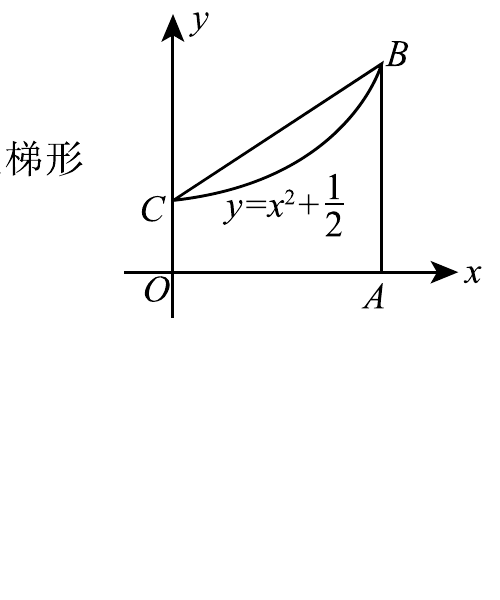

# 1994 数学二第 15 题

## 题目

如图，设曲线方程为 $y=x^2+\dfrac{1}{2}$，梯形 $OABC$ 的面积为 $D$，曲边梯形 $OABC$ 的面积为 $D_1$，点 $A$ 的坐标为 $(a,0)$，$a>0$。证明：
$$
\frac{D}{D_1}<\frac{3}{2}.
$$

## 标准答案

见解析。

## 解析

由图可知 $C=(0,\tfrac{1}{2})$，$B=(a,a^2+\tfrac{1}{2})$。故梯形面积
$$
D=\frac{\frac{1}{2}+\left(a^2+\frac{1}{2}\right)}{2}\cdot a=\frac{a(1+a^2)}{2}.
$$
曲边梯形面积
$$
D_1=\int_0^a\left(x^2+\frac{1}{2}\right)dx=\frac{a^3}{3}+\frac{a}{2}=\frac{a(3+2a^2)}{6}.
$$
于是
$$
\frac{D}{D_1}=\frac{3(1+a^2)}{3+2a^2}=\frac{3}{2}\cdot\frac{1+a^2}{\frac{3}{2}+a^2}<\frac{3}{2}.
$$

## 来源

- 题目来源：`math2_1994_questions.md`
- 答案来源：`math2_1994_answers.md`
