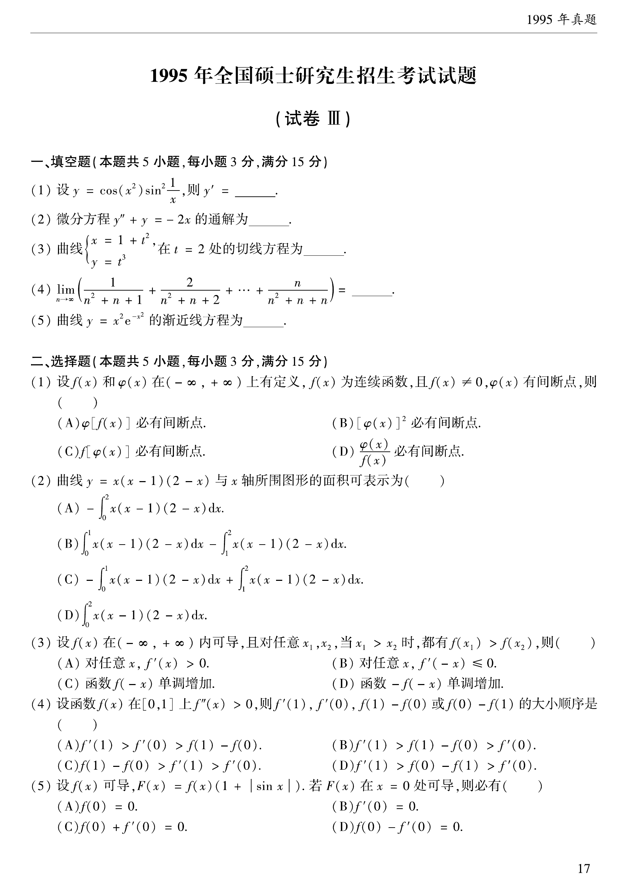

# 1995 数学二第 8 题

## 题目

设 $f(x)$ 在 $(-\infty,+\infty)$ 内可导，且对任意 $x_1,x_2$，当 $x_1>x_2$ 时，都有 $f(x_1)>f(x_2)$，则（ ）。

A. 对任意 $x$，$f'(x)>0$

B. 对任意 $x$，$f'(-x)\le0$

C. 函数 $f(-x)$ 单调增加

D. 函数 $-f(-x)$ 单调增加

## 标准答案

D

## 解析

题设说明 $f(x)$ 在整个实轴上严格单调增加。若 $x_1>x_2$，则有 $-x_1<-x_2$，从而
$$
f(-x_1)<f(-x_2),
$$
于是
$$
-f(-x_1)>-f(-x_2).
$$
故函数 $-f(-x)$ 单调增加，选 D。

A 不一定成立，例如 $f(x)=x^3$ 单调增加，但在 $x=0$ 处有 $f'(0)=0$。

## 来源

- 题目来源：`math2_1995_questions.md`
- 答案来源：`math2_1995_answers.md`
