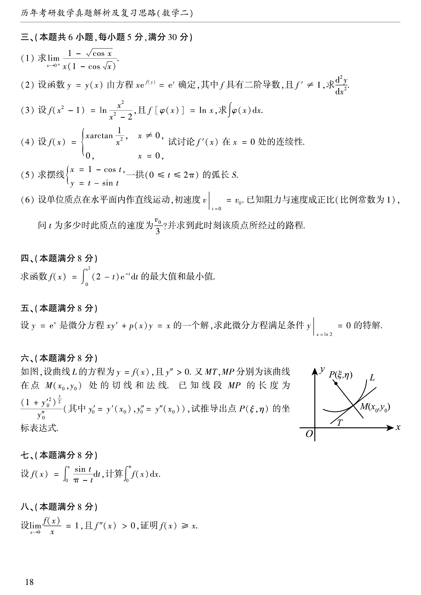

# 1995 数学二第 15 题

## 题目

求摆线
$$
\begin{cases}
x=1-\cos t,\\
y=t-\sin t
\end{cases}
$$
一拱（$0\le t\le2\pi$）的弧长 $S$。

## 标准答案

$8$

## 解析

由弧长公式，
$$
S=\int_0^{2\pi}\sqrt{\left(\frac{dx}{dt}\right)^2+\left(\frac{dy}{dt}\right)^2}\,dt.
$$
其中
$$
\frac{dx}{dt}=\sin t,\qquad \frac{dy}{dt}=1-\cos t.
$$
故
$$
\sqrt{\sin^2 t+(1-\cos t)^2}=\sqrt{2-2\cos t}=2\sin\frac{t}{2}
$$
（在 $0\le t\le2\pi$ 上取非负值）。于是
$$
S=\int_0^{2\pi}2\sin\frac{t}{2}\,dt=\left[-4\cos\frac{t}{2}\right]_0^{2\pi}=8.
$$

## 来源

- 题目来源：`math2_1995_questions.md`
- 答案来源：`math2_1995_answers.md`
