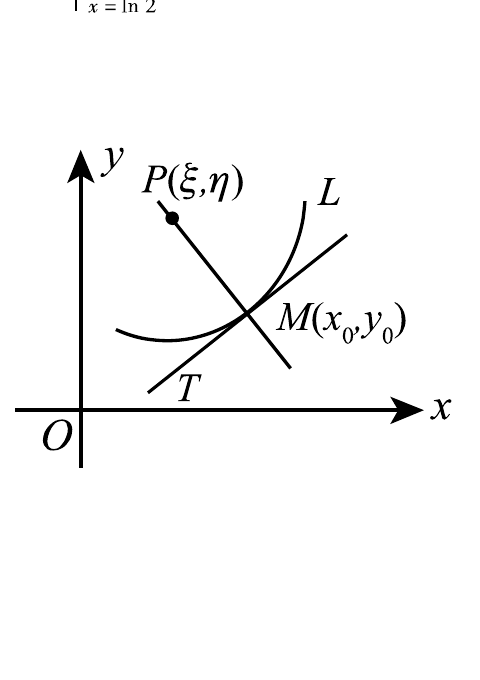

# 1995 数学二第 16 题

## 题目

如图，设曲线 $L$ 的方程为 $y=f(x)$，且 $y''>0$。又 $MT,MP$ 分别为该曲线在点 $M(x_0,y_0)$ 处的切线和法线。已知线段 $MP$ 的长度为
$$
\frac{(1+y_0'^2)^{3/2}}{y_0''}
$$
（其中 $y_0'=y'(x_0),\ y_0''=y''(x_0)$），试推导出点 $P(\xi,\eta)$ 的坐标表达式。

## 标准答案

$\xi=x_0-\dfrac{y_0'(1+y_0'^2)}{y_0''},\quad \eta=y_0+\dfrac{1+y_0'^2}{y_0''}$

## 解析

点 $M(x_0,y_0)$ 处切线斜率为 $y_0'$，故法线方向向量可取
$$
(-y_0',1).
$$
它的长度为 $\sqrt{1+y_0'^2}$，所以法线方向上的单位向量可取
$$
\left(\frac{-y_0'}{\sqrt{1+y_0'^2}},\frac{1}{\sqrt{1+y_0'^2}}\right).
$$
又已知
$$
|MP|=\frac{(1+y_0'^2)^{3/2}}{y_0''}.
$$
由于 $y_0''>0$，图中点 $P$ 位于法线向上的一侧，因此
$$
\overrightarrow{MP}=\frac{(1+y_0'^2)^{3/2}}{y_0''}\left(\frac{-y_0'}{\sqrt{1+y_0'^2}},\frac{1}{\sqrt{1+y_0'^2}}\right)
=\left(-\frac{y_0'(1+y_0'^2)}{y_0''},\frac{1+y_0'^2}{y_0''}\right).
$$
于是
$$
\xi=x_0-\frac{y_0'(1+y_0'^2)}{y_0''},\qquad
\eta=y_0+\frac{1+y_0'^2}{y_0''}.
$$

## 来源

- 题目来源：`math2_1995_questions.md`
- 答案来源：`math2_1995_answers.md`
