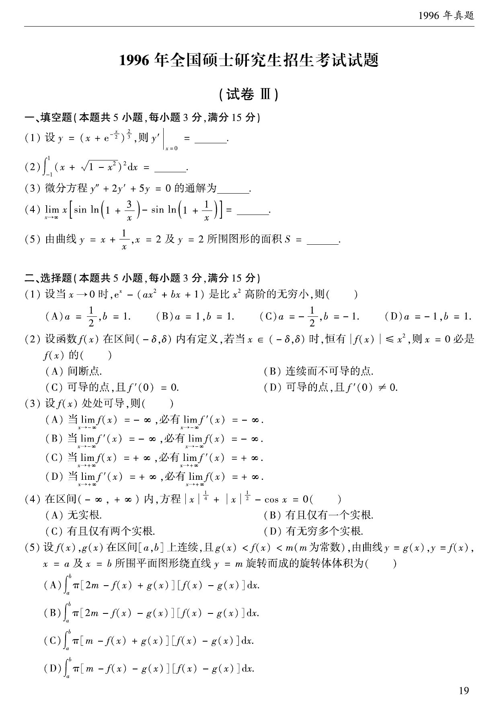

# 1996 数学二第 2 题

## 题目

计算
$$
\int_{-1}^{1}\left(x+\sqrt{1-x^2}\right)^2\,dx=\underline{\qquad}.
$$

## 标准答案

$2$

## 解析

展开被积式：
$$
\left(x+\sqrt{1-x^2}\right)^2=x^2+1-x^2+2x\sqrt{1-x^2}=1+2x\sqrt{1-x^2}.
$$
其中 $2x\sqrt{1-x^2}$ 是奇函数，在 $[-1,1]$ 上积分为 $0$，故
$$
\int_{-1}^{1}\left(x+\sqrt{1-x^2}\right)^2dx=\int_{-1}^{1}1\,dx=2.
$$

## 来源

- 题目来源：`math2_1996_questions.md`
- 答案来源：`math2_1996_answers.md`
