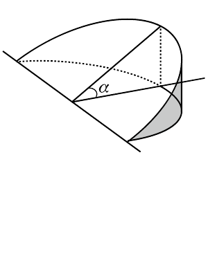

# 1996 数学二第 16 题

## 题目

设有一正椭圆柱体，其底面的长、短轴分别为 $2a,2b$，用过此柱体底面的短轴且与底面成 $\alpha$ 角（$0<\alpha<\dfrac\pi2$）的平面截此柱体，得一楔形体（如图），求此楔形体的体积 $V$。

## 标准答案

$V=\dfrac{2}{3}a^2b\tan\alpha$

## 解析

建立坐标系，底面椭圆方程为
$$
\frac{x^2}{a^2}+\frac{y^2}{b^2}=1.
$$
取垂直于 $y$ 轴的平面去截该楔形体，所得截面是直角三角形。其中一条直角边长为
$$
x=\frac{a}{b}\sqrt{b^2-y^2},
$$
另一条直角边长为
$$
x\tan\alpha=\frac{a}{b}\sqrt{b^2-y^2}\tan\alpha.
$$
所以截面面积为
$$
S(y)=\frac12\cdot\frac{a^2}{b^2}(b^2-y^2)\tan\alpha.
$$
由对称性，
$$
V=2\int_0^b S(y)dy
=\frac{a^2}{b^2}\tan\alpha\int_0^b(b^2-y^2)dy
=\frac{2}{3}a^2b\tan\alpha.
$$

## 来源

- 题目来源：`math2_1996_questions.md`
- 答案来源：`math2_1996_answers.md`
