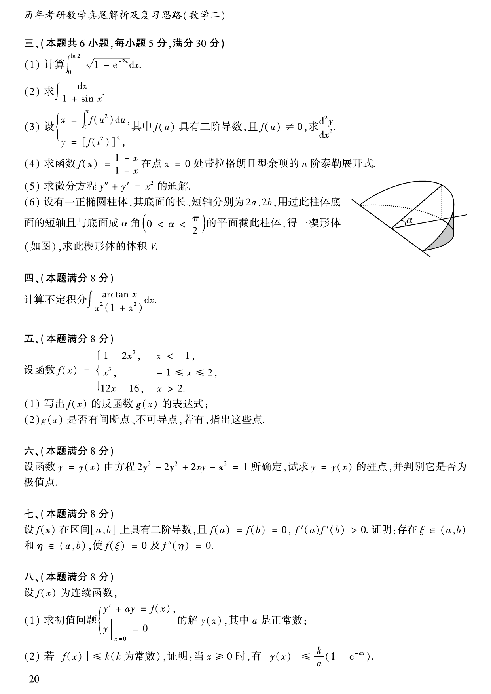

# 1996 数学二第 17 题

## 题目

计算不定积分
$$
\int\frac{\arctan x}{x^2(1+x^2)}\,dx.
$$

## 标准答案

$-\dfrac{1}{x}\arctan x+\ln\lvert x\rvert-\dfrac12\ln(1+x^2)-\dfrac12\arctan^2x+C$

## 解析

将原式拆为
$$
\int\frac{\arctan x}{x^2(1+x^2)}dx
=\int\frac{\arctan x}{x^2}dx-\int\frac{\arctan x}{1+x^2}dx.
$$
对第一项作分部积分：
$$
u=\arctan x,\quad dv=\frac{dx}{x^2},
$$
则
$$
du=\frac{dx}{1+x^2},\quad v=-\frac1x.
$$
所以
$$
\int\frac{\arctan x}{x^2}dx
=-\frac{\arctan x}{x}+\int\frac{dx}{x(1+x^2)}.
$$
又
$$
\int\frac{dx}{x(1+x^2)}
=\int\left(\frac1x-\frac{x}{1+x^2}\right)dx
=\ln\lvert x\rvert-\frac12\ln(1+x^2).
$$
第二项令 $t=\arctan x$，则
$$
\int\frac{\arctan x}{1+x^2}dx=\frac12\arctan^2x.
$$
因而
$$
\int\frac{\arctan x}{x^2(1+x^2)}dx
=-\frac{1}{x}\arctan x+\ln\lvert x\rvert-\frac12\ln(1+x^2)-\frac12\arctan^2x+C.
$$

## 来源

- 题目来源：`math2_1996_questions.md`
- 答案来源：`math2_1996_answers.md`
