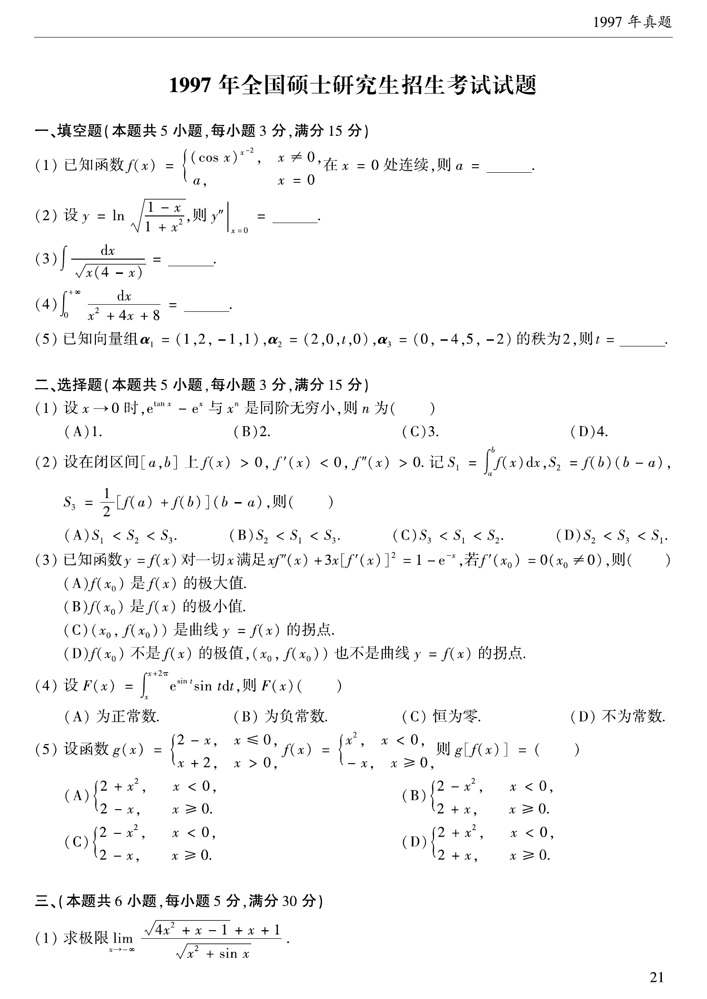

# 1997 数学二第 9 题

## 题目

设
$$
F(x)=\int_x^{x+2\pi}e^{\sin t}\sin t\,dt,
$$
则 $F(x)$（ ）。

(A) 为正常数  
(B) 为负常数  
(C) 恒为零  
(D) 不为常数

## 标准答案

$A$

## 解析

被积函数 $e^{\sin t}\sin t$ 是以 $2\pi$ 为周期的函数，所以
$$
F(x)
$$
与起点 $x$ 无关，是常数。又
$$
\int_0^{2\pi}e^{\sin t}\sin t\,dt>0,
$$
故 $F(x)$ 为正常数，应选 $A$。

## 来源

- 题目来源：`math2_1997_questions.md`
- 答案来源：`math2_1997_answers.md`
