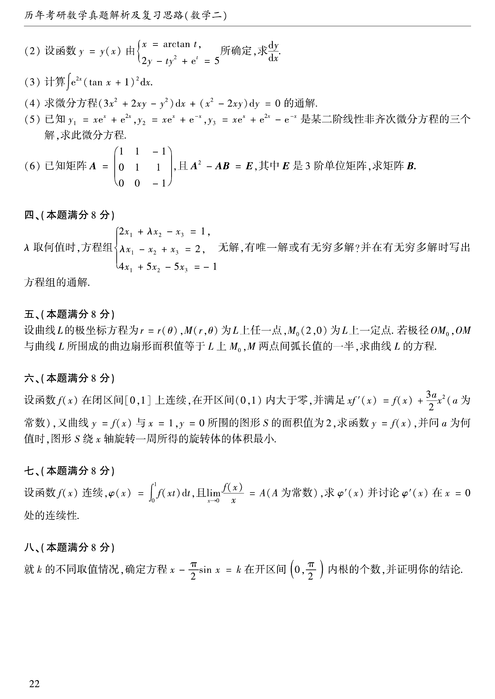

# 1997 数学二第 12 题

## 题目

设函数 $y=y(x)$ 由
$$
\begin{cases}
x=\arctan t,\\
2y-ty^2+e^t=5
\end{cases}
$$
所确定，求 $\dfrac{dy}{dx}$。

## 标准答案

$\dfrac{(1+t^2)(y^2-e^t)}{2(1-ty)}$

## 解析

对参数 $t$ 求导，
$$
\frac{dx}{dt}=\frac{1}{1+t^2}.
$$
对方程 $2y-ty^2+e^t=5$ 两边求导，得
$$
2\frac{dy}{dt}-y^2-2ty\frac{dy}{dt}+e^t=0,
$$
即
$$
\frac{dy}{dt}=\frac{y^2-e^t}{2(1-ty)}.
$$
因此
$$
\frac{dy}{dx}=\frac{dy/dt}{dx/dt}
=\frac{(1+t^2)(y^2-e^t)}{2(1-ty)}.
$$

## 来源

- 题目来源：`math2_1997_questions.md`
- 答案来源：`math2_1997_answers.md`
